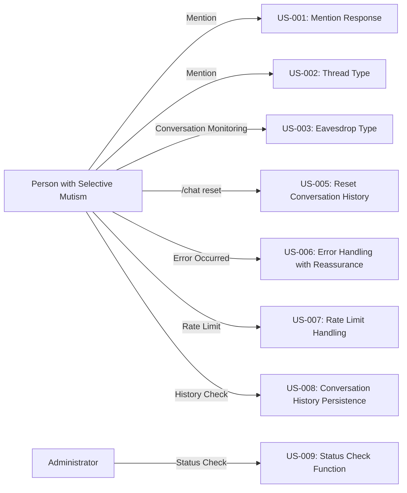

# ユーザーストーリー

## 1. ユーザーストーリー一覧

### Phase 1: 基盤実装

#### US-001: メンション応答型で会話を開始したい ✅ 完了

**ストーリー**:

```txt
場面緘黙当事者として、Bot にメンションして会話を開始したい。
なぜなら、必要な時だけ呼び出せるので、他の会話の邪魔にならないから。
```

**受け入れ基準**:

- ✅ Bot にメンション（@Kotonoha）すると応答する
- ✅ 会話履歴が保持される（メモリ + SQLite ハイブリッド）
- ✅ 会話を継続できる
- ✅ セッションキー: `mention:{user_id}`

**優先度**: 高

**見積もり**: 5 ポイント

**実装状況**: ✅ Phase 1 で実装済み

**実装ファイル**: `src/kotonoha_bot/bot/handlers.py`

---

#### US-002: スレッド型で会話を開始したい ✅ 完了

**ストーリー**:

```txt
場面緘黙当事者として、メンションすると自動でスレッドが作成され、その中で会話したい。
なぜなら、メインチャンネルを汚さず、プライベートな会話空間を提供できるから。
```

**受け入れ基準**:

- ✅ メンションすると自動でスレッドが作成される
- ✅ スレッド内でメンションなしで会話を継続できる
- ✅ スレッドアーカイブ時に会話履歴が保存される
- ✅ セッションキー: `thread:{thread_id}`
- ✅ スレッドの自動アーカイブ期間は環境変数で設定可能（`THREAD_AUTO_ARCHIVE_DURATION`）

**優先度**: 高

**見積もり**: 10 ポイント

**実装状況**: ✅ Phase 5 で実装済み

**実装ファイル**: `src/kotonoha_bot/bot/handlers.py`

---

#### US-003: 聞き耳型で自然に会話に参加してほしい ✅ 完了（LLM 判断のみ）

**ストーリー**:

```txt
場面緘黙当事者として、Bot が自然に会話に参加してほしい。
なぜなら、積極的に話しかけなくても、会話に参加できるから。
```

**受け入れ基準**:

- ✅ Bot が会話を監視している（`ConversationBuffer`）
- ✅ 適切なタイミングで自然に会話に参加する（LLM 判断）
- ✅ シリアスな話題には参加しない（会話状態分析）
- ✅ 最小介入間隔（10 分）をチェック
- ✅ 同じ会話判定、会話状況変化判定を実装
- ⏳ ルールベース判定は未実装（LLM 判定で十分な精度が得られているため）

**優先度**: 高

**見積もり**: 13 ポイント

**実装状況**: ✅ Phase 5 で実装済み（LLM 判断のみ）

**実装ファイル**: `src/kotonoha_bot/eavesdrop/llm_judge.py`, `src/kotonoha_bot/bot/handlers.py`

**設定値**:

- バッファサイズ: 20（`EAVESDROP_BUFFER_SIZE`）
- 最低メッセージ数: 3（`EAVESDROP_MIN_MESSAGES`）
- 最小介入間隔: 10 分（`EAVESDROP_MIN_INTERVENTION_INTERVAL_MINUTES`）
- 判定用モデル: Claude Haiku 4.5（`EAVESDROP_JUDGE_MODEL`）

---

### Phase 2: 機能拡張

#### US-005: 会話履歴をリセットしたい ✅ 完了

**ストーリー**:

```txt
場面緘黙当事者として、会話履歴をリセットして新しい会話として始めたい。
なぜなら、話題を変えたい時や、新しい気持ちで始めたい時があるから。
```

**受け入れ基準**:

- ✅ `/chat reset` コマンドで会話履歴をリセットできる
- ✅ リセット後、新しい会話として開始できる
- ✅ セッションキーに応じて適切にセッションを取得（スレッド、DM、メンション）

**優先度**: 中

**見積もり**: 3 ポイント

**実装状況**: ✅ Phase 6 で実装済み

**実装ファイル**: `src/kotonoha_bot/commands/chat.py`

---

#### US-006: エラーが発生しても安心したい ✅ 完了

**ストーリー**:

```txt
場面緘黙当事者として、エラーが発生しても不安にならないようにしたい。
なぜなら、エラーメッセージが不安を煽る表現だと、コミュニケーションを避けたくなるから。
```

**受け入れ基準**:

- ✅ エラーメッセージが優しい表現である（場面緘黙支援を考慮）
- ✅ エラーが発生してもシステムが停止しない
- ✅ 適切な代替案が提示される（フォールバック機能）
- ✅ リトライロジック（最大 3 回、指数バックオフ）
- ✅ エラーの分類と適切な処理（Discord エラー、データベースエラー）

**優先度**: 高

**見積もり**: 5 ポイント

**実装状況**: ✅ Phase 1, Phase 6 で実装済み

**実装ファイル**: `src/kotonoha_bot/errors/`, `src/kotonoha_bot/ai/litellm_provider.py`

---

#### US-007: レート制限に達しても動作を継続したい ✅ 完了

**ストーリー**:

```txt
場面緘黙当事者として、レート制限に達しても Bot が動作を継続してほしい。
なぜなら、突然応答が止まると不安になるから。
```

**受け入れ基準**:

- ✅ レート制限に達した場合、待機してリトライする（リクエストキュー）
- ✅ ユーザーに適切なメッセージを送信する（場面緘黙支援を考慮）
- ✅ システムが停止しない
- ✅ トークンバケットアルゴリズムでレート制限を管理
- ✅ 優先度管理（メンション > スレッド > 聞き耳型）

**優先度**: 高

**見積もり**: 8 ポイント

**実装状況**: ✅ Phase 6 で実装済み

**実装ファイル**: `src/kotonoha_bot/rate_limit/`

---

### Phase 3: 最適化・運用

#### US-008: 会話履歴が失われないようにしたい ✅ 完了

**ストーリー**:

```txt
場面緘黙当事者として、会話履歴が失われないようにしたい。
なぜなら、過去の会話を振り返りたい時があるから。
```

**受け入れ基準**:

- ✅ 会話履歴が SQLite に保存される（`sessions.db`）
- ✅ ボット再起動時に会話履歴が復元される
- ✅ バックアップが定期的に作成される（`scripts/backup.sh`）
- ✅ バッチ同期（5 分ごと）でアイドル状態のセッションを保存
- ✅ セッションクリーンアップ（1 時間ごと）で古いセッションを削除

**優先度**: 中

**見積もり**: 8 ポイント

**実装状況**: ✅ Phase 1, Phase 2 で実装済み

**実装ファイル**: `src/kotonoha_bot/session/manager.py`,
`src/kotonoha_bot/db/sqlite.py`, `scripts/backup.sh`

---

#### US-009: Bot の状態を確認したい ⚠️ 部分的

**ストーリー**:

```txt
管理者として、Bot の状態を確認したい。
なぜなら、問題が発生した時に迅速に対応したいから。
```

**受け入れ基準**:

- ✅ ヘルスチェックエンドポイントで状態を確認できる（`/health`, `/ready`）
- ✅ ログで動作状況を確認できる
- ⏳ モニタリング機能でパフォーマンスを確認できる（Phase 8 で実装予定）
- ✅ `/chat status` コマンドでセッション状態を確認できる

**優先度**: 中

**見積もり**: 8 ポイント

**実装状況**: ⚠️ 部分的（ヘルスチェック、ログ、`/chat status` は実装済み。詳細なパフォーマンス監視は Phase 8 で実装予定）

**実装ファイル**: `src/kotonoha_bot/health.py`, `src/kotonoha_bot/commands/chat.py`

---

## 2. エピック

### エピック 1: 基本会話機能 ✅ 完了

**説明**: 3 つの会話の契機を実装し、基本的な会話機能を提供する。

**ユーザーストーリー**:

- US-001: メンション応答型 ✅
- US-002: スレッド型 ✅
- US-003: 聞き耳型 ✅（LLM 判断のみ）

**優先度**: 高

**実装状況**: ✅ Phase 1, Phase 5 で実装済み

---

### エピック 2: セッション管理 ✅ 完了

**説明**: 会話履歴の管理と永続化機能を実装する。

**ユーザーストーリー**:

- US-005: 会話履歴リセット ✅
- US-008: 会話履歴の永続化 ✅

**優先度**: 中

**実装状況**: ✅ Phase 1, Phase 2, Phase 6 で実装済み

---

### エピック 3: エラーハンドリング ✅ 完了

**説明**: エラーが発生しても安心して使えるようにする。

**ユーザーストーリー**:

- US-006: エラー時の安心感 ✅
- US-007: レート制限対応 ✅

**優先度**: 高

**実装状況**: ✅ Phase 1, Phase 6 で実装済み

---

### エピック 4: 運用機能 ⚠️ 部分的

**説明**: Bot の運用を支援する機能を実装する。

**ユーザーストーリー**:

- US-009: 状態確認機能 ⚠️ 部分的

**優先度**: 中

**実装状況**: ⚠️ 部分的（ヘルスチェック、ログ、`/chat status` は実装済み。詳細なパフォーマンス監視は Phase 8 で実装予定）

---

## 3. ユーザーストーリーマップ



---

## 4. 受け入れテストシナリオ

### US-001 の受け入れテスト

#### シナリオ 1: メンションで会話を開始

```txt
Given: Bot が Discord に接続されている
When: ユーザーが「@Kotonoha こんにちは」とメンション
Then: Bot が「こんにちは！」と応答する
And: セッションが作成される（セッションキー: mention:{user_id}）
And: 会話履歴が SQLite に保存される
```

#### シナリオ 2: 会話を継続

```txt
Given: セッションが存在する
When: ユーザーが「今日は何月？」とメンション
Then: Bot が会話履歴を考慮して応答する
And: 日付情報を含む応答を生成する
```

---

### US-002 の受け入れテスト

#### シナリオ 1: スレッドの自動作成

```txt
Given: Bot が Discord に接続されている
When: ユーザーが「@Kotonoha 相談があります」とメンション
Then: Bot がスレッドを作成する
And: スレッド内で Bot が応答する
And: セッションが作成される（セッションキー: thread:{thread_id}）
```

#### シナリオ 2: スレッド内での会話継続

```txt
Given: スレッドが作成されている
When: ユーザーがスレッド内でメッセージを送信（メンションなし）
Then: Bot が応答する
And: 会話履歴が保持される
```

---

### US-003 の受け入れテスト

#### シナリオ 1: 適切なタイミングで参加

```txt
Given: 聞き耳型が有効になっている
When: ユーザーが「Python で配列の最後を取得する方法は？」と送信
And: 最低 3 件のメッセージがバッファに蓄積されている
And: 最小介入間隔（10 分）が経過している
Then: Bot が判定して「YES」と判断する
And: Bot が応答を生成して送信する
And: 介入履歴が記録される
```

#### シナリオ 2: 不適切なタイミングでは参加しない

```txt
Given: 聞き耳型が有効になっている
When: ユーザーが「今日のお昼ラーメン食べた」と送信
Then: Bot が判定して「NO」と判断する
And: Bot は応答しない
```

#### シナリオ 3: 会話が終了している場合は参加しない

```txt
Given: 聞き耳型が有効になっている
When: 会話状態が「ENDING」と判定される
Then: Bot は判定をスキップする
And: Bot は応答しない
```

---

### US-005 の受け入れテスト

#### シナリオ 1: 会話履歴をリセット

```txt
Given: アクティブなセッションが存在する
When: ユーザーが `/chat reset` コマンドを実行
Then: 会話履歴がクリアされる
And: 「会話履歴をリセットしました。新しい会話として始めましょう。」と応答する
And: セッションは保持されるが、メッセージ履歴は空になる
```

---

### US-006 の受け入れテスト

#### シナリオ 1: API エラー時の処理

```txt
Given: Bot が動作中
When: API エラー（500 Server Error）が発生
Then: Bot がリトライする（最大 3 回、指数バックオフ）
And: リトライが失敗した場合、優しいエラーメッセージを送信する
And: システムが停止しない
```

#### シナリオ 2: レート制限エラー時の処理

```txt
Given: Bot が動作中
When: レート制限（429 Rate Limit）が発生
Then: Bot がリクエストキューに追加して待機する
And: 適切なメッセージを送信する
And: システムが停止しない
```

---

### US-007 の受け入れテスト

#### シナリオ 1: レート制限に達した場合の処理

```txt
Given: Bot が動作中
When: レート制限に達する
Then: Bot がリクエストキューに追加する
And: 優先度に応じてリクエストを処理する（メンション > スレッド > 聞き耳型）
And: ユーザーに適切なメッセージを送信する
And: システムが停止しない
```

---

### US-008 の受け入れテスト

#### シナリオ 1: 会話履歴の永続化

```txt
Given: アクティブなセッションが存在する
When: ボットが再起動される
Then: セッションが SQLite から復元される
And: 会話履歴が保持されている
And: 会話を継続できる
```

#### シナリオ 2: バックアップの作成

```txt
Given: データベースが存在する
When: バックアップスクリプトが実行される
Then: バックアップファイルが作成される（`kotonoha_YYYYMMDD_HHMMSS.db.gz`）
And: 古いバックアップが削除される（7 日以上経過したもの）
```

---

### US-009 の受け入れテスト

#### シナリオ 1: ヘルスチェックエンドポイント

```txt
Given: Bot が動作中
When: 管理者が `/health` エンドポイントにアクセス
Then: Bot の状態が返される（healthy/unhealthy）
And: HTTP ステータスコードが返される（200/503）
```

#### シナリオ 2: セッション状態の確認

```txt
Given: アクティブなセッションが存在する
When: ユーザーが `/chat status` コマンドを実行
Then: セッションタイプ、会話履歴件数、開始時刻が表示される
```

---

## 5. 実装状況サマリー

### 5.1 ユーザーストーリーの実装状況

| ユーザーストーリー | 実装状況  | 実装 Phase | 実装ファイル                              |
| ------------------ | --------- | ---------- | ----------------------------------------- |
| US-001             | ✅ 完了   | Phase 1    | `src/kotonoha_bot/bot/handlers.py`        |
| US-002             | ✅ 完了   | Phase 5    | `src/kotonoha_bot/bot/handlers.py`        |
| US-003             | ✅ 完了   | Phase 5    | `src/kotonoha_bot/eavesdrop/llm_judge.py` |
| US-005             | ✅ 完了   | Phase 6    | `src/kotonoha_bot/commands/chat.py`       |
| US-006             | ✅ 完了   | Phase 1, 6 | `src/kotonoha_bot/errors/`                |
| US-007             | ✅ 完了   | Phase 6    | `src/kotonoha_bot/rate_limit/`            |
| US-008             | ✅ 完了   | Phase 1, 2 | `src/kotonoha_bot/session/manager.py`     |
| US-009             | ⚠️ 部分的 | Phase 2, 6 | `src/kotonoha_bot/health.py`              |

**実装完了率**: 7/8 (87.5%)、部分的: 1/8 (12.5%)

### 5.2 エピックの実装状況

| エピック                       | 実装状況  | 実装 Phase    |
| ------------------------------ | --------- | ------------- |
| エピック 1: 基本会話機能       | ✅ 完了   | Phase 1, 5    |
| エピック 2: セッション管理     | ✅ 完了   | Phase 1, 2, 6 |
| エピック 3: エラーハンドリング | ✅ 完了   | Phase 1, 6    |
| エピック 4: 運用機能           | ⚠️ 部分的 | Phase 2, 6, 8 |

---

**作成日**: 2026 年 1 月 14 日  
**最終更新日**: 2026 年 1 月（現在の実装に基づいて改訂）  
**バージョン**: 2.0  
**作成者**: kotonoha-bot 開発チーム

### 更新履歴

- **v2.0** (2026-01): 現在の実装に基づいて改訂
  - 各ユーザーストーリーに実装状況を追加
  - 実装 Phase を追加
  - 実装ファイルのパスを追加
  - 受け入れ基準に実装詳細を追加
  - 聞き耳型の設定値を追加
  - 受け入れテストシナリオを実装に合わせて更新
  - 実装状況サマリーセクションを追加
  - エピックの実装状況を更新
- **v1.0** (2026-01-14): 初版リリース
