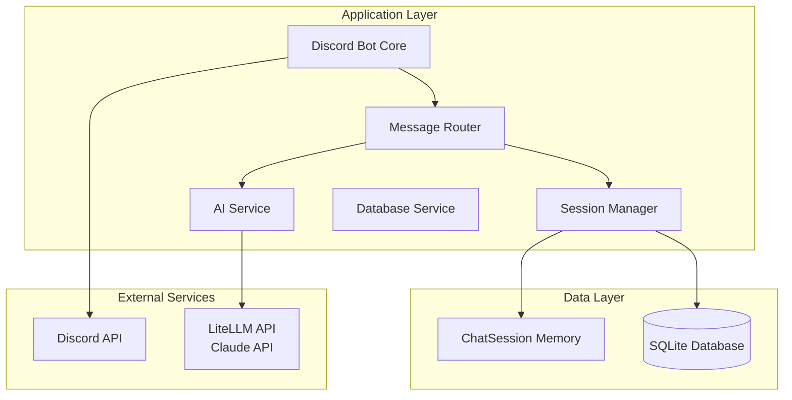
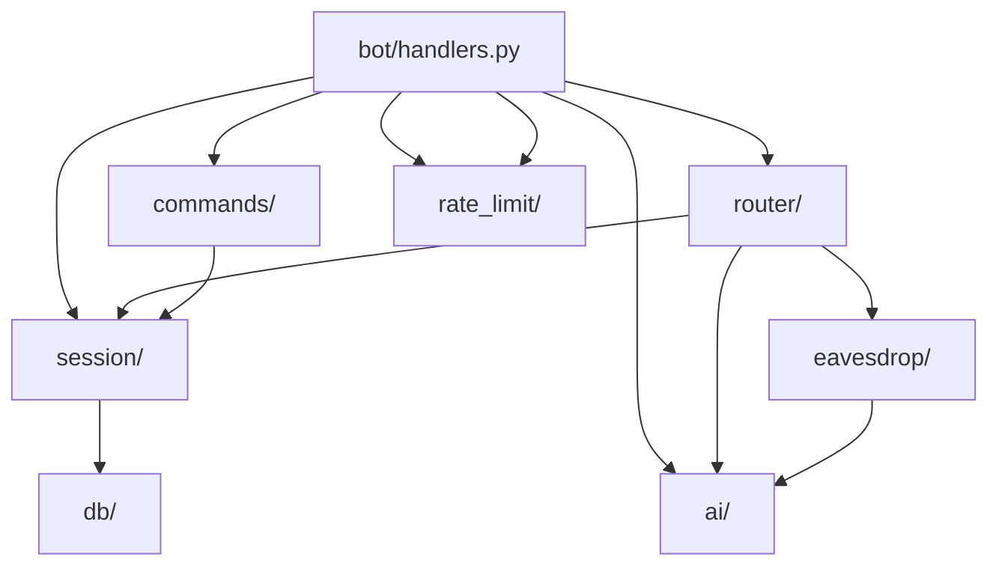
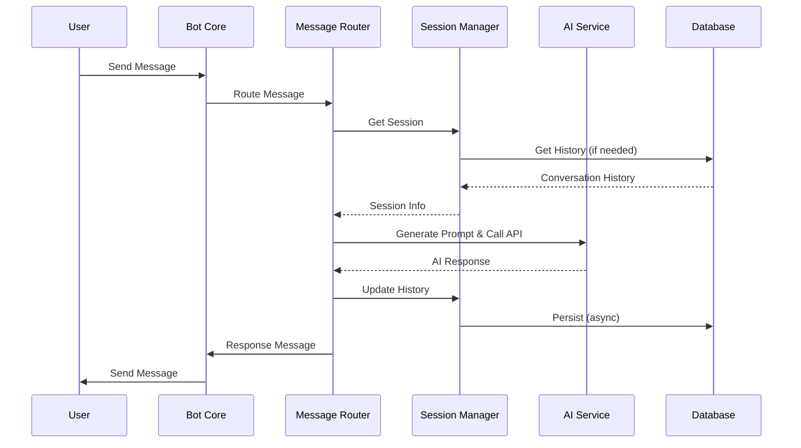
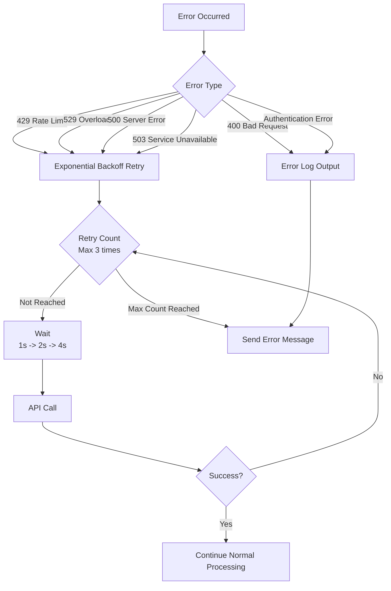

# 基本設計書

## 1. システム概要

### 1.1 システムの目的

場面緘黙自助グループの Discord サーバー運営を支援するため、安価な LLM API を使用したチャット AI 機能を統合した Discord ボット「KOTONOHA（コトノハ）」を開発する。

### 1.2 システムの範囲

- Discord ボットアプリケーション
- AI チャット機能（LiteLLM 経由、主に Anthropic Claude API - 有料だが安価）
- 会話履歴管理（SQL + ChatSession ハイブリッド）
- 3 つの会話の契機（メンション/スレッド/聞き耳型）
- CI/CD パイプライン
- Docker コンテナ化

### 1.3 システムの制約

- LLM API は有料だが安価なものを使用（Anthropic Claude API）
- Python 3.14 を使用
- SQLite データベースを使用
- Synology NAS 上で動作

---

## 2. アーキテクチャ設計

### 2.1 システムアーキテクチャ



### 2.2 レイヤー構成

| レイヤー                 | 責務                         | 主要モジュール                                 |
| ------------------------ | ---------------------------- | ---------------------------------------------- |
| **プレゼンテーション層** | Discord イベントの受信・送信 | `bot/`, `router/`                              |
| **アプリケーション層**   | ビジネスロジック             | `session/`, `ai/`, `eavesdrop/`, `rate_limit/` |
| **データアクセス層**     | データの永続化               | `db/`                                          |
| **外部サービス層**       | 外部 API との通信            | `ai/litellm_provider.py`                       |

---

## 3. モジュール設計

### 3.1 モジュール一覧

| モジュール                         | 責務                      | 依存関係                         |
| ---------------------------------- | ------------------------- | -------------------------------- |
| `bot/handlers.py`                  | Discord Bot のメイン処理  | `router/`, `session/`, `ai/`     |
| `router/message_router.py`         | メッセージのルーティング  | `session/`, `ai/`                |
| `session/manager.py`               | セッション管理            | `session/chat_session.py`, `db/` |
| `session/chat_session.py`          | セッションクラス          | -                                |
| `ai/provider.py`                   | AI プロバイダー抽象クラス | -                                |
| `ai/litellm_provider.py`           | LiteLLM 統合実装          | `ai/provider.py`                 |
| `eavesdrop/llm_judge.py`           | LLM 判断機能              | `ai/`                            |
| `eavesdrop/conversation_buffer.py` | 会話バッファ管理          | -                                |
| `db/sqlite.py`                     | SQLite 操作               | -                                |
| `commands/chat.py`                 | スラッシュコマンド        | `session/`                       |
| `rate_limit/request_queue.py`      | リクエストキュー管理      | -                                |
| `rate_limit/monitor.py`            | レート制限監視            | -                                |

### 3.2 モジュール間の依存関係



---

## 4. データ設計

### 4.1 データフロー



### 4.2 データ構造

**セッション**:

```python
{
    "session_key": str,
    "session_type": str,
    "messages": List[Message],
    "created_at": datetime,
    "last_activity": datetime
}
```

**メッセージ**:

```python
{
    "role": str,  # "user" | "assistant" | "system"
    "content": str,
    "timestamp": datetime,
    "message_id": int | None
}
```

---

## 5. インターフェース設計

### 5.1 外部インターフェース

| インターフェース     | プロトコル     | 用途                      |
| -------------------- | -------------- | ------------------------- |
| **Discord API**      | WebSocket/HTTP | Discord との通信          |
| **LiteLLM API**      | HTTP/REST      | AI 応答生成               |
| **Anthropic Claude** | HTTP/REST      | AI モデル（LiteLLM 経由） |
| **SQLite**           | SQL            | データ永続化              |

### 5.2 内部インターフェース

| インターフェース    | 形式          | 用途                   |
| ------------------- | ------------- | ---------------------- |
| **Session Manager** | Python クラス | セッション管理         |
| **AI Service**      | Python クラス | AI 応答生成            |
| **Message Router**  | Python クラス | メッセージルーティング |

---

## 6. エラーハンドリング設計

### 6.1 エラー分類

| エラーレベル | 説明           | 処理                                           |
| ------------ | -------------- | ---------------------------------------------- |
| **ERROR**    | 通常のエラー   | エラーログ出力、ユーザーに通知                 |
| **CRITICAL** | 致命的なエラー | エラーログ出力、管理者に通知、Bot 停止の可能性 |

### 6.2 エラー処理フロー



**リトライロジックの詳細**:

- **リトライ対象**: `RateLimitError` (429), `InternalServerError` (500, 529),
  `ServiceUnavailable` (503)
- **リトライ回数**: 最大 3 回（`LLM_MAX_RETRIES`で設定可能）
- **待機時間**: 指数バックオフ（1 秒 → 2 秒 → 4 秒）
- **リトライ対象外**: `AuthenticationError`（認証エラーは即座に失敗）

---

## 7. セキュリティ設計

### 7.1 認証・認可

- **Discord Bot Token**: 環境変数で管理
- **Anthropic API Key**: 環境変数で管理（LiteLLM 経由）
- **データベース**: ファイルシステムの権限で保護

### 7.2 データ保護

- **プライバシー保護**: ユーザーごとのセッション分離
- **データの最小化**: 必要最小限のデータのみ保存
- **入力のサニタイゼーション**: SQL インジェクション対策

---

## 8. パフォーマンス設計

### 8.1 応答時間目標

| 処理                               | 目標時間   |
| ---------------------------------- | ---------- |
| **メッセージ受信から応答送信まで** | 3 秒以内   |
| **セッション取得**                 | 100ms 以内 |
| **データベース操作**               | 50ms 以内  |

### 8.2 スケーラビリティ

- **同時セッション数**: 最大 100（メモリ内）
- **メッセージ処理**: 非同期処理で並行実行
- **データベース**: SQLite（将来的に PostgreSQL への移行を検討）

---

**作成日**: 2026 年 1 月 14 日
**最終更新日**: 2026 年 1 月 14 日
**バージョン**: 1.1
**作成者**: kotonoha-bot 開発チーム
