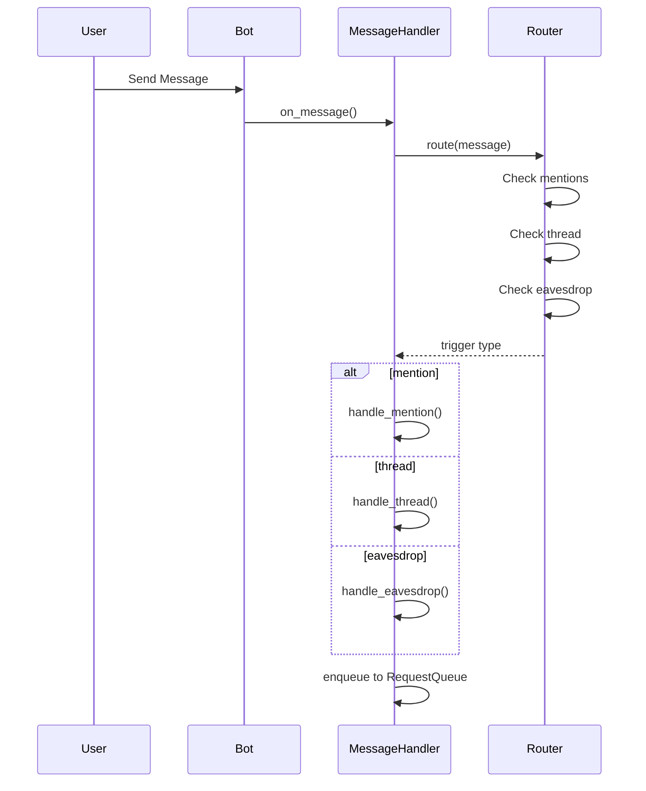
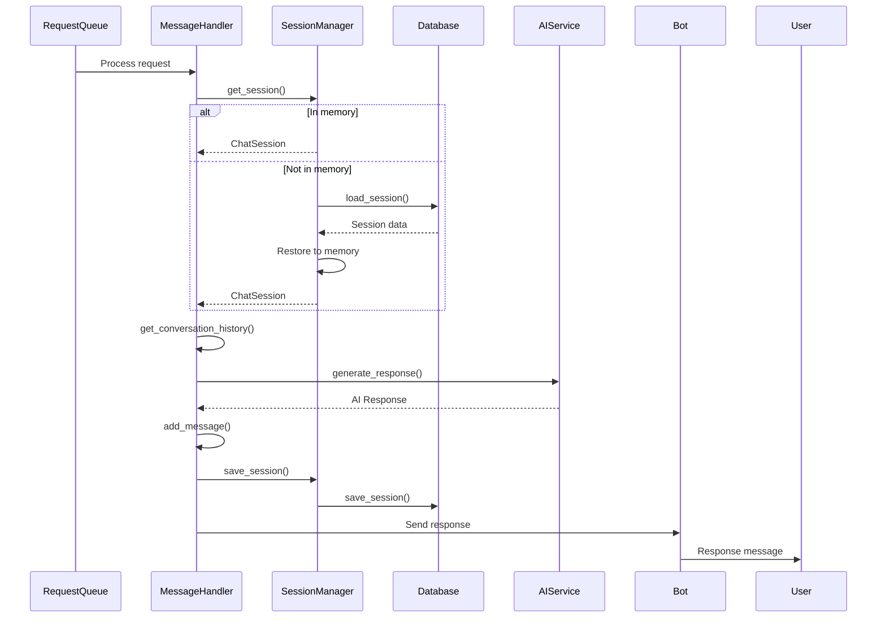

# 詳細設計書

## 1. モジュール仕様書

### 1.1 `bot/client.py` - Discord Bot クライアント

**責務**: Discord Bot のクライアント実装

**主要クラス**:

- `KotonohaBot`: Discord Bot のメインクラス（`commands.Bot` を継承）

**主要メソッド**:

- `on_ready()`: Bot 起動時の処理
- `on_error(event_method, ...)`: エラーハンドリング

**依存関係**:

- `discord.ext.commands`
- `config`

---

### 1.1.1 `bot/handlers.py` - メッセージハンドラー

**責務**: Discord イベントのハンドリング、メッセージ処理

**主要クラス**:

- `MessageHandler`: メッセージハンドラー

**主要メソッド**:

- `handle_mention(message)`: メンション応答型の処理
- `handle_thread(message)`: スレッド型の処理
- `handle_eavesdrop(message)`: 聞き耳型の処理
- `_process_mention(message)`: メンション処理の実装
- `_process_thread_creation(message)`: スレッド作成処理
- `_process_thread_message(message)`: スレッド内メッセージ処理
- `_process_eavesdrop(message)`: 聞き耳型処理の実装

**依存関係**:

- `router.message_router`
- `session.manager`
- `ai.litellm_provider`
- `eavesdrop.llm_judge`
- `eavesdrop.conversation_buffer`
- `rate_limit.request_queue`

---

### 1.2 `router/message_router.py` - メッセージルーター

**責務**: メッセージのルーティング、会話の契機判定

**主要クラス**:

- `MessageRouter`: メッセージルーティングクラス

**主要メソッド**:

- `route(message)`: メッセージをルーティングし、会話の契機を判定
- `_should_create_thread(message)`: スレッド型を有効にするか判定
- `_is_bot_thread(thread)`: Bot によって作成されたスレッドか判定
- `_should_eavesdrop(message)`: 聞き耳型を有効にするか判定
- `register_bot_thread(thread_id)`: Bot が作成したスレッドを記録
- `enable_thread_for_channel(channel_id)`: チャンネルでスレッド型を有効化
- `disable_thread_for_channel(channel_id)`: チャンネルでスレッド型を無効化
- `enable_eavesdrop_for_channel(channel_id)`: チャンネルで聞き耳型を有効化
- `disable_eavesdrop_for_channel(channel_id)`: チャンネルで聞き耳型を無効化

**依存関係**:

- `discord`

---

### 1.3 `session/manager.py` - セッション管理

**責務**: セッションの作成、取得、更新、削除

**主要クラス**:

- `SessionManager`: セッション管理クラス

**主要メソッド**:

- `get_session(session_key)`: セッションを取得（メモリから、または SQLite から復元）
- `create_session(session_key, session_type, **kwargs)`: セッションを作成
- `add_message(session_key, role, content)`: セッションにメッセージを追加
- `save_session(session_key)`: セッションを SQLite に保存
- `save_all_sessions()`: 全セッションを SQLite に保存
- `cleanup_old_sessions()`: 古いセッションをメモリから削除
- `_load_active_sessions()`: アクティブなセッションを SQLite から読み込み

**依存関係**:

- `session.chat_session`
- `db.sqlite`

---

### 1.4 `session/chat_session.py` - セッションクラス

**責務**: セッションのデータ構造と操作

**主要クラス**:

- `ChatSession`: セッションクラス

**主要メソッド**:

- `add_message(role, content)`: メッセージを追加（`last_active_at` も自動更新）
- `get_conversation_history(limit)`: 会話履歴を取得
- `to_dict()`: 辞書形式に変換
- `from_dict(data)`: 辞書から復元

**依存関係**: なし

---

### 1.5 `ai/provider.py` - AI プロバイダー抽象クラス

**責務**: AI プロバイダーの抽象化インターフェース

**主要クラス**:

- `AIProvider`: 抽象基底クラス

**主要メソッド（抽象）**:

- `generate_response(messages, system_prompt, model, max_tokens)`: 応答を生成

**依存関係**: なし

---

### 1.6 `ai/litellm_provider.py` - LiteLLM 統合実装

**責務**: LiteLLM を使用したマルチプロバイダー LLM 統合

**主要クラス**:

- `LiteLLMProvider`: LiteLLM 統合プロバイダー

**主要メソッド**:

- `generate_response(messages, system_prompt, model, max_tokens)`: 応答を生成
- `get_last_used_model()`: 最後に使用したモデル名を取得
- `get_rate_limit_usage()`: レート制限使用率を取得

**対応プロバイダー**:

- **開発**: `claude-haiku-4-5`（Anthropic Claude API、超低コスト）
- **本番**: `claude-opus-4-5`（Claude API）

**依存関係**:

- `ai.provider`
- `litellm`
- `rate_limit.monitor`
- `rate_limit.token_bucket`

---

### 1.7 `eavesdrop/llm_judge.py` - LLM 判断機能

**責務**: 聞き耳型の LLM 判断（アプローチ 1）

**主要クラス**:

- `LLMJudge`: LLM 判断クラス

**主要メソッド**:

- `should_respond(messages)`: 発言すべきか判定
- `_create_judge_prompt(messages)`: 判定用プロンプトを作成
- `_parse_judgment(response)`: 判定結果をパース

**依存関係**:

- `ai.litellm_provider`
- `session.manager`
- `eavesdrop.conversation_buffer`

---

### 1.8 `eavesdrop/conversation_buffer.py` - 会話バッファ管理

**責務**: 聞き耳型の会話バッファ管理

**主要クラス**:

- `ConversationBuffer`: 会話バッファクラス

**主要メソッド**:

- `add_message(channel_id, message)`: メッセージをバッファに追加
- `get_recent_messages(channel_id, limit)`: 直近のメッセージを取得
- `clear(channel_id)`: チャンネルのバッファをクリア

**依存関係**: なし

---

### 1.9 `db/sqlite.py` - SQLite 操作

**責務**: SQLite データベースの操作

**主要クラス**:

- `SQLiteDatabase`: SQLite データベースクラス

**主要メソッド**:

- `save_session(session)`: セッションを保存（メッセージ履歴も JSON 形式で保存）
- `load_session(session_key)`: セッションを読み込み
- `load_all_sessions()`: 全セッションを読み込み
- `delete_session(session_key)`: セッションを削除
- `_get_connection()`: データベース接続を取得（WAL モード有効化）

**依存関係**:

- `sqlite3`
- `session.models`

---

### 1.10 `commands/chat.py` - スラッシュコマンド

**責務**: スラッシュコマンドの処理

**主要クラス**:

- `ChatCommands`: チャットコマンドクラス

**主要メソッド**:

- `chat_reset(interaction)`: `/chat reset` コマンド（会話履歴をリセット）
- `chat_status(interaction)`: `/chat status` コマンド（セッション状態を表示）

**依存関係**:

- `bot.handlers`
- `discord.app_commands`

---

### 1.11 `rate_limit/request_queue.py` - リクエストキュー管理

**責務**: リクエストの優先度管理とキューイング

**主要クラス**:

- `RequestQueue`: リクエストキュー管理クラス
- `RequestPriority`: 優先度の列挙型（`EAVESDROP`, `MENTION`, `THREAD`）

**主要メソッド**:

- `enqueue(priority, func, *args, **kwargs)`: リクエストをキューに追加
- `start()`: キュー処理を開始
- `stop()`: キュー処理を停止

**依存関係**: なし

---

### 1.12 `rate_limit/monitor.py` - レート制限監視

**責務**: レート制限の監視と警告

**主要クラス**:

- `RateLimitMonitor`: レート制限監視クラス

**主要メソッド**:

- `record_request(provider)`: リクエストを記録
- `check_warning(provider)`: 警告閾値をチェック
- `set_rate_limit(provider, limit, window_seconds)`: レート制限を設定

**依存関係**: なし

---

## 2. 関数仕様書

### 2.1 セッション管理関数

#### 2.1.1 `get_session(session_key: str) -> ChatSession | None`

**説明**: セッションを取得します。メモリにない場合は SQLite から復元します。

**パラメータ**:

- `session_key` (str): セッションキー

**戻り値**: `ChatSession` オブジェクト、または `None`

**処理フロー**:

1. メモリ内のセッションを検索
2. 見つからない場合、SQLite から取得
3. SQLite から取得した場合、メモリに復元
4. セッションを返す

**例外**:

- `DatabaseError`: データベースエラー

---

#### 2.1.2 `create_session(session_key: str, session_type: str, **kwargs) -> ChatSession`

**説明**: 新しいセッションを作成します。

**パラメータ**:

- `session_key` (str): セッションキー
- `session_type` (str): セッションタイプ
- `**kwargs`: 追加パラメータ

**戻り値**: `ChatSession` オブジェクト

**処理フロー**:

1. セッションキーの形式を検証
2. `ChatSession` オブジェクトを作成
3. メモリに保存
4. SQLite にメタデータを保存（非同期）
5. セッションを返す

**例外**:

- `ValueError`: 無効なパラメータ
- `DatabaseError`: データベースエラー

---

### 2.2 AI 関数

#### 2.2.1 `generate_response()`

**説明**: AI で応答を生成します。

**パラメータ**:

- `messages` (List[Message]): 会話履歴
- `system_prompt` (str, optional): システムプロンプト

**戻り値**: AI が生成した応答テキスト

**処理フロー**:

1. プロンプトを生成（システムプロンプト + 会話履歴）
2. モデルを選択（Flash または Pro）
3. API を呼び出し
4. レスポンスをパース
5. 応答テキストを返す

**例外**:

- `APIError`: API エラー
- `RateLimitError`: レート制限超過
- `TimeoutError`: タイムアウト

---

#### 2.2.2 `generate_response()` (LLMJudge)

**説明**: 聞き耳型で応答を生成します（`LLMJudge` クラス）。

**パラメータ**:

- `channel_id` (int): チャンネル ID
- `recent_messages` (List[Message]): 直近のメッセージ

**戻り値**: 生成された応答テキスト、または `None`（発言しない場合）

**処理フロー**:

1. 会話の流れを分析
2. 発言すべきか判定
3. 発言すべき場合、応答を生成
4. 応答テキストを返す

**例外**:

- `APIError`: API エラー
- `RateLimitError`: レート制限超過

---

### 2.3 データベース関数

#### 2.3.1 `load_session(session_key: str) -> ChatSession | None`

**説明**: SQLite からセッションを読み込みます。

**パラメータ**:

- `session_key` (str): セッションキー

**戻り値**: `ChatSession` オブジェクト、または `None`

**処理フロー**:

1. SQL クエリを実行
2. メッセージ履歴を JSON から復元
3. `ChatSession` オブジェクトを作成
4. セッションを返す

**例外**:

- `DatabaseError`: データベースエラー

---

#### 2.3.2 `save_session(session: ChatSession) -> None`

**説明**: セッションを SQLite に保存します（メッセージ履歴も JSON 形式で保存）。

**パラメータ**:

- `session` (ChatSession): セッションオブジェクト

**処理フロー**:

1. メッセージ履歴を JSON 形式に変換
2. INSERT OR REPLACE を実行
3. セッションデータとメッセージ履歴を保存

**例外**:

- `DatabaseError`: データベースエラー

---

## 3. テーブル仕様書

### 3.1 sessions テーブル

**テーブル名**: `sessions`

**説明**: 会話セッションの情報とメッセージ履歴を管理します。メッセージは JSON 形式で `messages` カラムに保存されます。

| カラム名         | データ型 | NULL     | デフォルト | 説明                                                 |
| ---------------- | -------- | -------- | ---------- | ---------------------------------------------------- |
| `session_key`    | TEXT     | NOT NULL | -          | セッションキー（PRIMARY KEY）                        |
| `session_type`   | TEXT     | NOT NULL | -          | セッションタイプ（`mention`, `thread`, `eavesdrop`） |
| `messages`       | TEXT     | NOT NULL | -          | メッセージ履歴（JSON 形式）                          |
| `created_at`     | TEXT     | NOT NULL | -          | セッション作成日時（ISO 形式）                       |
| `last_active_at` | TEXT     | NOT NULL | -          | 最後のアクティビティ日時（ISO 形式）                 |
| `channel_id`     | INTEGER  | NULL     | -          | Discord チャンネル ID                                |
| `thread_id`      | INTEGER  | NULL     | -          | Discord スレッド ID（スレッド型の場合）              |
| `user_id`        | INTEGER  | NULL     | -          | Discord ユーザー ID                                  |

**制約**:

- PRIMARY KEY: `session_key`

**インデックス**:

- `idx_last_active_at`: `last_active_at`
- `idx_session_type`: `session_type`

**注**: 現在の実装では、メッセージは別テーブルではなく、`sessions` テーブルの `messages` カラムに JSON 形式で保存されます。

---

## 4. データフロー詳細

### 4.1 メッセージ処理フロー

#### 4.1.1 ルーティング段階

#### 4.1.2 処理段階

---

**作成日**: 2026 年 1 月 14 日
**バージョン**: 1.0
**作成者**: kotonoha-bot 開発チーム
