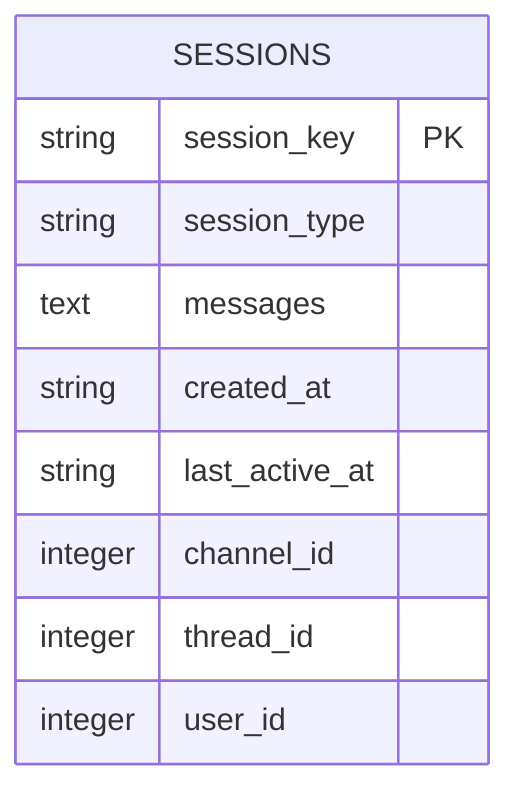
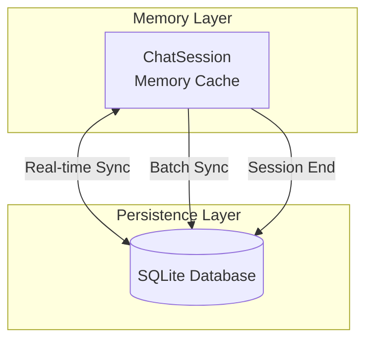
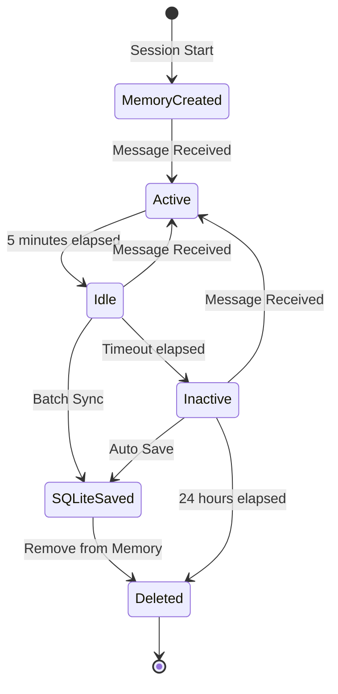

# ER 図・テーブル定義・永続化戦略

## 1. ER 図



## 2. テーブル定義

### 2.1 sessions テーブル

**説明**: 会話セッションの情報とメッセージ履歴を管理します。メッセージは JSON 形式で `messages` カラムに保存されます。

| カラム名         | データ型 | 制約        | 説明                                                 |
| ---------------- | -------- | ----------- | ---------------------------------------------------- |
| `session_key`    | TEXT     | PRIMARY KEY | セッションキー（一意）                               |
| `session_type`   | TEXT     | NOT NULL    | セッションタイプ（`mention`, `thread`, `eavesdrop`） |
| `messages`       | TEXT     | NOT NULL    | メッセージ履歴（JSON 形式）                          |
| `created_at`     | TEXT     | NOT NULL    | セッション作成日時（ISO 形式）                       |
| `last_active_at` | TEXT     | NOT NULL    | 最後のアクティビティ日時（ISO 形式）                 |
| `channel_id`     | INTEGER  | NULL        | Discord チャンネル ID                                |
| `thread_id`      | INTEGER  | NULL        | Discord スレッド ID（スレッド型の場合）              |
| `user_id`        | INTEGER  | NULL        | Discord ユーザー ID                                  |

**インデックス**:

- `idx_last_active_at`: `last_active_at`
- `idx_session_type`: `session_type`

**制約**:

- `session_key` は一意である必要がある
- `session_type` は必須
- `messages` は JSON 形式の文字列である必要がある

---

**注**: 現在の実装では、メッセージは別テーブルではなく、`sessions` テーブルの `messages` カラムに JSON 形式で保存されます。これにより、セッション単位でのデータ管理が簡潔になり、外部キー制約が不要になります。

---

## 3. SQL スキーマ

### 3.1 テーブル作成 SQL

```sql
-- sessions テーブル
CREATE TABLE IF NOT EXISTS sessions (
    session_key TEXT PRIMARY KEY,
    session_type TEXT NOT NULL,
    messages TEXT NOT NULL,
    created_at TEXT NOT NULL,
    last_active_at TEXT NOT NULL,
    channel_id INTEGER,
    thread_id INTEGER,
    user_id INTEGER
);
```

### 3.2 インデックス作成 SQL

```sql
-- sessions テーブルのインデックス
CREATE INDEX IF NOT EXISTS idx_last_active_at ON sessions(last_active_at);
CREATE INDEX IF NOT EXISTS idx_session_type ON sessions(session_type);
```

### 3.3 WAL モードと最適化設定

```sql
-- WAL モードを有効化（長時間稼働時のファイルロック問題を回避）
PRAGMA journal_mode=WAL;

-- 外部キー制約を有効化
PRAGMA foreign_keys=ON;

-- バスシーサイズを増やす（パフォーマンス向上）
PRAGMA busy_timeout=30000;  -- 30秒
```

---

## 4. 永続化戦略

### 4.1 ハイブリッド永続化アーキテクチャ



### 4.2 永続化タイミング

| タイミング           | 条件                               | 処理内容                                          |
| -------------------- | ---------------------------------- | ------------------------------------------------- |
| **セッション作成時** | 新しいセッションが作成された時     | 即座に SQLite に保存                              |
| **メッセージ追加後** | メッセージが追加された後           | 明示的に `save_session()` を呼び出した時のみ保存  |
| **バッチ同期**       | 5 分ごと                           | アイドル状態のセッションを保存                    |
| **セッション削除時** | タイムアウトしたセッションの削除時 | 削除前に SQLite に保存                            |
| **ボット再起動時**   | 起動時                             | SQLite からタイムアウトしていないセッションを復元 |

### 4.3 データのライフサイクル



### 4.4 データ保持ポリシー

| データ種別             | 保持期間         | 削除条件                                                  |
| ---------------------- | ---------------- | --------------------------------------------------------- |
| **メモリ内セッション** | アクティブな間   | `SESSION_TIMEOUT_HOURS`（デフォルト 24 時間）非アクティブ |
| **SQLite セッション**  | 無期限           | 手動削除のみ                                              |
| **メッセージ履歴**     | セッションと共に | セッション削除時に一緒に削除                              |

### 4.5 同期戦略

#### 4.5.1 セッション作成時の保存

**対象**: 新規作成されたセッション

- セッション作成時に即座に SQLite に保存

**処理**:

```python
def create_session(session_key: str, session_type: str, **kwargs):
    session = ChatSession(session_key, session_type, **kwargs)
    memory_sessions[session_key] = session
    db.save_session(session)  # 即座に保存
    return session
```

#### 4.5.2 バッチ同期

**対象**: アイドル状態のセッション

- 5 分ごとに実行
- 最後のアクティビティから 5 分以上経過したセッション

**処理**:

```python
async def batch_sync_task():
    now = datetime.now()
    idle_threshold = timedelta(minutes=5)

    for session_key, session in memory_sessions.items():
        time_since_activity = now - session.last_active_at
        if time_since_activity >= idle_threshold:
            db.save_session(session)
```

#### 4.5.3 セッション復元

**タイミング**: ボット再起動時

**処理**:

```python
def _load_active_sessions():
    all_sessions = db.load_all_sessions()
    now = datetime.now()
    timeout = timedelta(hours=Config.SESSION_TIMEOUT_HOURS)

    for session in all_sessions:
        # タイムアウトしていないセッションのみメモリに読み込む
        if now - session.last_active_at < timeout:
            memory_sessions[session.session_key] = session
```

---

## 5. データベース操作パターン

### 5.1 セッション作成

```python
def create_session(session_key: str, session_type: str, **kwargs):
    # メモリに作成
    session = ChatSession(session_key, session_type, **kwargs)
    memory_sessions[session_key] = session

    # SQLite にも即座に保存（メッセージ履歴も含む）
    db.save_session(session)
    return session
```

### 5.2 メッセージ追加

```python
def add_message(session_key: str, role: MessageRole, content: str):
    # メモリに追加
    session = get_session(session_key)
    if not session:
        raise KeyError(f"Session not found: {session_key}")

    session.add_message(role, content)
    # メッセージ追加後は明示的に save_session() を呼び出す必要がある
```

### 5.3 セッション取得

```python
def get_session(session_key: str) -> ChatSession | None:
    # まずメモリから取得
    if session_key in memory_sessions:
        return memory_sessions[session_key]

    # メモリにない場合は SQLite から復元
    session = db.load_session(session_key)
    if session:
        # メッセージ履歴は JSON から自動的に復元される
        memory_sessions[session_key] = session
        return session

    return None
```

---

## 6. パフォーマンス最適化

### 6.1 クエリ最適化

- **インデックスの活用**: 頻繁に検索するカラムにインデックスを作成
- **LIMIT 句の使用**: 履歴取得時は LIMIT 句を使用
- **ページネーション**: 大量のデータを取得する場合はページネーション

### 6.2 WAL モード

実装では、データベース接続取得時に自動的に WAL モードが有効化されます：

```python
def _get_connection(self) -> sqlite3.Connection:
    conn = sqlite3.connect(str(self.db_path), timeout=30.0, check_same_thread=False)
    conn.execute("PRAGMA journal_mode=WAL")
    conn.execute("PRAGMA foreign_keys=ON")
    conn.execute("PRAGMA busy_timeout=30000")  # 30秒
    return conn
```

### 6.3 接続管理

- 各操作で新しい接続を取得し、コンテキストマネージャーで自動的にクローズ
- 長時間稼働時のファイルロック問題を WAL モードで回避
- タイムアウト設定により、同時アクセス時の待機を制御

---

**作成日**: 2026 年 1 月 14 日
**バージョン**: 1.0
**作成者**: kotonoha-bot 開発チーム
