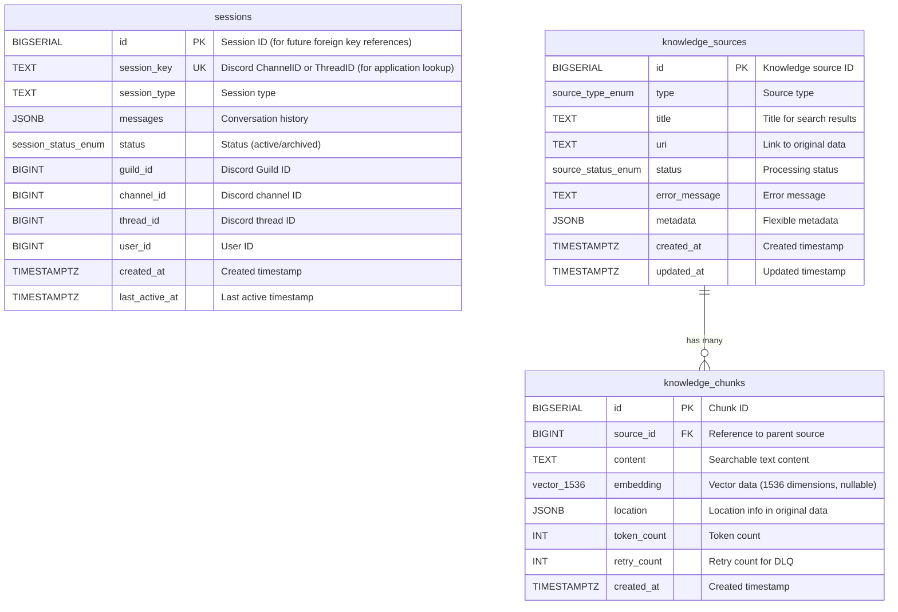

# PostgreSQL スキーマ設計書 - 概要

**作成日**: 2026年1月19日  
**バージョン**: 1.22  
**対象プロジェクト**: kotonoha-bot v0.8.0  
**データベース**: PostgreSQL 18 + pgvector 0.8.1

> **注記（2026年1月時点）**: 
> - PostgreSQL 18は2025年9月25日に正式リリースされた最新版である。非同期I/O（AIO）サブシステム、UUIDv7サポート、仮想生成カラム（デフォルト）などの新機能が含まれている。
> - pgvector 0.8.1はPostgreSQL 18 RC1をサポート（2025年9月4日リリース）。HNSWインデックスはpgvector 0.5.0以降で利用可能であり、0.8.1でも完全にサポートされている。
> - asyncpgについては、0.29.0はPostgreSQL 18を公式にはサポートしていないが、最新版はPostgreSQL 18をサポートしている。本番環境では最新版の使用を推奨する。

## 関連ドキュメント

- [テーブル定義](./postgresql-schema-tables.md)
- [インデックス設計](./postgresql-schema-indexes.md)
- [完全なDDLスクリプト](./postgresql-schema-ddl.md)
- [クエリガイド](../../50_implementation/51_guides/postgresql-query-guide.md)
- [実装ガイド](../../50_implementation/51_guides/postgresql-implementation-guide.md)

---

## 1. 概要

### 1.1 目的

このスキーマ設計書は、kotonoha-bot の PostgreSQL データベーススキーマを定義します。以下の機能を実現するための設計です：

- **短期記憶（Sessions）**: Discord Bot のリアルタイム会話セッション管理
- **長期記憶（Knowledge Base）**: ベクトル検索による統合知識ベース
- **マルチモーダル対応**: 会話、ファイル、Web、画像、音声など多様なデータソースの統合管理

### 1.2 設計思想

#### すべてのデータを「Source」と「Chunk」に抽象化する

- **Source（親）**: データの「出処」を管理（ファイルメタデータ、WebのURL、Discordのスレッド情報）
- **Chunk（子）**: 検索対象となる「テキスト実体」と「ベクトル」を管理

この設計により、将来の機能拡張（動画検索など）にも柔軟に対応できます。

### 1.3 技術スタック

- **データベース**: PostgreSQL 18（2024年9月リリース）
- **ベクトル拡張**: pgvector 0.8.1（HNSWインデックス対応、PostgreSQL 18 サポート）
  - **Pythonライブラリ**: `pgvector>=0.3.6`（pgvector 0.8.x 拡張に対応）
- **非同期ライブラリ**: asyncpg 0.29.0以降
- **Embeddingモデル**: OpenAI text-embedding-3-small (1536次元)

### 1.4 PostgreSQL 18 使用に伴うテスト戦略

PostgreSQL 18は比較的新しいバージョンであるため、本番環境での安定性を確保するために、**テストスクリプトを充実させる方針**を採用します。

#### テスト戦略の重点項目

1. **統合テストの充実**
   - PostgreSQL 18 + pgvector 0.8.1 の組み合わせでの動作確認
   - HNSWインデックスの構築・検索性能テスト
   - halfvec型の型キャストと演算のテスト

2. **パフォーマンステスト**
   - 大量データ（10万件以上）でのインデックス構築時間の測定
   - ベクトル検索のクエリ性能テスト
   - 接続プールの負荷テスト

3. **互換性テスト**
   - asyncpg 0.29.0以降との互換性確認
   - pgvector-python ライブラリとの型登録テスト
   - JSONBコーデックの動作確認

4. **回帰テスト**
   - 既存機能（SQLite移行前の機能）の動作確認
   - データマイグレーションスクリプトのテスト

5. **CI/CDでの自動テスト**
   - GitHub Actionsでの自動テスト実行
   - PostgreSQL 18コンテナを使用した統合テスト
   - テストカバレッジ80%以上の維持

**テスト実装の詳細**: テストスクリプトの実装方法については、
[11. 実装上の注意事項とベストプラクティス](#11-実装上の注意事項とベストプラクティス)
のセクションを参照してください。

---

## 2. ER図



**構成の説明**:

- **Left Side (Sessions)**: Discord Botがリアルタイムに読み書きする領域。高速動作を優先。
- **Right Side (Knowledge)**: AI検索用。あらゆるデータ（会話、ファイル、Web）を
  「Source」と「Chunk」に抽象化して管理。
- **データフロー**: `sessions` テーブルの非アクティブなセッションは、
  バッチ処理によって `knowledge_sources` と `knowledge_chunks` に変換されます。

---

## 3. 拡張機能と型定義

### 3.1 拡張機能

```sql
-- ベクトル検索機能の有効化 (必須)
CREATE EXTENSION IF NOT EXISTS vector;
```

**要件**: pgvector 0.8.1（PostgreSQL 18 サポート、HNSWインデックス対応）

### 3.2 ENUM型定義

#### source_type_enum

データソースの種類を定義します。将来の拡張に対応できるよう、ENUM型を使用しています。

```sql
CREATE TYPE source_type_enum AS ENUM (
    'discord_session',   -- 会話ログ
    'document_file',     -- PDF, Word, Txt
    'web_page',          -- URLスクレイピング
    'image_caption',     -- 画像説明文
    'audio_transcript'   -- 音声議事録
);
```

**使用箇所**: `knowledge_sources.type`

#### session_status_enum

セッションの状態を定義します。短期記憶（sessions）テーブル専用です。

```sql
CREATE TYPE session_status_enum AS ENUM (
    'active',    -- 会話中
    'archived'   -- 知識化済み・アーカイブ
);
```

**使用箇所**: `sessions.status`

#### source_status_enum

知識ソースの処理ステータスを定義します。非同期パイプラインでの状態管理に使用します。

```sql
CREATE TYPE source_status_enum AS ENUM (
    'pending',      -- 処理待ち
    'processing',   -- ベクトル化やOCR処理中
    'completed',    -- 検索可能（すべてのチャンクが正常に処理された）
    'partial',      -- ⚠️ 改善（データ整合性）: 一部のチャンクがDLQに移動した（検索可能だが不完全）
    'failed'        -- エラー
);
```

**使用箇所**: `knowledge_sources.status`

**設計理由**: 意味論的に異なるステータスを分離することで、型安全性と可読性が向上します。

---