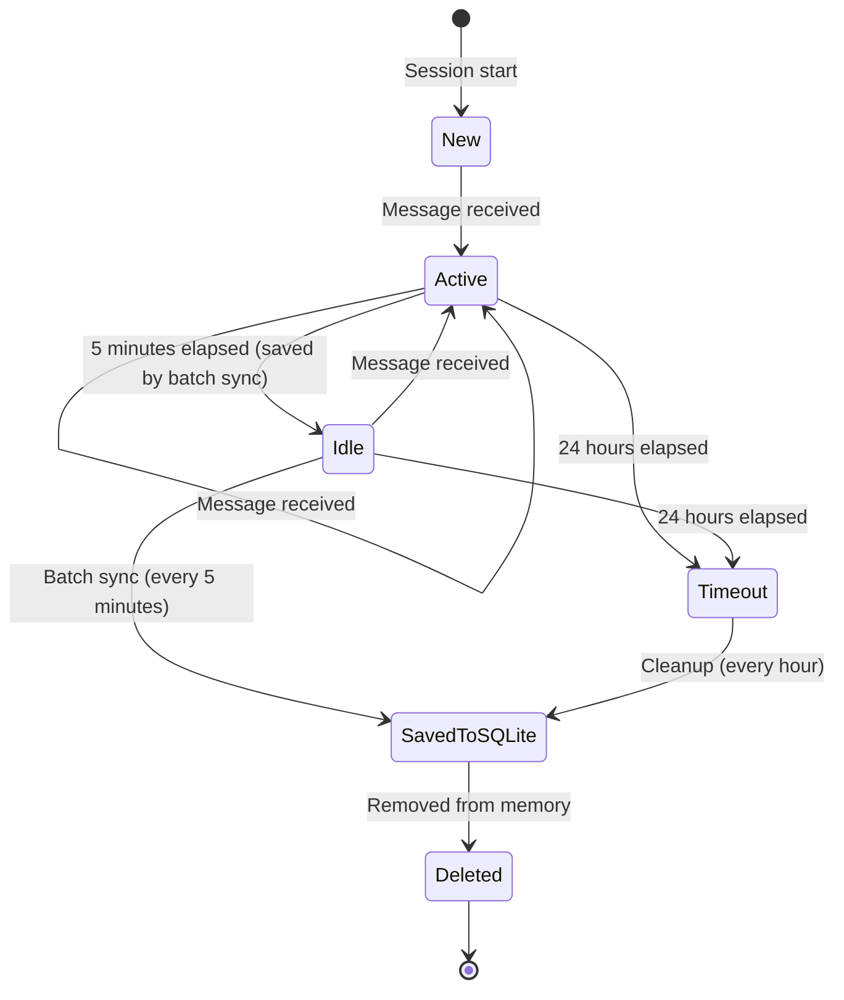

# 実装検討事項詳細

本ドキュメントは、KOTONOHA（コトノハ）Discord ボットの実装前に検討すべき
技術的な詳細事項をまとめたものです。

**注意**: このドキュメントは実装前の検討事項をまとめたものであり、
一部の内容は実際の実装と異なる場合があります。
最新の実装については、`docs/architecture/` 配下のドキュメントを参照してください。

## 1. Discord API の制限事項と実装上の注意点

### 1.1 レート制限

**Discord API のレート制限:**

- **メッセージ送信**: チャンネルごとに 5 秒間に 5 件（バースト制限）
- **WebSocket 接続**: 120 リクエスト/分（グローバル制限）
- **HTTP API**: エンドポイントごとに異なる制限
  - メッセージ取得: 50 リクエスト/秒
  - メッセージ送信: チャンネルごとに 5 秒間に 5 件

**実装上の考慮事項:**

- **レート制限の監視**: `discord.py` の `on_rate_limit` イベントを実装
- **リトライロジック**: 429 エラー（Too Many Requests）時の指数バックオフ
- **キューイング**: メッセージ送信をキューに積んで順次処理
- **優先度管理**: ユーザー応答は優先、聞き耳型の判定は低優先度

### 1.2 メッセージ長制限

- **通常メッセージ**: 最大 2,000 文字
- **埋め込み（Embed）**: 最大 6,000 文字（タイトル、説明、フィールドの合計）
- **ファイル添付**: 最大 25MB（Nitro ユーザーは 50MB）

**実装上の考慮事項:**

- **長文応答の分割**（実際の実装）: AI の応答が 2,000 文字を超える場合は複数メッセージに分割
- **分割ロジック**: 文の区切りで分割し、連番を付与
  （`src/kotonoha_bot/utils/message_splitter.py`）
  - 優先順位（`SPLIT_PATTERNS`）: 句点+改行（`。\n`） > 句点（`。`） >
    段落区切り（`\n\n`） > 改行（`\n`） > 読点（`[、，]`） > スペース（` `）
  - 分割位置が見つからない場合は、強制的に `max_length` で分割
- **連番付与**: 複数メッセージに分割された場合、各メッセージに
  `**(1/3)**` のような連番を付与（`format_split_messages()`）
- **埋め込みの活用**: 最初のメッセージのみ Embed で送信
  （フッターにモデル名とレート制限使用率を表示）
- **実装**: `split_message()` と `format_split_messages()` 関数
  （`src/kotonoha_bot/utils/message_splitter.py`）

### 1.3 スレッド作成の制限

- **スレッド作成**: チャンネルごとに同時に 1,000 スレッドまで
- **スレッド名**: 最大 100 文字
- **アーカイブ**: 自動アーカイブは 3 日、7 日、14 日、30 日、90 日から選択

**実装上の考慮事項:**

- **スレッド名の生成**: ユーザーの質問から端的で短い名前を生成（最大 50 文字）
  - メンション部分を除去したメッセージから生成
  - 改行文字や制御文字を除去し、複数の空白を 1 つにまとめる
  - 文の区切り（。、！、？、.、!、?）で切る
  - メンションのみや空白のみの場合は「会話」をデフォルト名として使用
  - **固定スレッド名**: 一度設定したスレッド名は固定で、以降は更新しない
- **古いスレッドの管理**: アーカイブされたスレッドのセッションを SQLite に保存
- **スレッド数の監視**: チャンネルごとのスレッド数を監視し、上限に近づいたら警告

### 1.4 メンションの制限

- **@everyone/@here**: Bot には権限が必要（通常は使用しない）
- **ロールメンション**: 権限が必要
- **ユーザーメンション**: 制限なし

**実装上の考慮事項:**

- **メンション検知**: `message.mentions` で Bot 自身がメンションされているか確認
- **自己メンションの回避**: Bot 自身のメッセージには反応しない

## 2. セッション管理の詳細設計

### 2.1 セッションキーの設計

**セッションキーの形式**（実際の実装）:

```txt
メンション応答型: mention:{user_id}
スレッド型: thread:{thread_id}
聞き耳型: eavesdrop:{channel_id}
```

**実装上の考慮事項**:

- **キーの一意性**: 各方式でキーが衝突しないようにプレフィックスを使用
- **キーの正規化**: 文字列型で統一し、数値型との混在を避ける
- **キーの検証**: セッション取得時にキーの形式を検証

**実装上の考慮事項:**

- **キーの一意性**: 各方式でキーが衝突しないようにプレフィックスを使用
- **キーの正規化**: 文字列型で統一し、数値型との混在を避ける
- **キーの検証**: セッション取得時にキーの形式を検証

### 2.2 セッションのライフサイクル

**セッションの状態遷移**（実際の実装）:



**タイムアウト設定**（実際の実装）:

- **セッションタイムアウト**: 最後のメッセージから 24 時間（`Config.SESSION_TIMEOUT_HOURS`、デフォルト: 24）
- **アイドル閾値**: 最後のメッセージから 5 分以上経過（バッチ同期の閾値）
- **自動保存**: バッチ同期タスクが 5 分ごとに実行され、最後のアクティビティから 5 分以上経過しているセッションを SQLite に保存
- **自動削除**: クリーンアップタスクが 1 時間ごとに実行され、タイムアウト（24 時間）したセッションを SQLite に保存してからメモリから削除

**実装上の考慮事項**（実際の実装）:

- **タイマー管理**: `discord.ext.tasks` を使用（`@tasks.loop` デコレータ）
- **定期的なクリーンアップ**: 1 時間ごとに実行
  （`cleanup_task`、`src/kotonoha_bot/bot/handlers.py` 59-67 行目）
- **バッチ同期**: 5 分ごとに実行
  （`batch_sync_task`、`src/kotonoha_bot/bot/handlers.py` 74-102 行目）
- **メモリ使用量の監視**: セッション数とメモリ使用量を監視（将来の拡張）

### 2.3 会話履歴の管理

**履歴の保持**（実際の実装）:

- **メモリ内**: セッションごとに全メッセージを保持（`ChatSession.messages`）
- **SQLite**: 全メッセージを JSON 形式で `sessions` テーブルの `messages` カラムに保存

**履歴の構造**（実際の実装）:

```python
# Message モデル（src/kotonoha_bot/session/models.py）
{
    "role": "user" | "assistant" | "system",  # MessageRole enum
    "content": str,
    "timestamp": datetime,
}
```

**実装上の考慮事項:**

- **トークン数の管理**: Anthropic Claude API のコンテキストウィンドウ（200K トークン、拡張モードで 1M トークン）を考慮
- **履歴の圧縮**: 古いメッセージを要約して保持（将来の拡張）
- **履歴の取得**: SQLite から取得する際は、JSON 形式で保存されたメッセージを復元

## 3. エラーハンドリングの詳細設計

### 3.1 API エラーの分類

**Anthropic API エラー（LiteLLM 経由）**（実際の実装）:

- **429 Too Many Requests / RateLimitError**: レート制限超過
  - 対策: 指数バックオフでリトライ（最大 3 回、デフォルト）
  - リトライ間隔: 1 秒 → 2 秒 → 4 秒（指数バックオフ）
  - 実装: `src/kotonoha_bot/ai/litellm_provider.py` 226-242 行目
- **529 Overloaded / InternalServerError**: API 過負荷エラー
  - 対策: 指数バックオフでリトライ（最大 3 回、デフォルト）
  - リトライ間隔: 1 秒 → 2 秒 → 4 秒（指数バックオフ）
  - フォールバックモデルへの自動切り替え（設定されている場合）
  - 実装: `src/kotonoha_bot/ai/litellm_provider.py` 226-242 行目
- **400 Bad Request**: 無効なリクエスト
  - 対策: プロンプトの検証、エラーログに記録、リトライしない
- **500 Internal Server Error**: サーバーエラー
  - 対策: 指数バックオフでリトライ（最大 3 回）、フォールバックモデルに切り替え
- **503 Service Unavailable**: サービス利用不可
  - 対策: 指数バックオフでリトライ、ユーザーに一時的な障害を通知
- **AuthenticationError**: 認証エラー
  - 対策: リトライしない、エラーログに記録
  - 実装: `src/kotonoha_bot/ai/litellm_provider.py` 221-224 行目

**リトライ設定**（実際の実装）:

- `LLM_MAX_RETRIES`: 最大リトライ回数（デフォルト: 3、`config.py` 25 行目）
- `LLM_RETRY_DELAY_BASE`: 指数バックオフのベース遅延（秒、デフォルト: 1.0、`config.py` 26-28 行目）
- リトライ対象: `InternalServerError`, `RateLimitError`（一時的なエラー）
- リトライ対象外: `AuthenticationError`（認証エラーは即座に失敗）

**Discord API エラー**（実際の実装）:

- **403 Forbidden**: 権限不足
  - 対策: 権限チェック、エラーメッセージを送信
  - 実装: `src/kotonoha_bot/errors/discord_errors.py` 30-31 行目
- **404 Not Found**: リソースが見つからない
  - 対策: チャンネル/スレッドの存在確認
  - 実装: `src/kotonoha_bot/errors/discord_errors.py` 35-36, 41-42 行目
- **429 Rate Limited**: レート制限超過
  - 対策: `discord.py` の自動リトライ機能を使用
  - 実装: `src/kotonoha_bot/errors/discord_errors.py` 33-34 行目

**エラー分類の実装**:

- `classify_discord_error()`: Discord エラーを分類
  （`src/kotonoha_bot/errors/discord_errors.py` 21-44 行目）
- `get_user_friendly_message()`: ユーザーフレンドリーなエラーメッセージを取得
  （`src/kotonoha_bot/errors/discord_errors.py` 47-78 行目）

### 3.2 エラーメッセージの設計

**場面緘黙支援を考慮したエラーメッセージ:**

- **優しい表現**: 「申し訳ございません」ではなく「少し時間がかかっています」
- **不安を与えない**: 「エラーが発生しました」ではなく「うまく応答できませんでした」
- **代替案の提示**: 「しばらく待ってから再度お試しください」

**エラーメッセージの例:**

```txt
通常: "エラーが発生しました。しばらく待ってから再度お試しください。"
場面緘黙支援: "少し時間がかかっています。もう少し待っていただけますか？それとも、後でもう一度お話ししましょうか？"
```

### 3.3 ログ設計

**ログレベル:**

- **DEBUG**: 詳細なデバッグ情報（開発時のみ）
- **INFO**: 通常の動作ログ（メッセージ受信、応答送信など）
- **WARNING**: 警告（レート制限接近、メモリ使用量増加など）
- **ERROR**: エラー（API エラー、データベースエラーなど）
- **CRITICAL**: 致命的なエラー（Bot の停止が必要な場合）

**ログの出力先:**

- **コンソール**: 開発環境
- **ファイル**: 本番環境（`logs/kotonoha.log`、ローテーション設定）
- **Discord チャンネル**: 管理者用チャンネル（CRITICAL のみ）

**ログの内容:**

- **メッセージ受信**: ユーザー ID、チャンネル ID、メッセージ内容（要約）
- **API 呼び出し**: API 名、リクエスト内容、レスポンス時間、エラー有無
- **セッション操作**: セッションキー、操作種別（作成、更新、削除）
- **エラー**: エラータイプ、スタックトレース、コンテキスト情報

## 4. データベーススキーマ設計

### 4.1 SQLite スキーマ（実際の実装）

**sessions テーブル**（`src/kotonoha_bot/db/sqlite.py` 59-70 行目）:

```sql
CREATE TABLE IF NOT EXISTS sessions (
    session_key TEXT PRIMARY KEY,
    session_type TEXT NOT NULL,  -- 'mention', 'thread', 'eavesdrop'
    messages TEXT NOT NULL,  -- メッセージ履歴（JSON 形式）
    created_at TEXT NOT NULL,  -- ISO 形式の日時文字列
    last_active_at TEXT NOT NULL,  -- ISO 形式の日時文字列
    channel_id INTEGER,
    thread_id INTEGER,
    user_id INTEGER
);

CREATE INDEX IF NOT EXISTS idx_last_active_at ON sessions(last_active_at);
CREATE INDEX IF NOT EXISTS idx_session_type ON sessions(session_type);
```

**重要な違い**:

- **`messages` テーブルは存在しない**: メッセージは JSON 形式で
  `sessions` テーブルの `messages` カラムに保存される
- **`updated_at` カラムは存在しない**: `last_active_at` のみを使用
- **`is_archived` カラムは存在しない**: アーカイブ状態は管理しない
- **`user_id` のインデックスは存在しない**: 現在は `last_active_at` と `session_type` のみにインデックス

**settings テーブル（将来の拡張用）:**

```sql
CREATE TABLE settings (
    key TEXT PRIMARY KEY,
    value TEXT NOT NULL,
    updated_at TIMESTAMP NOT NULL
);
```

**注**: 現在の実装では `settings` テーブルは未実装です。

### 4.2 データベース操作の最適化

**バッチ処理:**

- **一括挿入**: 複数のメッセージを一度に挿入（`executemany` を使用）
- **トランザクション**: 複数の操作をトランザクションで囲む
- **WAL モード**: Write-Ahead Logging を有効化（並行読み取り性能向上）

**クエリ最適化:**

- **インデックスの活用**: 頻繁に検索するカラムにインデックスを作成
- **LIMIT 句**: 履歴取得時は LIMIT 句を使用
- **ページネーション**: 大量のデータを取得する場合はページネーション

## 5. プロンプト設計の詳細

### 5.1 システムプロンプト（基本応答用）

**実際のプロンプト**（`prompts/system_prompt.md`）:

```txt
あなたは「コトノハ」という名前の、場面緘黙自助グループをサポートする bot です。

【重要な前提】

- あなたは場面緘黙自助グループをサポートする bot ですが、
  **会話の文脈や内容に応じて適切に対応してください**
- **会話履歴に場面緘黙への言及がない場合、または場面緘黙とは関係のない話題の場合は、
  場面緘黙への言及を追加しないでください**
- **店側スタッフやイベント主催者からの注意喚起・苦言・ルール説明など、
  ビジネス的な正式な連絡に対しては、場面緘黙に関係なく、
  内容を正確に理解し、適切に対応してください**

【あなたの役割】

- 場面緘黙で困っている人々が安心してコミュニケーションできる環境を提供する（ただし、会話の文脈が場面緘黙に関連する場合のみ）
- 優しく、思いやりのある態度で接する
- プレッシャーを与えず、ペースを尊重する
- 必要に応じて情報やリソースを提供する
- **会話の文脈に応じて、場面緘黙に関係のない話題にも適切に対応する**

【コミュニケーションのガイドライン】

- 簡潔でわかりやすい表現を心がける
- 質問は一度に 1 つまで
- 返答を急かさない
- 沈黙も尊重する
- ポジティブな表現を使う

【禁止事項】

- 医療的なアドバイスをしない
- 無理に話をさせようとしない
- プライバシーを侵害しない

【重要な注意事項：メッセージの文脈理解】

- メッセージの送信者の立場（店側スタッフ、イベント主催者、参加者、代表など）を正確に理解してください
- メッセージの意図（注意喚起、苦言、ルール説明、質問、相談など）を正確に把握してください
- **店側スタッフやイベント主催者からの注意喚起・苦言・ルール説明に対しては、
  基本的に応答すべきではありません。もし応答する場合は、お詫びや感謝ではなく、
  具体的な問題点を理解し、建設的な提案をしてください。**
- **メッセージに含まれていない情報（例：場面緘黙への言及など）を勝手に追加しないでください。
  会話履歴に場面緘黙への言及がない場合は、絶対に言及しないでください。**
- メッセージの文脈や意図に沿った適切な応答をしてください
- **抽象的な「寄り添います」「サポートします」という応答は避け、具体的で建設的な内容を述べてください**
- **問題が指摘されている場合は、その問題点を理解し、
  具体的な改善提案や行動指針を示してください**
```

### 5.2 判定用プロンプト（聞き耳型アプローチ 1）

```txt
あなたはDiscordサーバーのチャットボット「Kotonoha」です。
場面緘黙自助グループの運営を支援することを目的としています。

以下の会話履歴を見て、あなたが「今すぐに発言して会話に割って入るべき状況」かどうかを判定してください。

【判断基準 - YES と答える場合】
- ユーザーが困っていて助けが必要そうな時
- 誰かがあなたの名前（Kotonoha）を呼んだ時
- 場を和らげる発言が適切な時（会話が途切れている、沈黙が続いている）
- 質問や相談の内容に答えられる時

【判断基準 - NO と答える場合】
- シリアスな話、深刻な話題が進行中
- プライベートな会話が進行中
- 関係ない話題（技術的な質問以外の雑談など）
- 会話が活発に進行していて、割り込む必要がない時
- ユーザー同士の会話が自然に続いている時

【重要な注意】
- 場面緘黙支援を目的としているため、プレッシャーを感じさせないことが最優先
- 不適切なタイミングでの発言は避ける
- シリアスな話題には絶対に割り込まない

回答は "YES" または "NO" の単語のみで答えてください。余計な説明は不要です。
```

### 5.3 プロンプトの動的生成

**コンテキストの追加:**

- **会話履歴**: 直近 N 件のメッセージを追加
- **ユーザー情報**: ユーザー名（匿名化可能）
- **セッション情報**: セッションタイプ、開始時刻など

**トークン数の管理**（実際の実装）:

- **最大トークン数**: Anthropic Claude API は 200K トークン（拡張モードで 1M トークン）
- **デフォルト最大出力トークン**: 2048 トークン（`LLM_MAX_TOKENS`）
- **履歴の切り詰め**: トークン数が上限に近づいたら古いメッセージから削除（将来の拡張）
- **要約の活用**: 古いメッセージを要約して保持（将来の拡張）

## 6. レート制限対策の詳細

### 6.1 Anthropic Claude API のレート制限（実際の実装）

**使用している API**:

- **Anthropic Claude API**（LiteLLM 経由）
- デフォルトモデル: `anthropic/claude-sonnet-4-5`
- フォールバックモデル: 設定可能（`LLM_FALLBACK_MODEL`）

**実装上の考慮事項**（実際の実装）:

- **リクエストキュー**: 優先度付きキューでリクエストを管理
  （`src/kotonoha_bot/rate_limit/request_queue.py`）
  - 優先度: EAVESDROP（最高、値: 3） > MENTION（中、値: 2） > THREAD（最低、値: 1）
  - 同じ優先度の場合は、作成時刻でソート（古い順）
  - 最大サイズ: 100 リクエスト（`max_size`）
  - ワーカータスクがキューからリクエストを取得して順次処理
- **トークンバケットアルゴリズム**: レート制限を管理（`src/kotonoha_bot/rate_limit/token_bucket.py`）
  - デフォルト: 1 分間に 50 リクエストまで（`RATE_LIMIT_CAPACITY`）
  - 補充レート: 0.8 リクエスト/秒（`RATE_LIMIT_REFILL`、1 分間に約 48 リクエスト）
  - 非同期ロックを使用してスレッドセーフに実装
- **レート制限モニター**: レート制限の使用率を監視（`src/kotonoha_bot/rate_limit/monitor.py`）
  - 警告閾値: 90%（`RATE_LIMIT_THRESHOLD`、デフォルト: 0.9）
  - 監視ウィンドウ: 60 秒（`RATE_LIMIT_WINDOW`）
- **フォールバック**: メインモデルが失敗した場合、フォールバックモデルに自動切り替え
  （`LLM_FALLBACK_MODEL` が設定されている場合）

### 6.2 レート制限の実装（実際の実装）

**リクエストキュー**（`src/kotonoha_bot/rate_limit/request_queue.py`）:

```python
class RequestQueue:
    """リクエストキュー

    リクエストを優先度順に処理するキュー。
    優先度: EAVESDROP（最高） > MENTION（中） > THREAD（最低）
    """

    def __init__(self, max_size: int = 100):
        self.max_size = max_size
        self._queue: asyncio.PriorityQueue = (
            asyncio.PriorityQueue(maxsize=max_size)
        )

    async def enqueue(
        self, priority: RequestPriority, func: Callable, *args, **kwargs
    ):
        """リクエストをキューに追加"""
        # 優先度順に処理される
        pass
```

**トークンバケットアルゴリズム**（`src/kotonoha_bot/rate_limit/token_bucket.py`）:

```python
class TokenBucket:
    """トークンバケット

    レート制限を管理するトークンバケットアルゴリズム。
    デフォルト: 1分間に50リクエストまで
    """

    def __init__(
        self, capacity: int, refill_rate: float, initial_tokens: int | None = None
    ):
        self.capacity = capacity  # デフォルト: 50
        self.refill_rate = refill_rate  # デフォルト: 0.8 リクエスト/秒
        self.tokens = (
            initial_tokens if initial_tokens is not None else capacity
        )
        self.last_refill = datetime.now()
        self._lock = asyncio.Lock()  # 非同期ロック

    async def acquire(self, tokens: int = 1) -> bool:
        """トークンを取得（必要に応じて補充）

        Returns:
            トークンを取得できた場合 True
        """
        async with self._lock:
            await self._refill()
            if self.tokens >= tokens:
                self.tokens -= tokens
                return True
            return False

    async def wait_for_tokens(
        self, tokens: int = 1, timeout: float | None = None
    ) -> bool:
        """トークンが利用可能になるまで待機

        Returns:
            トークンを取得できた場合 True、タイムアウトした場合 False
        """
        # ループでトークンを取得できるまで待機
        # タイムアウトが設定されている場合はチェック
```

**レート制限モニター**（`src/kotonoha_bot/rate_limit/monitor.py`）:

```python
class RateLimitMonitor:
    """レート制限モニター

    レート制限の使用率を監視し、警告を発する。
    """

    def check_rate_limit(self, endpoint: str) -> tuple[bool, float]:
        """レート制限をチェック

        Returns:
            (is_ok, usage_rate): リクエスト可能か、使用率
        """
        # 監視ウィンドウ（60秒）内のリクエスト数をカウント
        # 使用率を計算し、警告閾値（90%）を超えたら警告
        pass
```

**注**: レート制限モニターは将来の拡張として設計されていますが、現在の実装では未使用です。

## 7. メモリ管理とパフォーマンス

### 7.1 メモリ使用量の最適化

**ChatSession のメモリ管理**（実際の実装）:

- **セッション数の制限**: 同時に保持するセッション数を 100 に制限（`Config.MAX_SESSIONS`、デフォルト: 100）
- **タイムアウトベースの削除**: 24 時間以上アクティブでないセッションを SQLite に保存してからメモリから削除
- **定期的なクリーンアップ**: 1 時間ごとに実行（`cleanup_task`）
- **バッチ同期**: 5 分ごとに実行され、最後のアクティビティから 5 分以上経過しているセッションを SQLite に保存

**会話履歴のメモリ管理**（実際の実装）:

- **履歴の保持**: メモリ内では全メッセージを保持（`ChatSession.messages`）
- **SQLite への保存**: 全メッセージを JSON 形式で `sessions` テーブルの `messages` カラムに保存
- **古いメッセージの圧縮**: 将来の拡張（現在は未実装）

### 7.2 非同期処理の活用

**並行処理:**

- **API 呼び出し**: `asyncio.gather` で複数の API 呼び出しを並行実行
- **データベース操作**: 読み取り操作は並行実行可能
- **メッセージ送信**: キューに積んで順次処理（レート制限対策）

**タスクの管理**（実際の実装）:

- **バックグラウンドタスク**: `discord.ext.tasks` を使用（`@tasks.loop` デコレータ）
  - セッションのクリーンアップ（1 時間ごと、`cleanup_task`）
  - SQLite へのバッチ同期（5 分ごと、`batch_sync_task`）
  - レート制限の監視（将来の拡張、現在は未実装）
- **タスクの開始**: `on_ready` イベントでタスクを開始（イベントループが必要なため）

## 8. セキュリティ対策の詳細

### 8.1 API キーの管理

**環境変数:**

- **開発環境**: `.env` ファイル（`.gitignore` に追加）
- **本番環境**: Docker の環境変数、GitHub Secrets

**キーのローテーション:**

- **定期的な変更**: 3 ヶ月ごとに API キーを変更
- **複数キーの管理**: フォールバック用に複数のキーを保持（将来の拡張）

### 8.2 入力のサニタイゼーション

**ユーザー入力の検証:**

- **メッセージ長**: 2,000 文字を超える場合は拒否
- **不正な文字**: 制御文字を除去
- **SQL インジェクション**: パラメータ化クエリを使用

**プロンプトインジェクション対策:**

- **システムプロンプトの固定**: ユーザー入力とシステムプロンプトを明確に分離
- **入力のエスケープ**: 特殊文字をエスケープ
- **プロンプトの検証**: 送信前にプロンプトの内容を検証

### 8.3 プライバシー保護

**データの最小化:**

- **必要最小限のデータ**: 会話内容のみを保存、メタデータは最小限
- **匿名化**: ユーザー ID は保存するが、個人を特定できる情報は保存しない
- **データの削除**: ユーザーが削除を要求した場合は即座に削除

**アクセス制御:**

- **セッションの分離**: ユーザーごとのセッションを完全に分離
- **データベースアクセス**: セッションキーでフィルタリング
- **ログの匿名化**: ログに個人を特定できる情報を含めない

## 9. テスト戦略

### 9.1 単体テスト

**テスト対象:**

- **セッション管理**: セッションの作成、更新、削除
- **メッセージルーティング**: 4 つの会話の契機の判定
- **プロンプト生成**: プロンプトの動的生成
- **レート制限**: レート制限の実装

**テストフレームワーク:**

- **pytest**: テストフレームワーク
- **pytest-asyncio**: 非同期テスト
- **pytest-mock**: モックオブジェクト

### 9.2 統合テスト

**テスト対象:**

- **Discord API との連携**: メッセージの送受信
- **Gemini API との連携**: API 呼び出しとレスポンス処理
- **SQLite との連携**: データの保存と取得

**テスト環境:**

- **Discord テストサーバー**: 専用のテストサーバーを作成
- **モック API**: Gemini API をモック化（レート制限を回避）

### 9.3 エンドツーエンドテスト

**テストシナリオ:**

1. **メンション応答型**: メンション → 応答 → 会話継続
2. **スレッド型**: メンション → スレッド作成 → 応答 → 会話継続
3. **聞き耳型**: 会話の監視 → 判定 → 応答（適切なタイミング）

## 10. モニタリングとアラート

### 10.1 監視項目

**パフォーマンス指標:**

- **応答時間**: API 呼び出しから応答送信までの時間
- **レート制限**: API のレート制限使用率
- **メモリ使用量**: ChatSession のメモリ使用量
- **データベースサイズ**: SQLite データベースのサイズ

**エラー指標:**

- **API エラー率**: Gemini API のエラー率
- **Discord API エラー率**: Discord API のエラー率
- **データベースエラー率**: SQLite のエラー率

### 10.2 アラート設定

**アラート条件:**

- **レート制限接近**: 使用率が 80% を超えたら警告
- **メモリ使用量**: メモリ使用量が 500MB を超えたら警告
- **エラー率**: エラー率が 5% を超えたら警告
- **応答時間**: 応答時間が 10 秒を超えたら警告

**アラートの通知先:**

- **Discord チャンネル**: 管理者用チャンネル
- **ログファイル**: エラーログに記録

## 11. デプロイメントと運用

### 11.1 Docker コンテナの設定

**リソース制限:**

```yaml
resources:
  limits:
    memory: 1G
    cpus: "1.0"
  reservations:
    memory: 512M
    cpus: "0.5"
```

**環境変数**（実際の実装）:

- **必須**: `DISCORD_TOKEN`, `ANTHROPIC_API_KEY`
- **オプション**: 各種設定値（デフォルト値あり）
  - `LLM_MODEL`: デフォルト `anthropic/claude-sonnet-4-5`
  - `LLM_FALLBACK_MODEL`: フォールバックモデル（オプション）
  - `LLM_MAX_RETRIES`: 最大リトライ回数（デフォルト: 3）
  - `LLM_RETRY_DELAY_BASE`: 指数バックオフのベース遅延（デフォルト: 1.0 秒）
  - `RATE_LIMIT_CAPACITY`: レート制限の上限値（デフォルト: 50）
  - `RATE_LIMIT_REFILL`: 補充レート（デフォルト: 0.8 リクエスト/秒）
  - その他: `config.py` を参照

**ボリュームマウント:**

- **データベース**: `/app/data` → ホストの `./data`
- **ログ**: `/app/logs` → ホストの `./logs`

### 11.2 ヘルスチェック

**ヘルスチェックエンドポイント:**

- **Liveness**: Bot が動作しているか確認
- **Readiness**: Bot がリクエストを受け付けられるか確認

**実装:**

```python
@app.route('/health')
async def health_check():
    # Discord 接続状態を確認
    # データベース接続を確認
    return {"status": "healthy"}
```

### 11.3 バックアップ戦略

**データベースのバックアップ:**

- **頻度**: 1 日 1 回（深夜）
- **保存期間**: 7 日分
- **保存場所**: ホストの `./backups` ディレクトリ

**バックアップスクリプト:**

```bash
#!/bin/bash
DATE=$(date +%Y%m%d_%H%M%S)
cp /app/data/kotonoha.db /app/backups/kotonoha_${DATE}.db
# 7 日以上古いバックアップを削除
find /app/backups -name "kotonoha_*.db" -mtime +7 -delete
```

## 12. 将来の拡張に向けた設計

### 12.1 プラグインアーキテクチャ

**抽象化インターフェース:**

- **AI プロバイダー**: 複数の AI API に対応
- **ストレージ**: SQLite 以外のデータベースに対応
- **通知**: 複数の通知方法に対応

### 12.2 設定管理の拡張

**設定の階層化:**

1. **デフォルト設定**: コード内のデフォルト値
2. **環境変数**: Docker の環境変数
3. **データベース**: `settings` テーブル（ユーザーごとの設定）

**設定の優先順位:**

データベース > 環境変数 > デフォルト設定

---

**作成日**: 2026 年 1 月 14 日
**最終更新**: 2026 年 1 月（現在の実装状況を反映）
**バージョン**: 1.2
**作成者**: kotonoha-bot 開発チーム

**注意**: このドキュメントは実装前の検討事項をまとめたものであり、
一部の内容は実際の実装と異なる場合があります。
最新の実装については、`docs/architecture/` 配下のドキュメントを参照してください。

**更新履歴**:

- v1.2 (2026 年 1 月): 現在の実装状況を反映（セッション管理、レート制限、メッセージ分割、エラーハンドリングなど）
- v1.1 (2026 年 1 月): 初期版
