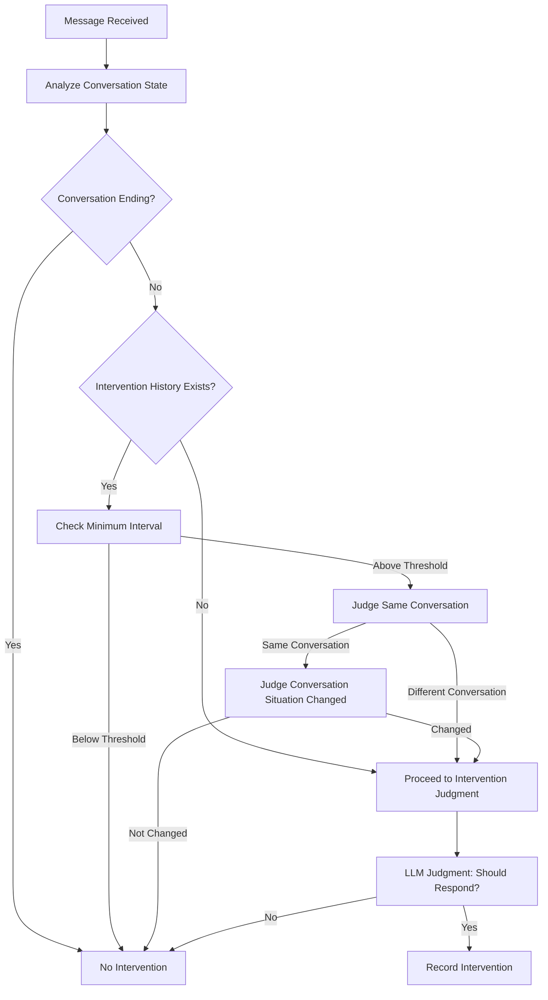

# 「同じ会話」の定義

## 現在の実装

現在の実装では、**LLM で「同じ会話かどうか」を判定する方式**を採用しています。

### 実装の詳細

#### 1. 介入履歴の管理

**データ構造**:

```python
intervention_history: dict[int, list[tuple[datetime, str]]]
  - キー: チャンネルID
  - 値: (介入時刻, 介入時の会話ログ)のリスト
```

**実装箇所**: `src/kotonoha_bot/eavesdrop/llm_judge.py`

**管理方法**:

- チャンネル ID ごとに介入履歴を追跡
- 介入時に、最新の 5 メッセージの会話ログを保存
- 1 時間以内の履歴を保持（古い履歴は自動削除）

**コード例**:

```python
def _record_intervention(
    self, channel_id: int, recent_messages: list[discord.Message]
) -> None:
    """介入を記録"""
    now = datetime.now()
    if channel_id not in self.intervention_history:
        self.intervention_history[channel_id] = []

    # 介入時の会話ログを保存（最新の5メッセージ）
    conversation_log = self._format_conversation_log(recent_messages[-5:])
    self.intervention_history[channel_id].append((now, conversation_log))

    # 履歴が長くなりすぎないように、古い履歴を削除
    cutoff_time = now - timedelta(hours=1)
    self.intervention_history[channel_id] = [
        (t, log)
        for t, log in self.intervention_history[channel_id]
        if t > cutoff_time
    ]
```

#### 2. 同じ会話判定（LLM 判定）

**実装メソッド**: `_is_same_conversation()`

**判定方法**:

- 前回の介入時の会話ログ（最新 5 メッセージ）と
- 現在の会話ログ（最新 5 メッセージ）を比較
- LLM に「SAME」または「DIFFERENT」で判定させる

**プロンプト**: `prompts/eavesdrop_same_conversation_prompt.md`

**判定基準**:

- **SAME**: トピックが同じ/関連、参加者が同じ/重複、時間が経過していても返信の場合は同じ会話
- **DIFFERENT**: トピックが全く異なる、会話の文脈が切れている

**優先順位**:

1. トピックと内容の関連性（最優先）
2. 会話の文脈の連続性
3. 時間的な間隔、参加者の変化（参考程度）

**コード例**:

````python
```python
async def _is_same_conversation(
    self,
    previous_log: str,
    current_log: str,
    cache_key: tuple[int, str] | None = None,
) -> bool:
    """LLMで「同じ会話かどうか」を判定"""
    # 判定用プロンプトを作成
    prompt = SAME_CONVERSATION_PROMPT_TEMPLATE.format(
        previous_conversation=previous_log,
        current_conversation=current_log,
    )

    # 判定用 AI に問い合わせ（軽量モデルを使用）
    response = await self.ai_provider.generate_response(
        messages=[judge_message],
        system_prompt="",
        model=self.judge_model,
        max_tokens=20,  # SAME/DIFFERENT のみなので短く
    )

    # 応答を解析
    response_upper = response.strip().upper()
    is_same = response_upper.startswith("SAME")

    return is_same
````

#### 3. キャッシュ機能

**データ構造**:

```python
conversation_check_cache: dict[tuple[int, str], tuple[bool, datetime]]
  - キー: (チャンネルID, 会話ログのハッシュ)
  - 値: (判定結果, キャッシュ時刻)
```

**目的**: トークン消費を削減

**有効期限**: 5 分間（`cache_ttl_minutes = 5`）

#### 4. 介入の制限

**最小間隔チェック**:

- 設定: `EAVESDROP_MIN_INTERVENTION_INTERVAL_MINUTES`（デフォルト: 10 分）
- 最後の介入から 10 分経過していない場合は介入しない

**実装箇所**: `_has_conversation_changed_after_intervention()`

**コード例**:

```python
# 最小間隔（設定から読み込む）
min_interval_minutes = Config.EAVESDROP_MIN_INTERVENTION_INTERVAL_MINUTES
if minutes_since_last < min_interval_minutes:
    logger.debug(
        f"Intervention blocked: minimum interval not met "
        f"({minutes_since_last} < {min_interval_minutes} minutes)"
    )
    return False
```

**会話状況の変化判定**:

- 同じ会話の場合、会話状況が変わったかを LLM 判定で確認
- `_check_conversation_situation_changed()` メソッドを使用
- プロンプト: `prompts/eavesdrop_conversation_situation_changed_prompt.md`

#### 5. 会話状態の分析

**実装メソッド**: `_analyze_conversation_state()`

**判定する状態**:

- `"active"`: 通常の会話が順調に進行している
- `"ending"`: 会話が終了しようとしている
- `"misunderstanding"`: 参加者間の誤解が発生している
- `"conflict"`: 対立や緊張感が高まっている

**プロンプト**: `prompts/eavesdrop_conversation_state_prompt.md`

**処理**:

- 会話が終了しようとしている（`"ending"`）場合は介入しない

## 実装の流れ

### 1. 介入判定の流れ



### 2. 同じ会話判定の流れ

1. **介入履歴の取得**

   - チャンネルの介入履歴から最後の介入を取得
   - 1 時間以内の履歴のみを対象

2. **最小間隔チェック**

   - 最後の介入から `EAVESDROP_MIN_INTERVENTION_INTERVAL_MINUTES`（デフォルト: 10 分）経過しているか確認
   - 未満の場合は介入しない

3. **同じ会話判定（LLM）**

   - 前回の介入時の会話ログ（最新 5 メッセージ）と
   - 現在の会話ログ（最新 5 メッセージ）を比較
   - LLM に「SAME」または「DIFFERENT」で判定させる

4. **判定結果に応じた処理**
   - **別の会話の場合**: 介入を許可（新しい会話として扱う）
   - **同じ会話の場合**: 会話状況が変わったかを LLM 判定で確認
     - 変わっていない場合: 介入しない
     - 変わった場合: 介入判定へ

## 設定値

**設定ファイル**: `src/kotonoha_bot/config.py`

| 設定項目                                      | デフォルト値                 | 説明                 |
| --------------------------------------------- | ---------------------------- | -------------------- |
| `EAVESDROP_MIN_INTERVENTION_INTERVAL_MINUTES` | 10                           | 介入の最小間隔（分） |
| `EAVESDROP_JUDGE_MODEL`                       | `anthropic/claude-haiku-4.5` | 判定用モデル         |

**介入履歴の保持期間**: 1 時間（コード内で固定）

**キャッシュの有効期限**: 5 分間（コード内で固定）

## メリット

1. **柔軟な判定**

   - 会話の内容を分析し、機械的なルールに依存しない
   - トピックが同じでも時間が経過していれば別の会話として扱える
   - トピックが異なれば、時間が短くても別の会話として扱える

2. **オーバーフィッティングを避ける**

   - 一般的な原則（トピック、文脈、参加者）に基づく判定
   - 特定の会話パターンに特化しない
   - プロンプトで一般的な判断基準を指示

3. **実用的**
   - 時間ベースの判定も併用（最小間隔チェック）
   - エラー時は安全側に倒す（同じ会話として扱う）
   - キャッシュ機能でトークン消費を削減

## プロンプト設計

### 同じ会話判定用プロンプト

**ファイル**: `prompts/eavesdrop_same_conversation_prompt.md`

**判定基準**:

- **SAME**:

  - トピックが同じ、または関連している
  - 参加者が同じ、または重複している
  - 時間が経過していても返信の場合は同じ会話
  - 会話の文脈が続いている

- **DIFFERENT**:
  - トピックが全く異なる
  - 時間的な間隔が長く、かつ内容が全く関連していない
  - 会話の文脈が切れている
  - 参加者が大きく変わっている（ただし、トピックが同じ場合は同じ会話）

**優先順位**:

1. トピックと内容の関連性（最優先）
2. 会話の文脈の連続性
3. 時間的な間隔、参加者の変化（参考程度）

### 会話状況変化判定用プロンプト

**ファイル**: `prompts/eavesdrop_conversation_situation_changed_prompt.md`

**目的**: 同じ会話内で会話状況が変わったかを判定

**判定基準**:

- **CHANGED**: 会話の状況が変わった（新しい質問、新しい話題、状況の変化など）
- **UNCHANGED**: 会話の状況が変わっていない（同じ話題が続いている）

## 現在の実装との違い（改善前との比較）

| 項目               | 改善前                     | 現在の実装                                         |
| ------------------ | -------------------------- | -------------------------------------------------- |
| 同じ会話の定義     | 同じチャンネル             | LLM で判定（トピック、文脈、参加者を総合的に判断） |
| 介入履歴の保持期間 | 1 時間                     | 1 時間（同じ）                                     |
| 介入回数のチェック | 30 分以内                  | LLM 判定に委ねる（会話状況の変化を判定）           |
| 別の会話の判定     | チャンネルが異なる場合のみ | LLM で「同じ会話かどうか」を判定                   |
| 最小間隔チェック   | なし                       | 10 分（設定可能）                                  |
| 会話状況の変化判定 | なし                       | LLM で判定                                         |

## 実装上の考慮事項

### 1. エラーハンドリング

**同じ会話判定のエラー時**:

- 安全側に倒して、同じ会話として扱う
- 介入回数をチェックするため、過度な介入を防ぐ

**会話状況変化判定のエラー時**:

- 安全側に倒して、変化があったとみなす
- 介入を許可するため、会話の流れを妨げない

### 2. パフォーマンス

**キャッシュ機能**:

- 同じ会話ログの判定結果を 5 分間キャッシュ
- トークン消費を削減

**軽量モデルの使用**:

- 判定用モデル: `anthropic/claude-haiku-4.5`（軽量・高速）
- 最大トークン数: 20 トークン（SAME/DIFFERENT のみ）

### 3. トークン消費

**要約**:

- 判定用プロンプトは短く設計
- 会話ログは最新 5 メッセージのみを使用
- キャッシュ機能で重複判定を回避

## 結論

**実装された改善**: LLM で「同じ会話かどうか」を判定する方式を採用しました。

これにより、以下の問題が解決されます：

1. ✅ 異なるトピックの会話を区別できる
2. ✅ 時間が経過した後の会話を適切に判定できる
3. ✅ 会話の内容と文脈を考慮した柔軟な判定が可能
4. ✅ 会話状況の変化を検知して適切に介入できる

機械的なルールに依存せず、会話の内容を分析して適切に「同じ会話かどうか」を判定できるようになりました。

---

**作成日**: 2026 年 1 月
**最終更新**: 2026 年 1 月（現在の実装に基づいて改訂）
**バージョン**: 2.0
