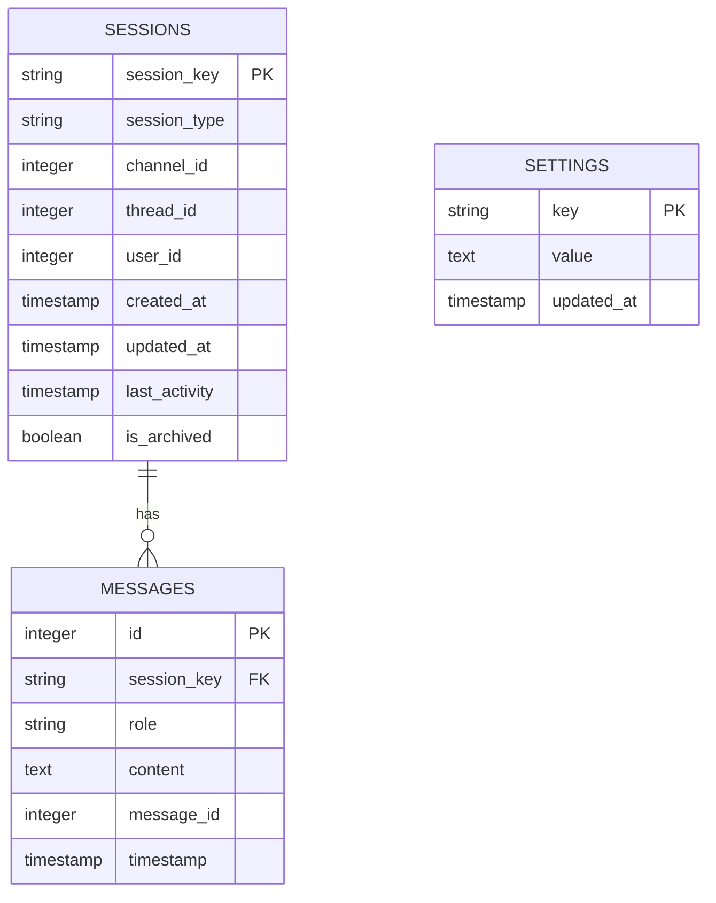
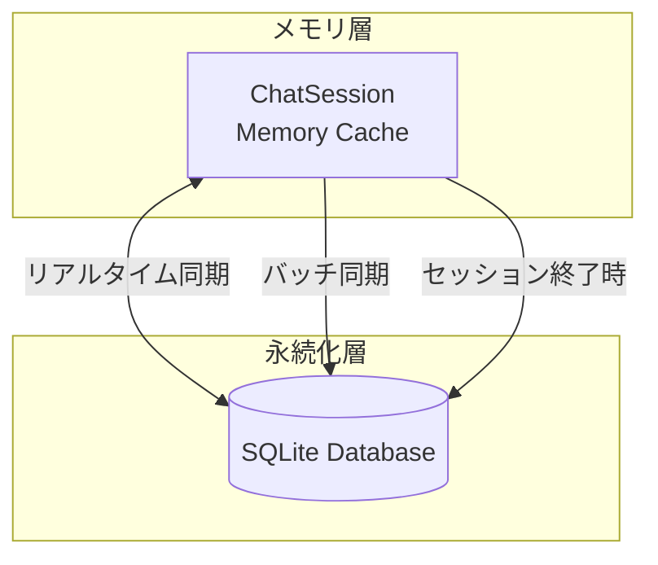
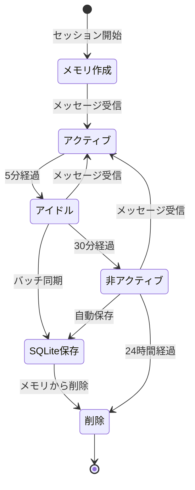

# ER 図・テーブル定義・永続化戦略

## 1. ER 図



## 2. テーブル定義

### 2.1 sessions テーブル

**説明**: 会話セッションの情報を管理します。

| カラム名        | データ型  | 制約        | 説明                                                       |
| --------------- | --------- | ----------- | ---------------------------------------------------------- |
| `session_key`   | TEXT      | PRIMARY KEY | セッションキー（一意）                                     |
| `session_type`  | TEXT      | NOT NULL    | セッションタイプ（`mention`, `thread`, `dm`, `eavesdrop`） |
| `channel_id`    | INTEGER   | NULL        | Discord チャンネル ID                                      |
| `thread_id`     | INTEGER   | NULL        | Discord スレッド ID（スレッド型の場合）                    |
| `user_id`       | INTEGER   | NULL        | Discord ユーザー ID                                        |
| `created_at`    | TIMESTAMP | NOT NULL    | セッション作成日時                                         |
| `updated_at`    | TIMESTAMP | NOT NULL    | セッション更新日時                                         |
| `last_activity` | TIMESTAMP | NOT NULL    | 最後のアクティビティ日時                                   |
| `is_archived`   | BOOLEAN   | DEFAULT 0   | アーカイブ済みフラグ                                       |

**インデックス**:

- `idx_sessions_type`: `session_type`
- `idx_sessions_user_id`: `user_id`
- `idx_sessions_last_activity`: `last_activity`
- `idx_sessions_thread_id`: `thread_id` (NULL でない場合)

**制約**:

- `session_key` は一意である必要がある
- `session_type` は必須
- `last_activity` は `created_at` 以降である必要がある

---

### 2.2 messages テーブル

**説明**: 会話履歴（メッセージ）を管理します。

| カラム名      | データ型  | 制約                      | 説明                                                |
| ------------- | --------- | ------------------------- | --------------------------------------------------- |
| `id`          | INTEGER   | PRIMARY KEY AUTOINCREMENT | メッセージ ID（内部）                               |
| `session_key` | TEXT      | NOT NULL, FK              | セッションキー（sessions.session_key への外部キー） |
| `role`        | TEXT      | NOT NULL                  | ロール（`user`, `assistant`, `system`）             |
| `content`     | TEXT      | NOT NULL                  | メッセージ内容                                      |
| `message_id`  | INTEGER   | NULL                      | Discord メッセージ ID                               |
| `timestamp`   | TIMESTAMP | NOT NULL                  | メッセージ送信日時                                  |

**インデックス**:

- `idx_messages_session_key`: `session_key`
- `idx_messages_timestamp`: `timestamp`
- `idx_messages_message_id`: `message_id` (NULL でない場合)

**制約**:

- `session_key` は `sessions` テーブルに存在する必要がある
- `role` は `user`, `assistant`, `system` のいずれかである必要がある
- `content` は必須

**外部キー制約**:

- `session_key` → `sessions.session_key` ON DELETE CASCADE

---

### 2.3 settings テーブル

**説明**: システム設定を管理します（将来の拡張用）。

| カラム名     | データ型  | 制約        | 説明                  |
| ------------ | --------- | ----------- | --------------------- |
| `key`        | TEXT      | PRIMARY KEY | 設定キー              |
| `value`      | TEXT      | NOT NULL    | 設定値（JSON 形式可） |
| `updated_at` | TIMESTAMP | NOT NULL    | 更新日時              |

**インデックス**:

- なし（`key` が PRIMARY KEY のため）

---

## 3. SQL スキーマ

### 3.1 テーブル作成 SQL

```sql
-- sessions テーブル
CREATE TABLE IF NOT EXISTS sessions (
    session_key TEXT PRIMARY KEY,
    session_type TEXT NOT NULL CHECK(session_type IN ('mention', 'thread', 'dm', 'eavesdrop')),
    channel_id INTEGER,
    thread_id INTEGER,
    user_id INTEGER,
    created_at TIMESTAMP NOT NULL DEFAULT CURRENT_TIMESTAMP,
    updated_at TIMESTAMP NOT NULL DEFAULT CURRENT_TIMESTAMP,
    last_activity TIMESTAMP NOT NULL DEFAULT CURRENT_TIMESTAMP,
    is_archived BOOLEAN DEFAULT 0
);

-- messages テーブル
CREATE TABLE IF NOT EXISTS messages (
    id INTEGER PRIMARY KEY AUTOINCREMENT,
    session_key TEXT NOT NULL,
    role TEXT NOT NULL CHECK(role IN ('user', 'assistant', 'system')),
    content TEXT NOT NULL,
    message_id INTEGER,
    timestamp TIMESTAMP NOT NULL DEFAULT CURRENT_TIMESTAMP,
    FOREIGN KEY (session_key) REFERENCES sessions(session_key) ON DELETE CASCADE
);

-- settings テーブル
CREATE TABLE IF NOT EXISTS settings (
    key TEXT PRIMARY KEY,
    value TEXT NOT NULL,
    updated_at TIMESTAMP NOT NULL DEFAULT CURRENT_TIMESTAMP
);
```

### 3.2 インデックス作成 SQL

```sql
-- sessions テーブルのインデックス
CREATE INDEX IF NOT EXISTS idx_sessions_type ON sessions(session_type);
CREATE INDEX IF NOT EXISTS idx_sessions_user_id ON sessions(user_id);
CREATE INDEX IF NOT EXISTS idx_sessions_last_activity ON sessions(last_activity);
CREATE INDEX IF NOT EXISTS idx_sessions_thread_id ON sessions(thread_id) WHERE thread_id IS NOT NULL;

-- messages テーブルのインデックス
CREATE INDEX IF NOT EXISTS idx_messages_session_key ON messages(session_key);
CREATE INDEX IF NOT EXISTS idx_messages_timestamp ON messages(timestamp);
CREATE INDEX IF NOT EXISTS idx_messages_message_id ON messages(message_id) WHERE message_id IS NOT NULL;
```

### 3.3 トリガー（将来の拡張）

```sql
-- updated_at の自動更新トリガー
CREATE TRIGGER IF NOT EXISTS update_sessions_timestamp
AFTER UPDATE ON sessions
BEGIN
    UPDATE sessions SET updated_at = CURRENT_TIMESTAMP WHERE session_key = NEW.session_key;
END;
```

---

## 4. 永続化戦略

### 4.1 ハイブリッド永続化アーキテクチャ



### 4.2 永続化タイミング

| タイミング           | 条件                               | 処理内容                       |
| -------------------- | ---------------------------------- | ------------------------------ |
| **リアルタイム同期** | 重要な会話                         | 即座に SQLite に保存           |
| **バッチ同期**       | 5 分ごと                           | アイドル状態のセッションを保存 |
| **セッション終了時** | スレッドアーカイブ、セッション削除 | 必ず SQLite に保存             |
| **ボット再起動時**   | 起動時                             | SQLite からセッションを復元    |

### 4.3 データのライフサイクル



### 4.4 データ保持ポリシー

| データ種別             | 保持期間         | 削除条件                       |
| ---------------------- | ---------------- | ------------------------------ |
| **メモリ内セッション** | アクティブな間   | 24 時間非アクティブ            |
| **SQLite セッション**  | 無期限           | 手動削除のみ                   |
| **メッセージ履歴**     | セッションと共に | セッション削除時（CASCADE）    |
| **バックアップ**       | 7 日分           | 7 日以上古いファイルを自動削除 |

### 4.5 同期戦略

#### 4.5.1 リアルタイム同期

**対象**: 重要な会話

- スレッドアーカイブ時
- セッション終了時
- エラー発生時（データ損失防止）

**処理**:

```python
async def save_session_realtime(session_key: str):
    session = memory_sessions.get(session_key)
    if session:
        await db.save_session(session)
        await db.save_messages(session_key, session.messages)
```

#### 4.5.2 バッチ同期

**対象**: アイドル状態のセッション

- 5 分ごとに実行
- 最後のアクティビティから 5 分以上経過したセッション

**処理**:

```python
async def batch_sync_sessions():
    idle_sessions = get_idle_sessions(timeout=300)  # 5分
    for session_key in idle_sessions:
        await save_session_realtime(session_key)
```

#### 4.5.3 セッション復元

**タイミング**: ボット再起動時

**処理**:

```python
async def restore_sessions():
    active_sessions = await db.get_active_sessions()
    for session_data in active_sessions:
        session = ChatSession.from_dict(session_data)
        messages = await db.get_messages(session_key)
        session.messages = messages
        memory_sessions[session_key] = session
```

---

## 5. データベース操作パターン

### 5.1 セッション作成

```python
async def create_session(session_key: str, session_type: str, **kwargs):
    # メモリに作成
    session = ChatSession(session_key, session_type, **kwargs)
    memory_sessions[session_key] = session

    # SQLite にも作成（メタデータのみ）
    await db.create_session(
        session_key=session_key,
        session_type=session_type,
        channel_id=kwargs.get('channel_id'),
        thread_id=kwargs.get('thread_id'),
        user_id=kwargs.get('user_id')
    )
```

### 5.2 メッセージ追加

```python
async def add_message(session_key: str, role: str, content: str, message_id: int = None):
    # メモリに追加
    session = memory_sessions.get(session_key)
    if session:
        session.add_message(role, content, message_id)

    # SQLite にも追加（非同期）
    asyncio.create_task(db.add_message(session_key, role, content, message_id))
```

### 5.3 セッション取得

```python
async def get_session(session_key: str) -> ChatSession:
    # まずメモリから取得
    if session_key in memory_sessions:
        return memory_sessions[session_key]

    # メモリにない場合は SQLite から復元
    session_data = await db.get_session(session_key)
    if session_data:
        session = ChatSession.from_dict(session_data)
        messages = await db.get_messages(session_key, limit=50)
        session.messages = messages
        memory_sessions[session_key] = session
        return session

    return None
```

---

## 6. パフォーマンス最適化

### 6.1 クエリ最適化

- **インデックスの活用**: 頻繁に検索するカラムにインデックスを作成
- **LIMIT 句の使用**: 履歴取得時は LIMIT 句を使用
- **ページネーション**: 大量のデータを取得する場合はページネーション

### 6.2 WAL モード

```sql
PRAGMA journal_mode = WAL;
PRAGMA synchronous = NORMAL;
PRAGMA cache_size = -64000;  -- 64MB
PRAGMA temp_store = MEMORY;
```

### 6.3 接続プール

- データベース接続をプール化
- 接続の再利用
- 同時接続数の制限

---

**作成日**: 2026年1月14日
**バージョン**: 1.0
**作成者**: kotonoha-bot 開発チーム
