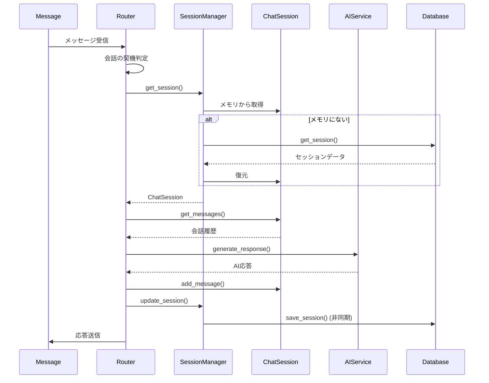

# 詳細設計書

## 1. モジュール仕様書

### 1.1 `bot.py` - Discord Bot コア

**責務**: Discord Bot のメイン処理、イベントハンドリング

**主要クラス**:

- `KotonohaBot`: Discord Bot のメインクラス

**主要メソッド**:

- `on_ready()`: Bot 起動時の処理
- `on_message(message)`: メッセージ受信時の処理
- `on_thread_create(thread)`: スレッド作成時の処理
- `on_thread_update(before, after)`: スレッド更新時の処理

**依存関係**:

- `router.message_router`
- `session.manager`
- `ai.base`

---

### 1.2 `router/message_router.py` - メッセージルーター

**責務**: メッセージのルーティング、会話の契機判定

**主要クラス**:

- `MessageRouter`: メッセージルーティングクラス

**主要メソッド**:

- `route_message(message)`: メッセージをルーティング
- `detect_trigger_type(message)`: 会話の契機を判定
- `handle_mention(message)`: メンション応答型の処理
- `handle_thread(message)`: スレッド型の処理
- `handle_dm(message)`: DM 型の処理
- `handle_eavesdrop(message)`: 聞き耳型の処理

**依存関係**:

- `session.manager`
- `ai.base`
- `eavesdrop.llm_judge`
- `eavesdrop.rule_judge`

---

### 1.3 `session/manager.py` - セッション管理

**責務**: セッションの作成、取得、更新、削除

**主要クラス**:

- `SessionManager`: セッション管理クラス

**主要メソッド**:

- `get_session(session_key)`: セッションを取得
- `create_session(session_key, session_type, **kwargs)`: セッションを作成
- `update_session(session_key, message)`: セッションを更新
- `save_session(session_key)`: セッションを保存
- `delete_session(session_key)`: セッションを削除
- `cleanup_idle_sessions()`: 非アクティブセッションをクリーンアップ

**依存関係**:

- `session.chat_session`
- `database.sqlite`

---

### 1.4 `session/chat_session.py` - セッションクラス

**責務**: セッションのデータ構造と操作

**主要クラス**:

- `ChatSession`: セッションクラス

**主要メソッド**:

- `add_message(role, content, message_id)`: メッセージを追加
- `get_messages(limit)`: メッセージ履歴を取得
- `clear_messages()`: メッセージ履歴をクリア
- `update_activity()`: アクティビティを更新
- `to_dict()`: 辞書形式に変換
- `from_dict(data)`: 辞書から復元

**依存関係**: なし

---

### 1.5 `ai/base.py` - AI プロバイダー抽象クラス

**責務**: AI プロバイダーの抽象化インターフェース

**主要クラス**:

- `AIProvider`: 抽象基底クラス

**主要メソッド（抽象）**:

- `generate_response(messages, system_prompt)`: 応答を生成
- `judge_should_respond(messages)`: 発言すべきか判定

**依存関係**: なし

---

### 1.6 `ai/gemini.py` - Gemini API 実装

**責務**: Gemini API の実装

**主要クラス**:

- `GeminiProvider`: Gemini API プロバイダー

**主要メソッド**:

- `generate_response(messages, system_prompt)`: 応答を生成
- `judge_should_respond(messages)`: 発言すべきか判定
- `_call_api(model, prompt, **kwargs)`: API を呼び出し
- `_parse_response(response)`: レスポンスをパース

**依存関係**:

- `ai.base`
- `google.generativeai`

---

### 1.7 `eavesdrop/llm_judge.py` - LLM 判断機能

**責務**: 聞き耳型の LLM 判断（アプローチ 1）

**主要クラス**:

- `LLMJudge`: LLM 判断クラス

**主要メソッド**:

- `should_respond(messages)`: 発言すべきか判定
- `_create_judge_prompt(messages)`: 判定用プロンプトを作成
- `_parse_judgment(response)`: 判定結果をパース

**依存関係**:

- `ai.base`

---

### 1.8 `eavesdrop/rule_judge.py` - ルールベース判断機能

**責務**: 聞き耳型のルールベース判断（アプローチ 2）

**主要クラス**:

- `RuleJudge`: ルールベース判断クラス

**主要メソッド**:

- `should_respond(message, context)`: 発言すべきか判定
- `_check_keywords(message)`: キーワードをチェック
- `_check_activity(context)`: 盛り上がりをチェック
- `_random_check()`: ランダム判定

**依存関係**: なし

---

### 1.9 `database/sqlite.py` - SQLite 操作

**責務**: SQLite データベースの操作

**主要クラス**:

- `SQLiteDatabase`: SQLite データベースクラス

**主要メソッド**:

- `get_session(session_key)`: セッションを取得
- `save_session(session_data)`: セッションを保存
- `get_messages(session_key, limit)`: メッセージを取得
- `add_message(session_key, message_data)`: メッセージを追加
- `delete_session(session_key)`: セッションを削除

**依存関係**:

- `aiosqlite`

---

### 1.10 `commands/chat.py` - スラッシュコマンド

**責務**: スラッシュコマンドの処理

**主要クラス**:

- `ChatCommands`: チャットコマンドクラス

**主要メソッド**:

- `chat_start(interaction, topic)`: `/chat start` コマンド
- `chat_reset(interaction)`: `/chat reset` コマンド
- `chat_status(interaction)`: `/chat status` コマンド

**依存関係**:

- `session.manager`
- `discord.app_commands`

---

## 2. 関数仕様書

### 2.1 セッション管理関数

#### 2.1.1 `get_session(session_key: str) -> ChatSession | None`

**説明**: セッションを取得します。メモリにない場合は SQLite から復元します。

**パラメータ**:

- `session_key` (str): セッションキー

**戻り値**: `ChatSession` オブジェクト、または `None`

**処理フロー**:

1. メモリ内のセッションを検索
2. 見つからない場合、SQLite から取得
3. SQLite から取得した場合、メモリに復元
4. セッションを返す

**例外**:

- `DatabaseError`: データベースエラー

---

#### 2.1.2 `create_session(session_key: str, session_type: str, **kwargs) -> ChatSession`

**説明**: 新しいセッションを作成します。

**パラメータ**:

- `session_key` (str): セッションキー
- `session_type` (str): セッションタイプ
- `**kwargs`: 追加パラメータ

**戻り値**: `ChatSession` オブジェクト

**処理フロー**:

1. セッションキーの形式を検証
2. `ChatSession` オブジェクトを作成
3. メモリに保存
4. SQLite にメタデータを保存（非同期）
5. セッションを返す

**例外**:

- `ValueError`: 無効なパラメータ
- `DatabaseError`: データベースエラー

---

### 2.2 AI 関数

#### 2.2.1 `generate_response(messages: List[Message], system_prompt: str = None) -> str`

**説明**: AI で応答を生成します。

**パラメータ**:

- `messages` (List[Message]): 会話履歴
- `system_prompt` (str, optional): システムプロンプト

**戻り値**: AI が生成した応答テキスト

**処理フロー**:

1. プロンプトを生成（システムプロンプト + 会話履歴）
2. モデルを選択（Flash または Pro）
3. API を呼び出し
4. レスポンスをパース
5. 応答テキストを返す

**例外**:

- `APIError`: API エラー
- `RateLimitError`: レート制限超過
- `TimeoutError`: タイムアウト

---

#### 2.2.2 `judge_should_respond(messages: List[Message]) -> bool`

**説明**: 聞き耳型で発言すべきか判定します。

**パラメータ**:

- `messages` (List[Message]): 会話履歴（直近 10 件）

**戻り値**: `True`（発言すべき）または `False`（発言しない）

**処理フロー**:

1. 判定用プロンプトを作成
2. Gemini Flash で API を呼び出し
3. レスポンスをパース（YES/NO）
4. ブール値を返す

**例外**:

- `APIError`: API エラー
- `RateLimitError`: レート制限超過

---

### 2.3 データベース関数

#### 2.3.1 `get_session(session_key: str) -> dict | None`

**説明**: SQLite からセッションを取得します。

**パラメータ**:

- `session_key` (str): セッションキー

**戻り値**: セッションデータ（辞書形式）、または `None`

**処理フロー**:

1. SQL クエリを実行
2. 結果を辞書に変換
3. セッションデータを返す

**例外**:

- `DatabaseError`: データベースエラー

---

#### 2.3.2 `save_session(session_data: dict) -> None`

**説明**: セッションを SQLite に保存します。

**パラメータ**:

- `session_data` (dict): セッションデータ

**処理フロー**:

1. セッションデータを検証
2. INSERT または UPDATE を実行
3. メッセージ履歴も保存

**例外**:

- `DatabaseError`: データベースエラー

---

## 3. テーブル仕様書

### 3.1 sessions テーブル

**テーブル名**: `sessions`

**説明**: 会話セッションの情報を管理します。

| カラム名        | データ型  | NULL     | デフォルト        | 説明                          |
| --------------- | --------- | -------- | ----------------- | ----------------------------- |
| `session_key`   | TEXT      | NOT NULL | -                 | セッションキー（PRIMARY KEY） |
| `session_type`  | TEXT      | NOT NULL | -                 | セッションタイプ              |
| `channel_id`    | INTEGER   | NULL     | -                 | Discord チャンネル ID         |
| `thread_id`     | INTEGER   | NULL     | -                 | Discord スレッド ID           |
| `user_id`       | INTEGER   | NULL     | -                 | Discord ユーザー ID           |
| `created_at`    | TIMESTAMP | NOT NULL | CURRENT_TIMESTAMP | 作成日時                      |
| `updated_at`    | TIMESTAMP | NOT NULL | CURRENT_TIMESTAMP | 更新日時                      |
| `last_activity` | TIMESTAMP | NOT NULL | CURRENT_TIMESTAMP | 最後のアクティビティ日時      |
| `is_archived`   | BOOLEAN   | NOT NULL | 0                 | アーカイブ済みフラグ          |

**制約**:

- PRIMARY KEY: `session_key`
- CHECK: `session_type IN ('mention', 'thread', 'dm', 'eavesdrop')`
- CHECK: `is_archived IN (0, 1)`

**インデックス**:

- `idx_sessions_type`: `session_type`
- `idx_sessions_user_id`: `user_id`
- `idx_sessions_last_activity`: `last_activity`
- `idx_sessions_thread_id`: `thread_id` (WHERE thread_id IS NOT NULL)

---

### 3.2 messages テーブル

**テーブル名**: `messages`

**説明**: 会話履歴（メッセージ）を管理します。

| カラム名      | データ型  | NULL     | デフォルト        | 説明                                        |
| ------------- | --------- | -------- | ----------------- | ------------------------------------------- |
| `id`          | INTEGER   | NOT NULL | -                 | メッセージ ID（PRIMARY KEY, AUTOINCREMENT） |
| `session_key` | TEXT      | NOT NULL | -                 | セッションキー（FOREIGN KEY）               |
| `role`        | TEXT      | NOT NULL | -                 | ロール                                      |
| `content`     | TEXT      | NOT NULL | -                 | メッセージ内容                              |
| `message_id`  | INTEGER   | NULL     | -                 | Discord メッセージ ID                       |
| `timestamp`   | TIMESTAMP | NOT NULL | CURRENT_TIMESTAMP | 送信日時                                    |

**制約**:

- PRIMARY KEY: `id`
- FOREIGN KEY: `session_key` REFERENCES `sessions(session_key)` ON DELETE CASCADE
- CHECK: `role IN ('user', 'assistant', 'system')`

**インデックス**:

- `idx_messages_session_key`: `session_key`
- `idx_messages_timestamp`: `timestamp`
- `idx_messages_message_id`: `message_id` (WHERE message_id IS NOT NULL)

---

### 3.3 settings テーブル

**テーブル名**: `settings`

**説明**: システム設定を管理します（将来の拡張用）。

| カラム名     | データ型  | NULL     | デフォルト        | 説明                    |
| ------------ | --------- | -------- | ----------------- | ----------------------- |
| `key`        | TEXT      | NOT NULL | -                 | 設定キー（PRIMARY KEY） |
| `value`      | TEXT      | NOT NULL | -                 | 設定値                  |
| `updated_at` | TIMESTAMP | NOT NULL | CURRENT_TIMESTAMP | 更新日時                |

**制約**:

- PRIMARY KEY: `key`

---

## 4. データフロー詳細

### 4.1 メッセージ処理フロー

---

**作成日**: 2026年1月14日
**バージョン**: 1.0
**作成者**: kotonoha-bot 開発チーム
