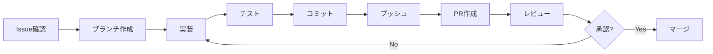

# Contributing Guide - Kotonoha Discord Bot

Kotonoha プロジェクトへのコントリビューションガイド

## Welcome

Kotonoha プロジェクトへの貢献に興味を持っていただきありがとうございます！このガイドでは、プロジェクトへの貢献方法を説明します。

## 目次

1. [行動規範](#行動規範)
2. [開始方法](#開始方法)
3. [開発フロー](#開発フロー)
4. [コーディング規約](#コーディング規約)
5. [コミット規約](#コミット規約)
6. [プルリクエストのガイドライン](#プルリクエストのガイドライン)
7. [テストの書き方](#テストの書き方)
8. [ドキュメントの更新](#ドキュメントの更新)

## 行動規範

Kotonoha プロジェクトは、**場面緘黙自助グループの支援**を目的としています。全ての貢献者は、優しく、思いやりのある態度で接することを期待されます。

### 基本原則

- **尊重**: 全ての人を尊重し、思いやりを持って接する
- **包括性**: 多様性を尊重し、誰もが参加しやすい環境を作る
- **建設的**: 建設的なフィードバックを提供する
- **プライバシー**: ユーザーのプライバシーを最優先する

## 開始方法

### 1. リポジトリをフォーク

```bash
# GitHubでForkボタンをクリック
# フォークしたリポジトリをクローン
# 注: your-username は実際のGitHubユーザー名に置き換えてください
git clone https://github.com/your-username/kotonoha-bot.git
cd kotonoha-bot
```

### 2. 環境をセットアップ

[Getting Started Guide](../getting-started.md) を参照して環境をセットアップしてください。

### 3. Issue を確認

- Issue 一覧を確認（注: GitHubリポジトリURLは実際の組織名に置き換えてください）
- `good first issue` ラベルの付いた Issue から始めるのがおすすめ
- 作業を始める前に、Issue にコメントして割り当てを依頼

### 4. ブランチを作成

```bash
# 最新のmainブランチを取得
git checkout main
git pull upstream main

# 新しいブランチを作成
git checkout -b feature/your-feature-name
# または
git checkout -b fix/your-bug-fix
```

## 開発フロー

### 標準的なワークフロー



### 実装のステップ

1. **実装**: 機能を実装またはバグを修正
2. **テスト**: 動作確認とテストコードの作成
3. **ドキュメント**: 必要に応じてドキュメントを更新
4. **コミット**: 明確なコミットメッセージでコミット
5. **プッシュ**: リモートブランチにプッシュ
6. **PR 作成**: Pull Request を作成

## コーディング規約

### Python スタイルガイド

- **PEP 8** に準拠
- **Black** でフォーマット（自動）
- **型ヒント** を使用

```python
# Good
def generate_response(
    messages: List[Message],
    system_prompt: Optional[str] = None
) -> str:
    """AI で応答を生成する。

    Args:
        messages: 会話履歴
        system_prompt: システムプロンプト（オプション）

    Returns:
        生成された応答テキスト
    """
    ...

# Bad
def generate_response(messages, system_prompt=None):
    ...
```

### ネーミング規約

| 種類             | 規約                  | 例                  |
| ---------------- | --------------------- | ------------------- |
| **モジュール**   | `snake_case`          | `message_router.py` |
| **クラス**       | `PascalCase`          | `SessionManager`    |
| **関数**         | `snake_case`          | `get_session()`     |
| **変数**         | `snake_case`          | `session_key`       |
| **定数**         | `UPPER_SNAKE_CASE`    | `MAX_SESSIONS`      |
| **プライベート** | `_leading_underscore` | `_sync_sessions()`  |

### ドキュメント文字列

```python
def get_session(session_key: str) -> Optional[ChatSession]:
    """セッションを取得する。

    メモリ内のセッションを検索し、見つからない場合は
    SQLiteから復元を試みる。

    Args:
        session_key: セッションキー

    Returns:
        ChatSessionオブジェクト、または None

    Raises:
        DatabaseError: データベースエラーが発生した場合
    """
    ...
```

### インポートの順序

```python
# 1. 標準ライブラリ
import os
import sys
from datetime import datetime

# 2. サードパーティライブラリ
import discord
from discord.ext import commands

# 3. ローカルモジュール
from kotonoha_bot.session import SessionManager
from kotonoha_bot.ai import GeminiProvider
```

## コミット規約

### コミットメッセージの形式

```text
<type>: <subject>

<body>

<footer>
```

### Type

| Type       | 説明                             | 例                           |
| ---------- | -------------------------------- | ---------------------------- |
| `feat`     | 新機能                           | `feat: スレッド型の実装`     |
| `fix`      | バグ修正                         | `fix: セッション復元の問題`  |
| `docs`     | ドキュメント                     | `docs: README更新`           |
| `style`    | コードスタイル（機能に影響なし） | `style: フォーマット修正`    |
| `refactor` | リファクタリング                 | `refactor: ルーター整理`     |
| `test`     | テスト                           | `test: セッションテスト追加` |
| `chore`    | その他                           | `chore: 依存関係更新`        |

### 例

```bash
# 良い例
git commit -m "feat: 聞き耳型のLLM判断機能を実装

- Gemini Flashで判定フェーズを実装
- Yes/Noのみの簡潔な判定プロンプト
- メインチャンネルへの直接投稿機能

Closes #12"

# 悪い例
git commit -m "fix"
git commit -m "いろいろ修正した"
```

### コミットのベストプラクティス

- **小さく、頻繁にコミット**: 1 つのコミットは 1 つの論理的な変更
- **動作する状態でコミット**: コミット後は必ずテストを通す
- **明確なメッセージ**: 何を、なぜ変更したかを明確に

## プルリクエストのガイドライン

### PR の作成前チェックリスト

- [ ] コードがテストされている
- [ ] テストが追加されている（新機能の場合）
- [ ] ドキュメントが更新されている
- [ ] コードがフォーマットされている（`black .`）
- [ ] 型チェックが通る（`mypy .`）
- [ ] リンターが通る（`flake8 .`）

### PR テンプレート

```markdown
## 概要

この変更の目的を簡潔に説明してください。

## 変更内容

- 変更点 1
- 変更点 2

## テスト方法

1. ステップ 1
2. ステップ 2

## スクリーンショット（該当する場合）

（画像を添付）

## 関連 Issue

Closes #123

## チェックリスト

- [ ] テストが追加されている
- [ ] ドキュメントが更新されている
- [ ] コードがフォーマットされている
```

### レビュープロセス

1. **PR 作成**: レビュー依頼
2. **CI/CD チェック**: GitHub Actions が自動実行
3. **コードレビュー**: レビュアーがレビュー
4. **修正**: フィードバックに基づいて修正
5. **承認**: レビュアーが承認
6. **マージ**: メインブランチにマージ

### レビューの観点

- **機能性**: 期待通りに動作するか
- **コード品質**: 読みやすく、保守しやすいか
- **テスト**: 適切にテストされているか
- **ドキュメント**: ドキュメントが更新されているか
- **パフォーマンス**: パフォーマンスに問題がないか
- **セキュリティ**: セキュリティ上の問題がないか

## テストの書き方

### テストの配置

```txt
tests/
├── unit/                 # 単体テスト
│   ├── test_session.py
│   ├── test_ai.py
│   └── test_router.py
├── integration/          # 統合テスト
│   ├── test_discord.py
│   └── test_gemini.py
└── conftest.py          # pytestの設定
```

### テストの例

```python
import pytest
from kotonoha_bot.session import SessionManager

class TestSessionManager:
    @pytest.fixture
    def manager(self):
        """SessionManagerのフィクスチャ。"""
        return SessionManager()

    def test_create_session(self, manager):
        """セッションが作成できることを確認。"""
        session = manager.create_session(
            session_key="test:123",
            session_type="mention"
        )

        assert session is not None
        assert session.session_key == "test:123"
        assert session.session_type == "mention"

    def test_get_session(self, manager):
        """セッションが取得できることを確認。"""
        # セッションを作成
        manager.create_session("test:123", "mention")

        # 取得
        session = manager.get_session("test:123")
        assert session is not None
        assert session.session_key == "test:123"
```

### テストの実行

```bash
# 全テストを実行
pytest

# 特定のテストを実行
pytest tests/unit/test_session.py

# カバレッジ付きで実行
pytest --cov=kotonoha_bot --cov-report=html
```

## ドキュメントの更新

### ドキュメントの種類

- **API ドキュメント**: コード内の docstring
- **ユーザーガイド**: `docs/` ディレクトリ
- **README**: プロジェクトの概要

### ドキュメント更新のタイミング

- 新機能を追加した時
- API を変更した時
- 動作が変わった時
- バグを修正した時（該当する場合）

### Markdown のベストプラクティス

- **見出し**: `#` を使用（階層を明確に）
- **コードブロック**: 言語を指定（```python）
- **リンク**: 相対パスを使用
- **画像**: `docs/images/` に配置

## 質問・サポート

### 質問の方法

1. **FAQ を確認**: [FAQ](./faq.md) を確認
2. **Issue を検索**: 既存の Issue を検索
3. **新しい Issue を作成**: 見つからない場合は新規作成

### サポートチャンネル

- **GitHub Issues**: 技術的な質問、バグ報告（注: GitHubリポジトリURLは実際の組織名に置き換えてください）
- **GitHub Discussions**: 一般的な質問、アイデア
- **Discord**: 開発者用サーバー（準備中）

## ライセンス

Kotonoha プロジェクトは [MIT License](../../LICENSE) の下で公開されています。コントリビューションは同じライセンスの下で提供されます。

## 謝辞

Kotonoha プロジェクトへの貢献に感謝します！あなたの貢献が、場面緘黙で困っている人々の助けになります。

---

**作成日**: 2026年1月14日
**最終更新日**: 2026年1月14日
**バージョン**: 1.0
