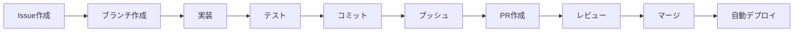

# Getting Started - Kotonoha Discord Bot

場面緘黙自助グループ運営支援 Discord ボット「Kotonoha（コトノハ）」の開発を始めるためのクイックスタートガイドです。

## 前提条件

- **OS**: WSL2 Ubuntu 22.04+ (Windows) または Linux/macOS
- **Python**: 3.14
- **uv**: パッケージマネージャー
- **Discord Bot Token**: [Discord Developer Portal](https://discord.com/developers/applications) から取得
- **LLM API Key**:
  - 開発環境: [Anthropic Console](https://console.anthropic.com/) から Claude API Key を取得
  - 本番環境: [Anthropic Console](https://console.anthropic.com/) から Claude API Key を取得

## 5 分でセットアップ

### 1. リポジトリのクローン

```bash
# 注: your-org は実際のGitHub組織名/ユーザー名に置き換えてください
git clone https://github.com/your-org/kotonoha-bot.git
cd kotonoha-bot
```

### 2. 環境変数の設定

```bash
# .envファイルを作成
cp .env.example .env

# エディタで開いて以下を設定
# DISCORD_TOKEN=your_discord_bot_token_here
# LLM_MODEL=anthropic/claude-3-haiku-20240307  # 開発用（レガシー、超低コスト）
# ANTHROPIC_API_KEY=your_anthropic_api_key_here  # 開発・本番環境用

# 本番環境の場合:
# LLM_MODEL=anthropic/claude-opus-4-5  # 本番用
# ANTHROPIC_API_KEY=your_anthropic_api_key_here
```

### 3. 依存関係のインストール

```bash
# uvをインストール（未インストールの場合）
curl -LsSf https://astral.sh/uv/install.sh | sh

# 依存関係をインストール
uv sync
```

### 4. Bot の起動

```bash
# 開発モードで起動
uv run python -m kotonoha_bot

# または
uv run python src/kotonoha_bot/bot.py
```

### 5. 動作確認

1. Discord サーバーで Bot にメンションする

   ```txt
   @Kotonoha こんにちは
   ```

2. Bot が応答すれば成功！

## プロジェクト構造

```txt
kotonoha-bot/
├── docs/                    # ドキュメント
│   ├── requirements/        # 要件定義
│   ├── architecture/        # アーキテクチャ設計
│   ├── specifications/      # 仕様書
│   ├── implementation/      # 実装ガイド
│   ├── testing/            # テスト計画
│   ├── operations/         # 運用ガイド
│   └── development/        # 開発者向け
├── src/kotonoha_bot/       # ソースコード
│   ├── bot.py              # Botメイン
│   ├── ai/                 # AI サービス
│   ├── session/            # セッション管理
│   ├── router/             # メッセージルーティング
│   ├── eavesdrop/          # 聞き耳型機能
│   ├── database/           # データベース
│   └── commands/           # スラッシュコマンド
├── tests/                  # テストコード
├── data/                   # データベース（.gitignore）
├── .env                    # 環境変数（.gitignore）
└── pyproject.toml          # プロジェクト設定
```

## 次に読むべきドキュメント

### 開発を始める前に

1. **[要件定義](requirements/overview.md)** - プロジェクトの全体像を理解
2. **[実装ロードマップ](implementation/roadmap.md)** - 段階的な実装計画
3. **[開発者ガイド](development/contributing.md)** - コントリビューション方法

### 設計を理解する

1. **[システムアーキテクチャ](architecture/system-architecture.md)** - システム構成と技術スタック
2. **[基本設計](architecture/basic-design.md)** - システムの基本設計
3. **[データベース設計](architecture/database-design.md)** - データベーススキーマ

### 実装を始める

1. **[実装検討事項](implementation/considerations.md)** - 実装前の技術的検討事項
2. **[API 仕様](specifications/api-specification.md)** - 外部/内部 API 仕様
3. **[コマンド仕様](specifications/command-specification.md)** - スラッシュコマンド仕様

## よくある質問

### Q: Bot が Discord に接続できない

**A**: `DISCORD_TOKEN` が正しく設定されているか確認してください。また、Bot がサーバーに招待されているか確認してください。

### Q: AI が応答しない

**A**: 以下を確認してください:

- `LLM_MODEL` が正しく設定されているか
- API キーが設定されているか（`ANTHROPIC_API_KEY`）

### Q: データベースエラーが発生する

**A**: `data/` ディレクトリが作成されているか、書き込み権限があるか確認してください。

詳細は [FAQ](development/faq.md) と [トラブルシューティング](operations/troubleshooting.md) を参照してください。

## 開発フロー



1. **Issue 作成**: 実装する機能や修正するバグを Issue に記録
2. **ブランチ作成**: `feature/xxx` または `fix/xxx` ブランチを作成
3. **実装**: コードを実装
4. **テスト**: 動作確認とテストを実施
5. **コミット**: 明確なコミットメッセージでコミット
6. **PR 作成**: Pull Request を作成してレビューを依頼
7. **マージ**: レビュー承認後にマージ
8. **自動デプロイ**: GitHub Actions が自動的にデプロイ

## コミットメッセージの規約

```txt
<type>: <subject>

<body>

<footer>
```

**Type**:

- `feat`: 新機能
- `fix`: バグ修正
- `docs`: ドキュメント
- `style`: コードスタイル
- `refactor`: リファクタリング
- `test`: テスト
- `chore`: その他

**例**:

```txt
feat: メンション応答型の実装

- discord.pyを使用してメンション検知を実装
- Gemini APIで応答を生成
- 基本的なエラーハンドリングを追加

Closes #1
```

## トラブルシューティング

問題が発生した場合は以下を確認してください:

1. **ログの確認**

   ```bash
   # 実行中のログを確認
   tail -f logs/kotonoha.log
   ```

2. **環境変数の確認**

   ```bash
   # .envファイルの確認
   cat .env
   ```

3. **依存関係の再インストール**

   ```bash
   uv sync --reinstall
   ```

4. **データベースのリセット**

   ```bash
   rm data/kotonoha.db
   # 再起動すると自動で再作成されます
   ```

詳細は [トラブルシューティングガイド](operations/troubleshooting.md) を参照してください。

## サポート

- **ドキュメント**: [docs/](.)
- **Issue**: GitHub Issues（注: GitHub リポジトリ URL は実際の組織名に置き換えてください）
- **Discord**: 開発者用 Discord サーバー（準備中）

---

**作成日**: 2026 年 1 月 14 日
**最終更新日**: 2026 年 1 月 14 日
**バージョン**: 1.0
