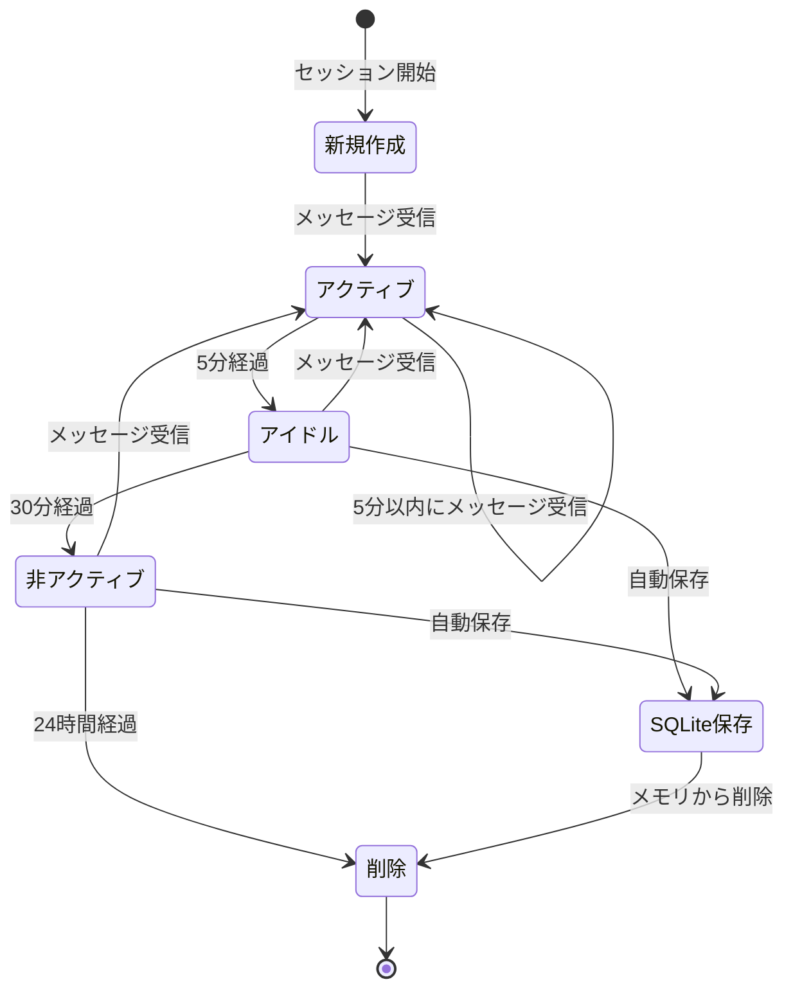

# 実装検討事項詳細

本ドキュメントは、Kotonoha（コトノハ）Discord ボットの実装前に検討すべき技術的な詳細事項をまとめたものです。

## 1. Discord API の制限事項と実装上の注意点

### 1.1 レート制限

**Discord API のレート制限:**

- **メッセージ送信**: チャンネルごとに 5 秒間に 5 件（バースト制限）
- **WebSocket 接続**: 120 リクエスト/分（グローバル制限）
- **HTTP API**: エンドポイントごとに異なる制限
  - メッセージ取得: 50 リクエスト/秒
  - メッセージ送信: チャンネルごとに 5 秒間に 5 件

**実装上の考慮事項:**

- **レート制限の監視**: `discord.py` の `on_rate_limit` イベントを実装
- **リトライロジック**: 429 エラー（Too Many Requests）時の指数バックオフ
- **キューイング**: メッセージ送信をキューに積んで順次処理
- **優先度管理**: ユーザー応答は優先、聞き耳型の判定は低優先度

### 1.2 メッセージ長制限

- **通常メッセージ**: 最大 2,000 文字
- **埋め込み（Embed）**: 最大 6,000 文字（タイトル、説明、フィールドの合計）
- **ファイル添付**: 最大 25MB（Nitro ユーザーは 50MB）

**実装上の考慮事項:**

- **長文応答の分割**: AI の応答が 2,000 文字を超える場合は複数メッセージに分割
- **分割ロジック**: 文の区切り（句点、改行）で分割し、連番を付与
- **埋め込みの活用**: 長文の場合は Embed を使用（ただし 6,000 文字制限あり）

### 1.3 スレッド作成の制限

- **スレッド作成**: チャンネルごとに同時に 1,000 スレッドまで
- **スレッド名**: 最大 100 文字
- **アーカイブ**: 自動アーカイブは 3 日、7 日、14 日、30 日、90 日から選択

**実装上の考慮事項:**

- **スレッド名の生成**: メッセージの最初の 100 文字をスレッド名に使用（長い場合は省略）
- **古いスレッドの管理**: アーカイブされたスレッドのセッションを SQLite に保存
- **スレッド数の監視**: チャンネルごとのスレッド数を監視し、上限に近づいたら警告

### 1.4 メンションの制限

- **@everyone/@here**: Bot には権限が必要（通常は使用しない）
- **ロールメンション**: 権限が必要
- **ユーザーメンション**: 制限なし

**実装上の考慮事項:**

- **メンション検知**: `message.mentions` で Bot 自身がメンションされているか確認
- **自己メンションの回避**: Bot 自身のメッセージには反応しない

## 2. セッション管理の詳細設計

### 2.1 セッションキーの設計

**セッションキーの形式:**

```txt
メンション応答型: channel_id または channel_id:user_id
スレッド型: thread_id
聞き耳型: eavesdrop:channel_id
```

**実装上の考慮事項:**

- **キーの一意性**: 各方式でキーが衝突しないようにプレフィックスを使用
- **キーの正規化**: 文字列型で統一し、数値型との混在を避ける
- **キーの検証**: セッション取得時にキーの形式を検証

### 2.2 セッションのライフサイクル

**セッションの状態遷移:**



**タイムアウト設定:**

- **アクティブ**: 最後のメッセージから 5 分以内
- **アイドル**: 最後のメッセージから 5 分〜30 分
- **非アクティブ**: 最後のメッセージから 30 分以上
- **自動保存**: アイドル状態になったら SQLite に保存
- **自動削除**: 非アクティブ状態が 24 時間続いたらメモリから削除

**実装上の考慮事項:**

- **タイマー管理**: `asyncio.Timer` または `discord.ext.tasks` を使用
- **定期的なクリーンアップ**: 1 時間ごとに非アクティブセッションをクリーンアップ
- **メモリ使用量の監視**: セッション数とメモリ使用量を監視

### 2.3 会話履歴の管理

**履歴の保持:**

- **メモリ内**: 直近 50 メッセージ（ChatSession）
- **SQLite**: 全メッセージ（制限なし、ただし実用的には 1,000 件程度）

**履歴の構造:**

```python
{
    "role": "user" | "assistant" | "system",
    "content": str,
    "timestamp": datetime,
    "message_id": int,  # Discord メッセージ ID
}
```

**実装上の考慮事項:**

- **トークン数の管理**: Gemini API のコンテキストウィンドウ（1M トークン）を考慮
- **履歴の圧縮**: 古いメッセージを要約して保持（将来の拡張）
- **履歴の取得**: SQLite から取得する際は LIMIT 句を使用

## 3. エラーハンドリングの詳細設計

### 3.1 API エラーの分類

**Anthropic API エラー（LiteLLM経由）:**

- **429 Too Many Requests / RateLimitError**: レート制限超過
  - 対策: 指数バックオフでリトライ（最大 3 回、デフォルト）
  - リトライ間隔: 1秒 → 2秒 → 4秒（指数バックオフ）
- **529 Overloaded / InternalServerError**: API過負荷エラー
  - 対策: 指数バックオフでリトライ（最大 3 回、デフォルト）
  - リトライ間隔: 1秒 → 2秒 → 4秒（指数バックオフ）
  - フォールバックモデルへの自動切り替え（設定されている場合）
- **400 Bad Request**: 無効なリクエスト
  - 対策: プロンプトの検証、エラーログに記録、リトライしない
- **500 Internal Server Error**: サーバーエラー
  - 対策: 指数バックオフでリトライ（最大 3 回）、フォールバック API に切り替え
- **503 Service Unavailable**: サービス利用不可
  - 対策: 指数バックオフでリトライ、ユーザーに一時的な障害を通知
- **AuthenticationError**: 認証エラー
  - 対策: リトライしない、エラーログに記録

**リトライ設定:**

- `LLM_MAX_RETRIES`: 最大リトライ回数（デフォルト: 3）
- `LLM_RETRY_DELAY_BASE`: 指数バックオフのベース遅延（秒、デフォルト: 1.0）
- リトライ対象: `InternalServerError`, `RateLimitError`（一時的なエラー）
- リトライ対象外: `AuthenticationError`（認証エラーは即座に失敗）

**Discord API エラー:**

- **403 Forbidden**: 権限不足
  - 対策: 権限チェック、エラーメッセージを送信
- **404 Not Found**: リソースが見つからない
  - 対策: チャンネル/スレッドの存在確認
- **429 Rate Limited**: レート制限超過
  - 対策: `discord.py` の自動リトライ機能を使用

### 3.2 エラーメッセージの設計

**場面緘黙支援を考慮したエラーメッセージ:**

- **優しい表現**: 「申し訳ございません」ではなく「少し時間がかかっています」
- **不安を与えない**: 「エラーが発生しました」ではなく「うまく応答できませんでした」
- **代替案の提示**: 「しばらく待ってから再度お試しください」

**エラーメッセージの例:**

```txt
通常: "エラーが発生しました。しばらく待ってから再度お試しください。"
場面緘黙支援: "少し時間がかかっています。もう少し待っていただけますか？それとも、後でもう一度お話ししましょうか？"
```

### 3.3 ログ設計

**ログレベル:**

- **DEBUG**: 詳細なデバッグ情報（開発時のみ）
- **INFO**: 通常の動作ログ（メッセージ受信、応答送信など）
- **WARNING**: 警告（レート制限接近、メモリ使用量増加など）
- **ERROR**: エラー（API エラー、データベースエラーなど）
- **CRITICAL**: 致命的なエラー（Bot の停止が必要な場合）

**ログの出力先:**

- **コンソール**: 開発環境
- **ファイル**: 本番環境（`logs/kotonoha.log`、ローテーション設定）
- **Discord チャンネル**: 管理者用チャンネル（CRITICAL のみ）

**ログの内容:**

- **メッセージ受信**: ユーザー ID、チャンネル ID、メッセージ内容（要約）
- **API 呼び出し**: API 名、リクエスト内容、レスポンス時間、エラー有無
- **セッション操作**: セッションキー、操作種別（作成、更新、削除）
- **エラー**: エラータイプ、スタックトレース、コンテキスト情報

## 4. データベーススキーマ設計

### 4.1 SQLite スキーマ

**sessions テーブル:**

```sql
CREATE TABLE sessions (
    session_key TEXT PRIMARY KEY,
    session_type TEXT NOT NULL,  -- 'mention', 'thread', 'eavesdrop'
    channel_id INTEGER,
    thread_id INTEGER,
    user_id INTEGER,
    created_at TIMESTAMP NOT NULL,
    updated_at TIMESTAMP NOT NULL,
    last_activity TIMESTAMP NOT NULL,
    is_archived BOOLEAN DEFAULT 0
);

CREATE INDEX idx_sessions_type ON sessions(session_type);
CREATE INDEX idx_sessions_user_id ON sessions(user_id);
CREATE INDEX idx_sessions_last_activity ON sessions(last_activity);
```

**messages テーブル:**

```sql
CREATE TABLE messages (
    id INTEGER PRIMARY KEY AUTOINCREMENT,
    session_key TEXT NOT NULL,
    role TEXT NOT NULL,  -- 'user', 'assistant', 'system'
    content TEXT NOT NULL,
    message_id INTEGER,  -- Discord メッセージ ID
    timestamp TIMESTAMP NOT NULL,
    FOREIGN KEY (session_key) REFERENCES sessions(session_key) ON DELETE CASCADE
);

CREATE INDEX idx_messages_session_key ON messages(session_key);
CREATE INDEX idx_messages_timestamp ON messages(timestamp);
```

**settings テーブル（将来の拡張用）:**

```sql
CREATE TABLE settings (
    key TEXT PRIMARY KEY,
    value TEXT NOT NULL,
    updated_at TIMESTAMP NOT NULL
);
```

### 4.2 データベース操作の最適化

**バッチ処理:**

- **一括挿入**: 複数のメッセージを一度に挿入（`executemany` を使用）
- **トランザクション**: 複数の操作をトランザクションで囲む
- **WAL モード**: Write-Ahead Logging を有効化（並行読み取り性能向上）

**クエリ最適化:**

- **インデックスの活用**: 頻繁に検索するカラムにインデックスを作成
- **LIMIT 句**: 履歴取得時は LIMIT 句を使用
- **ページネーション**: 大量のデータを取得する場合はページネーション

## 5. プロンプト設計の詳細

### 5.1 システムプロンプト（基本応答用）

```txt
あなたは「Kotonoha（コトノハ）」という Discord ボットです。
場面緘黙自助グループの運営を支援することを目的としています。

【キャラクター設定】
- 優しく、安心感のある応答を心がけます
- プレッシャーを感じさせない、自然な会話を大切にします
- ユーザーのペースに合わせて、段階的にコミュニケーションを支援します
- 常に温かく、受け入れる姿勢で応答します

【応答の原則】
- 短い応答から長い対話まで、ユーザーのペースに合わせます
- 否定的な言葉は使わず、肯定的な表現を心がけます
- ユーザーが話しやすい環境を作ることを最優先にします
- エラーや問題が発生しても、不安を与えない表現を使用します

【禁止事項】
- 医療的な診断やアドバイスは行いません
- 個人を特定できる情報を尋ねません
- 強制的な発言を促すような表現は使いません
```

### 5.2 判定用プロンプト（聞き耳型アプローチ 1）

```txt
あなたはDiscordサーバーのチャットボット「Kotonoha」です。
場面緘黙自助グループの運営を支援することを目的としています。

以下の会話履歴を見て、あなたが「今すぐに発言して会話に割って入るべき状況」かどうかを判定してください。

【判断基準 - YES と答える場合】
- ユーザーが困っていて助けが必要そうな時
- 誰かがあなたの名前（Kotonoha）を呼んだ時
- 場を和らげる発言が適切な時（会話が途切れている、沈黙が続いている）
- 質問や相談の内容に答えられる時

【判断基準 - NO と答える場合】
- シリアスな話、深刻な話題が進行中
- プライベートな会話が進行中
- 関係ない話題（技術的な質問以外の雑談など）
- 会話が活発に進行していて、割り込む必要がない時
- ユーザー同士の会話が自然に続いている時

【重要な注意】
- 場面緘黙支援を目的としているため、プレッシャーを感じさせないことが最優先
- 不適切なタイミングでの発言は避ける
- シリアスな話題には絶対に割り込まない

回答は "YES" または "NO" の単語のみで答えてください。余計な説明は不要です。
```

### 5.3 プロンプトの動的生成

**コンテキストの追加:**

- **会話履歴**: 直近 N 件のメッセージを追加
- **ユーザー情報**: ユーザー名（匿名化可能）
- **セッション情報**: セッションタイプ、開始時刻など

**トークン数の管理:**

- **最大トークン数**: Gemini 1.5 Flash は 1M トークン、実用的には 32K トークン程度
- **履歴の切り詰め**: トークン数が上限に近づいたら古いメッセージから削除
- **要約の活用**: 古いメッセージを要約して保持（将来の拡張）

## 6. レート制限対策の詳細

### 6.1 Gemini API のレート制限（2026 年 1 月現在の無料枠）

**制限値:**

- **Gemini 2.5 Flash**: 5 回/分、20 回/日、250,000 トークン/分
- **Gemini 2.5 Flash Lite**: 10 回/分、20 回/日、250,000 トークン/分
- **Gemini 3 Flash**: 5 回/分、20 回/日、250,000 トークン/分

**重要**: 無料枠は 1 日 20 リクエストまでに制限されています。継続的な開発やテストには有料プランへの移行を検討してください。

**実装上の考慮事項:**

- **リクエスト数の監視**: 時間窓ごとのリクエスト数をカウント
- **優先度管理**: ユーザー応答 > 聞き耳型判定
- **キューイング**: レート制限に達したらリクエストをキューに積む
- **フォールバック**: Flash の制限に達したら Pro に切り替え（ただし Pro の制限も厳しい）

### 6.2 レート制限の実装

**トークンバケットアルゴリズム:**

```python
class RateLimiter:
    def __init__(self, max_requests: int, time_window: int):
        self.max_requests = max_requests
        self.time_window = time_window
        self.requests = []  # タイムスタンプのリスト

    async def acquire(self):
        now = time.time()
        # 時間窓外のリクエストを削除
        self.requests = [r for r in self.requests if now - r < self.time_window]

        if len(self.requests) >= self.max_requests:
            # 次のリクエスト可能時刻まで待機
            wait_time = self.time_window - (now - self.requests[0])
            await asyncio.sleep(wait_time)

        self.requests.append(now)
```

**使用例（無料枠の場合、2026 年 1 月現在）:**

```python
# 無料枠の場合
flash_limiter = RateLimiter(max_requests=5, time_window=60)  # 1分間に5回（gemini-2.5-flash）
flash_lite_limiter = RateLimiter(max_requests=10, time_window=60)  # 1分間に10回（gemini-2.5-flash-lite）
daily_limiter = RateLimiter(max_requests=20, time_window=86400)  # 1日に20回（無料枠共通）
```

## 7. メモリ管理とパフォーマンス

### 7.1 メモリ使用量の最適化

**ChatSession のメモリ管理:**

- **セッション数の制限**: 同時に保持するセッション数を 100 に制限
- **LRU キャッシュ**: 最近使用されていないセッションから SQLite に移動
- **定期的なクリーンアップ**: 1 時間ごとに非アクティブセッションを削除

**会話履歴のメモリ管理:**

- **履歴の制限**: メモリ内では直近 50 メッセージのみ保持
- **古いメッセージの圧縮**: 30 分以上前のメッセージは要約して保持（将来の拡張）

### 7.2 非同期処理の活用

**並行処理:**

- **API 呼び出し**: `asyncio.gather` で複数の API 呼び出しを並行実行
- **データベース操作**: 読み取り操作は並行実行可能
- **メッセージ送信**: キューに積んで順次処理（レート制限対策）

**タスクの管理:**

- **バックグラウンドタスク**: `discord.ext.tasks` を使用
  - セッションのクリーンアップ（1 時間ごと）
  - SQLite へのバッチ同期（5 分ごと）
  - レート制限の監視（1 分ごと）

## 8. セキュリティ対策の詳細

### 8.1 API キーの管理

**環境変数:**

- **開発環境**: `.env` ファイル（`.gitignore` に追加）
- **本番環境**: Docker の環境変数、GitHub Secrets

**キーのローテーション:**

- **定期的な変更**: 3 ヶ月ごとに API キーを変更
- **複数キーの管理**: フォールバック用に複数のキーを保持（将来の拡張）

### 8.2 入力のサニタイゼーション

**ユーザー入力の検証:**

- **メッセージ長**: 2,000 文字を超える場合は拒否
- **不正な文字**: 制御文字を除去
- **SQL インジェクション**: パラメータ化クエリを使用

**プロンプトインジェクション対策:**

- **システムプロンプトの固定**: ユーザー入力とシステムプロンプトを明確に分離
- **入力のエスケープ**: 特殊文字をエスケープ
- **プロンプトの検証**: 送信前にプロンプトの内容を検証

### 8.3 プライバシー保護

**データの最小化:**

- **必要最小限のデータ**: 会話内容のみを保存、メタデータは最小限
- **匿名化**: ユーザー ID は保存するが、個人を特定できる情報は保存しない
- **データの削除**: ユーザーが削除を要求した場合は即座に削除

**アクセス制御:**

- **セッションの分離**: ユーザーごとのセッションを完全に分離
- **データベースアクセス**: セッションキーでフィルタリング
- **ログの匿名化**: ログに個人を特定できる情報を含めない

## 9. テスト戦略

### 9.1 単体テスト

**テスト対象:**

- **セッション管理**: セッションの作成、更新、削除
- **メッセージルーティング**: 4 つの会話の契機の判定
- **プロンプト生成**: プロンプトの動的生成
- **レート制限**: レート制限の実装

**テストフレームワーク:**

- **pytest**: テストフレームワーク
- **pytest-asyncio**: 非同期テスト
- **pytest-mock**: モックオブジェクト

### 9.2 統合テスト

**テスト対象:**

- **Discord API との連携**: メッセージの送受信
- **Gemini API との連携**: API 呼び出しとレスポンス処理
- **SQLite との連携**: データの保存と取得

**テスト環境:**

- **Discord テストサーバー**: 専用のテストサーバーを作成
- **モック API**: Gemini API をモック化（レート制限を回避）

### 9.3 エンドツーエンドテスト

**テストシナリオ:**

1. **メンション応答型**: メンション → 応答 → 会話継続
2. **スレッド型**: メンション → スレッド作成 → 応答 → 会話継続
3. **聞き耳型**: 会話の監視 → 判定 → 応答（適切なタイミング）

## 10. モニタリングとアラート

### 10.1 監視項目

**パフォーマンス指標:**

- **応答時間**: API 呼び出しから応答送信までの時間
- **レート制限**: API のレート制限使用率
- **メモリ使用量**: ChatSession のメモリ使用量
- **データベースサイズ**: SQLite データベースのサイズ

**エラー指標:**

- **API エラー率**: Gemini API のエラー率
- **Discord API エラー率**: Discord API のエラー率
- **データベースエラー率**: SQLite のエラー率

### 10.2 アラート設定

**アラート条件:**

- **レート制限接近**: 使用率が 80% を超えたら警告
- **メモリ使用量**: メモリ使用量が 500MB を超えたら警告
- **エラー率**: エラー率が 5% を超えたら警告
- **応答時間**: 応答時間が 10 秒を超えたら警告

**アラートの通知先:**

- **Discord チャンネル**: 管理者用チャンネル
- **ログファイル**: エラーログに記録

## 11. デプロイメントと運用

### 11.1 Docker コンテナの設定

**リソース制限:**

```yaml
resources:
  limits:
    memory: 1G
    cpus: "1.0"
  reservations:
    memory: 512M
    cpus: "0.5"
```

**環境変数:**

- **必須**: `DISCORD_TOKEN`, `GEMINI_API_KEY`
- **オプション**: 各種設定値（デフォルト値あり）

**ボリュームマウント:**

- **データベース**: `/app/data` → ホストの `./data`
- **ログ**: `/app/logs` → ホストの `./logs`

### 11.2 ヘルスチェック

**ヘルスチェックエンドポイント:**

- **Liveness**: Bot が動作しているか確認
- **Readiness**: Bot がリクエストを受け付けられるか確認

**実装:**

```python
@app.route('/health')
async def health_check():
    # Discord 接続状態を確認
    # データベース接続を確認
    return {"status": "healthy"}
```

### 11.3 バックアップ戦略

**データベースのバックアップ:**

- **頻度**: 1 日 1 回（深夜）
- **保存期間**: 7 日分
- **保存場所**: ホストの `./backups` ディレクトリ

**バックアップスクリプト:**

```bash
#!/bin/bash
DATE=$(date +%Y%m%d_%H%M%S)
cp /app/data/kotonoha.db /app/backups/kotonoha_${DATE}.db
# 7 日以上古いバックアップを削除
find /app/backups -name "kotonoha_*.db" -mtime +7 -delete
```

## 12. 将来の拡張に向けた設計

### 12.1 プラグインアーキテクチャ

**抽象化インターフェース:**

- **AI プロバイダー**: 複数の AI API に対応
- **ストレージ**: SQLite 以外のデータベースに対応
- **通知**: 複数の通知方法に対応

### 12.2 設定管理の拡張

**設定の階層化:**

1. **デフォルト設定**: コード内のデフォルト値
2. **環境変数**: Docker の環境変数
3. **データベース**: `settings` テーブル（ユーザーごとの設定）

**設定の優先順位:**

データベース > 環境変数 > デフォルト設定

---

**作成日**: 2026 年 1 月 14 日
**バージョン**: 1.0
**作成者**: kotonoha-bot 開発チーム
