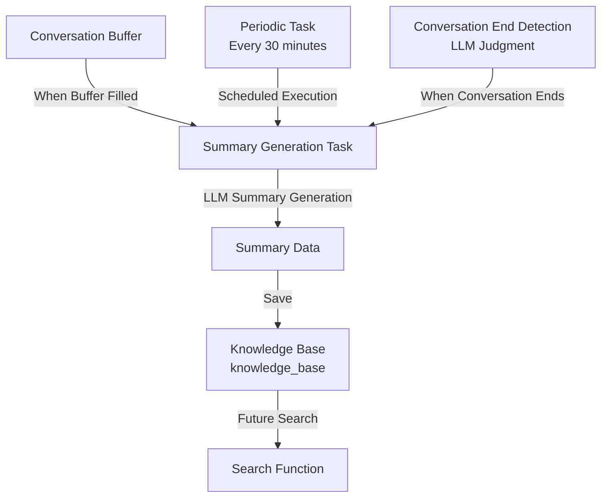

# 知識データベース機能 設計書

## 1. 概要

### 1.1 目的

聞き耳モードで監視しているチャンネルの会話から、必要な情報のみを要約して知識データベースに蓄積する機能です。

**主な目的**:

- 会話の要点を自動的に抽出・保存
- ストレージ効率を最大化（全メッセージ保存ではなく要約のみ）
- 将来的な検索・参照機能の基盤を構築
- プライバシーを保護（詳細な会話内容ではなく要点のみ保存）

### 1.2 背景

現在、聞き耳モードのチャンネルでは：

- すべてのメッセージが `ConversationBuffer` に一時保存される（メモリ内、最大 20 件）
- Bot が応答した場合のみ、セッションとして SQLite に保存される
- Bot が応答しないメッセージは永続化されない

**課題**:

- 会話の重要な情報が失われる可能性がある
- 過去の会話を参照できない
- 全メッセージを保存するとストレージ容量が膨大になる

**解決策**:

- LLM を使って会話の要点を自動抽出
- 要約のみをデータベースに保存
- ストレージ効率と情報保持を両立

## 2. 設計思想

### 2.1 基本方針

1. **要約ベースの保存**: 全メッセージを保存せず、LLM で要約を生成して保存
2. **非侵入的**: ユーザーの会話に影響を与えない（バックグラウンド処理）
3. **効率的**: 軽量モデルを使用し、API コストを最小化
4. **プライバシー重視**: 詳細な会話内容ではなく要点のみを保存

### 2.2 設計原則

- **ストレージ効率**: 全メッセージ保存よりも大幅に容量を削減
- **検索性**: 要約された情報を検索しやすい形式で保存
- **拡張性**: 将来的な検索機能や分析機能に対応できる設計
- **パフォーマンス**: ユーザー応答を優先し、要約生成は非同期で実行

## 3. アーキテクチャ設計

### 3.1 全体構成



### 3.2 データフロー

1. **メッセージ受信**: 聞き耳モードのチャンネルでメッセージを受信
2. **バッファに追加**: `ConversationBuffer` にメッセージを追加
3. **要約生成の判定**:
   - バッファが一定量（例：20 件）溜まったら
   - または定期的（30 分ごと）に
   - または会話終了と判定された時
4. **要約生成**: LLM を使って会話の要点を抽出
5. **データベース保存**: 要約を `knowledge_base` テーブルに保存
6. **バッファクリア**: 要約済みのメッセージをバッファから削除（オプション）

## 4. データベース設計

### 4.1 テーブル定義

```sql
CREATE TABLE IF NOT EXISTS knowledge_base (
    id INTEGER PRIMARY KEY AUTOINCREMENT,
    channel_id INTEGER NOT NULL,
    summary TEXT NOT NULL,              -- 会話の要約（主要な内容）
    key_points TEXT,                     -- 重要なポイント（JSON形式）
    message_count INTEGER,               -- 要約対象のメッセージ数
    start_time TEXT NOT NULL,            -- 会話の開始時刻（ISO形式）
    end_time TEXT NOT NULL,              -- 会話の終了時刻（ISO形式）
    created_at TEXT NOT NULL,            -- 要約生成時刻（ISO形式）
    conversation_hash TEXT               -- 会話のハッシュ（重複排除用）
);

-- インデックス
CREATE INDEX IF NOT EXISTS idx_kb_channel_id ON knowledge_base(channel_id);
CREATE INDEX IF NOT EXISTS idx_kb_created_at ON knowledge_base(created_at);
CREATE INDEX IF NOT EXISTS idx_kb_conversation_hash ON knowledge_base(conversation_hash);
```

### 4.2 データ構造

**`key_points` の JSON 形式**:

```json
{
  "decisions": ["決定事項1", "決定事項2"],
  "questions": ["質問1", "質問2"],
  "answers": ["回答1", "回答2"],
  "topics": ["話題1", "話題2"],
  "important_info": ["重要な情報1", "重要な情報2"]
}
```

### 4.3 重複排除

- `conversation_hash`: 会話内容のハッシュ値を保存
- 同じ会話の要約が重複しないように管理
- ハッシュ値は会話のメッセージ ID と内容から生成

## 5. 要約生成の仕組み

### 5.1 要約プロンプトの設計

**プロンプトの要件**:

- 会話の要点を抽出
- 重要な情報（決定事項、質問、回答など）を構造化
- 不要な情報（挨拶、雑談など）は省略
- 場面緘黙支援の文脈を考慮

**プロンプト例**:

```txt
以下のDiscordチャンネルの会話履歴を要約してください。

【要約の要件】
1. 会話の主要な内容を簡潔にまとめる
2. 重要な情報を抽出する：
   - 決定事項や合意形成
   - 質問とその回答
   - 重要な話題や議論
   - 参加者が必要としている情報
3. 不要な情報は省略する：
   - 単なる挨拶や雑談
   - 会話の流れに影響しない発言
   - 個人を特定できる情報

【出力形式】
- 要約: 会話の主要な内容を3-5文でまとめる
- 重要なポイント（JSON形式）:
  {
    "decisions": ["決定事項のリスト"],
    "questions": ["質問のリスト"],
    "answers": ["回答のリスト"],
    "topics": ["話題のリスト"],
    "important_info": ["重要な情報のリスト"]
  }

【会話履歴】
{conversation_log}
```

### 5.2 要約生成のタイミング

#### 5.2.1 バッファベース

- **条件**: 会話バッファが一定量（例：20 件）溜まったら
- **メリット**: 会話の区切りで要約を生成できる
- **デメリット**: 会話が少ない場合は要約が生成されない

#### 5.2.2 時間ベース

- **条件**: 定期的（例：30 分ごと）に要約を生成
- **メリット**: 確実に要約が生成される
- **デメリット**: 会話の区切りと一致しない場合がある

#### 5.2.3 会話終了時

- **条件**: LLM が会話終了と判定した時
- **メリット**: 会話の区切りで要約を生成できる
- **デメリット**: 判定の精度に依存

**推奨**: バッファベースと時間ベースの組み合わせ

### 5.3 使用モデル

- **要約生成**: 軽量モデル（例：`anthropic/claude-haiku-4.5`）
- **理由**: コスト効率と速度を重視
- **トークン制限**: 要約は短く、最大 500 トークン程度

## 6. 実装の詳細

### 6.1 モジュール構成

```txt
src/kotonoha_bot/
├── knowledge/
│   ├── __init__.py
│   ├── summarizer.py      # 要約生成機能
│   └── storage.py          # データベース操作
└── db/
    └── sqlite.py           # データベース接続（拡張）
```

### 6.2 主要クラス

#### 6.2.1 `KnowledgeSummarizer`

```python
class KnowledgeSummarizer:
    """会話の要約を生成するクラス"""

    async def summarize_conversation(
        self,
        messages: list[discord.Message]
    ) -> dict:
        """会話を要約

        Returns:
            {
                "summary": str,
                "key_points": dict,
                "message_count": int,
                "start_time": datetime,
                "end_time": datetime
            }
        """
```

#### 6.2.2 `KnowledgeStorage`

```python
class KnowledgeStorage:
    """知識データベースの操作クラス"""

    async def save_summary(
        self,
        channel_id: int,
        summary_data: dict
    ) -> bool:
        """要約をデータベースに保存"""

    async def get_summaries(
        self,
        channel_id: int,
        limit: int = 10
    ) -> list[dict]:
        """チャンネルの要約を取得"""
```

### 6.3 定期タスク

```python
@tasks.loop(minutes=30)  # 30分ごとに実行
async def knowledge_summary_task(self):
    """知識データベースの要約生成タスク"""
    try:
        # 聞き耳型が有効なチャンネルを取得
        for channel_id in self.router.eavesdrop_enabled_channels:
            # 会話バッファを取得
            messages = self.conversation_buffer.get_recent_messages(
                channel_id, limit=20
            )

            # 一定量溜まっているか確認
            if len(messages) >= Config.KNOWLEDGE_MIN_MESSAGES:
                # 要約を生成
                summary = await self.knowledge_summarizer.summarize_conversation(
                    messages
                )

                # データベースに保存
                await self.knowledge_storage.save_summary(channel_id, summary)

                # バッファから要約済みメッセージを削除（オプション）
                # self.conversation_buffer.clear(channel_id)
    except Exception as e:
        logger.error(f"Error in knowledge summary task: {e}")
```

### 6.4 設定項目

```python
# config.py に追加
KNOWLEDGE_ENABLED: bool = os.getenv("KNOWLEDGE_ENABLED", "false").lower() == "true"
KNOWLEDGE_MIN_MESSAGES: int = int(os.getenv("KNOWLEDGE_MIN_MESSAGES", "20"))
KNOWLEDGE_SUMMARY_INTERVAL_MINUTES: int = int(
    os.getenv("KNOWLEDGE_SUMMARY_INTERVAL_MINUTES", "30")
)
KNOWLEDGE_SUMMARY_MODEL: str = os.getenv(
    "KNOWLEDGE_SUMMARY_MODEL", "anthropic/claude-haiku-4.5"
)
```

## 7. 考慮事項

### 7.1 パフォーマンス

**非同期処理**:

- 要約生成はバックグラウンドで実行
- ユーザー応答を優先し、要約生成は低優先度で処理
- リクエストキューを使用して優先度管理

**トークン消費**:

- 軽量モデルを使用してコストを削減
- 要約は短く（最大 500 トークン）
- バッファサイズを制限（最大 20 件）

### 7.2 プライバシー

**データの最小化**:

- 詳細な会話内容ではなく要点のみを保存
- 個人を特定できる情報は要約から除外
- ユーザー ID は保存しない（チャンネル ID のみ）

**アクセス制御**:

- 要約データへのアクセスは管理者のみ（将来の拡張）
- データの削除機能を実装（将来の拡張）

### 7.3 コスト

**API コスト**:

- 軽量モデル（Haiku）を使用: 約 $0.25/1M 入力トークン
- 要約は 30 分ごと、または 20 件溜まったら生成
- 1 日あたりのコストは使用量に依存

**ストレージコスト**:

- 要約のみを保存するため、全メッセージ保存よりも大幅に削減
- SQLite のファイルサイズは小規模

### 7.4 精度

**要約の品質**:

- LLM の要約品質に依存
- プロンプトの調整が必要
- 要約の品質を評価する仕組み（将来の拡張）

**重複排除**:

- 同じ会話の要約が重複しないように管理
- ハッシュ値を使用して重複を検出

## 8. 将来の拡張

### 8.1 検索機能

**キーワード検索**:

- 要約や重要ポイントからキーワードを検索
- チャンネル ID や日付範囲で絞り込み

**セマンティック検索**:

- ベクトルデータベースを導入
- 要約をベクトル化して保存
- 意味的に近い要約を検索

### 8.2 分析機能

**会話の傾向分析**:

- チャンネルごとの話題の傾向
- 時間帯ごとの会話の特徴
- 参加者の関心事の分析

**可視化**:

- 会話の時系列グラフ
- 話題の分布図
- 重要ポイントの頻出度

### 8.3 統合機能

**Bot 応答への活用**:

- 過去の会話要約を参照して応答
- コンテキストの提供
- 一貫性のある応答

**コマンド機能**:

- `!knowledge search <keyword>`: 要約を検索
- `!knowledge summary <channel>`: チャンネルの要約を表示
- `!knowledge stats`: 統計情報を表示

## 9. 実装計画

### 9.1 Phase 1: 基本機能（優先度: 高）

1. **データベーステーブルの作成**

   - `knowledge_base` テーブルの作成
   - インデックスの作成

2. **要約生成機能の実装**

   - `KnowledgeSummarizer` クラスの実装
   - 要約プロンプトの作成

3. **データベース操作の実装**

   - `KnowledgeStorage` クラスの実装
   - 保存・取得機能

4. **定期タスクの実装**
   - `knowledge_summary_task` の実装
   - バッファベースと時間ベースの判定

### 9.2 Phase 2: 最適化（優先度: 中）

1. **重複排除の実装**

   - ハッシュ値の生成と管理
   - 重複チェック機能

2. **パフォーマンス最適化**

   - 非同期処理の最適化
   - バッファ管理の改善

3. **エラーハンドリング**
   - 要約生成の失敗時の処理
   - リトライロジック

### 9.3 Phase 3: 拡張機能（優先度: 低）

1. **検索機能の実装**

   - キーワード検索
   - セマンティック検索（オプション）

2. **分析機能の実装**

   - 統計情報の生成
   - 可視化機能

3. **コマンド機能の実装**
   - 検索コマンド
   - 統計コマンド

## 10. テスト戦略

### 10.1 単体テスト

- **要約生成**: 会話から要約が正しく生成されるか
- **データベース操作**: 保存・取得が正しく動作するか
- **重複排除**: 同じ会話の要約が重複しないか

### 10.2 統合テスト

- **定期タスク**: タスクが正しく実行されるか
- **バッファ管理**: バッファと要約の連携が正しいか
- **エラーハンドリング**: エラー時の処理が適切か

### 10.3 パフォーマンステスト

- **要約生成の速度**: 要約生成にかかる時間
- **データベースのパフォーマンス**: 大量データでの動作
- **メモリ使用量**: メモリリークの有無

## 11. 参考資料

- [会話の契機の詳細](../requirements/conversation-triggers.md)
- [聞き耳型機能の仕様](../specifications/eavesdrop-specification.md)
- [データベース設計](../architecture/database-design.md)
- [実装検討事項](./considerations.md)

---

**作成日**: 2026 年 1 月
**バージョン**: 1.0
**作成者**: kotonoha-bot 開発チーム
