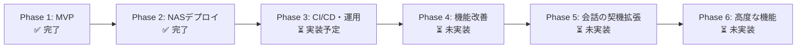

# 実装ロードマップ

段階的な実装計画と各段階での実装順序を定義します。

## 1. 実装方針

### 1.1 段階的実装のメリット

- **早期の動作確認**: 各段階で動作する最小限の機能を実装し、早期に動作確認できる
- **リスクの低減**: 小さな単位で実装・テストすることで、問題を早期に発見できる
- **学習効果**: 各段階で学んだことを次の段階に活かせる
- **柔軟な変更**: 要件変更に柔軟に対応できる
- **進捗管理**: 明確なマイルストーンで進捗を管理しやすい

### 1.2 実装原則

1. **動作する最小限の機能を優先**: 各段階で必ず動作する状態を作る
2. **テスト可能な状態を維持**: 各段階でテスト可能な状態を保つ
3. **リファクタリングを適宜実施**: コードの品質を維持しながら進める
4. **ドキュメントを更新**: 実装と同時にドキュメントも更新

---

## 2. 実装段階の全体像と実装状況

### 実装状況サマリー

| Phase       | 段階              | 実装状況    | 期間     | 主要機能                                     |
| ----------- | ----------------- | ----------- | -------- | -------------------------------------------- |
| **Phase 1** | 段階 1, 3, 4 統合 | ✅ 完了     | 実装済み | MVP（メンション応答型、セッション管理）      |
| **Phase 2** | 段階 2            | ✅ 完了     | 実装済み | NAS デプロイ、Docker 化、バックアップ        |
| **Phase 3** | 段階 7            | ⏳ 実装予定 | 8-10 日  | CI/CD、テスト、コード品質                    |
| **Phase 4** | -                 | ⏳ 未実装   | 3-5 日   | メッセージ長制限、バッチ同期                 |
| **Phase 5** | 段階 5            | ⏳ 未実装   | 10-14 日 | スレッド型、聞き耳型                         |
| **Phase 6** | 段階 6            | ⏳ 未実装   | 8-10 日  | レート制限、コマンド、エラーハンドリング強化 |

---

## Phase 1: MVP（メンション応答型）✅ 完了

**目標**: Discord 上でメンションされた時に LiteLLM 経由で LLM API を使って応答できる最小限の Bot

**実装期間**: 2026 年 1 月（完了）

**実装済み機能**:

- ✅ 環境構築と Discord 接続
- ✅ AI 応答機能（メンション応答型）
  - ✅ LiteLLM 統合
  - ✅ システムプロンプトの実装
  - ✅ 動的プロンプト生成（日付情報の注入）
  - ✅ フォールバック機能
- ✅ セッション管理と会話履歴保持
  - ✅ SQLite データベースのセットアップ
  - ✅ ChatSession クラスの実装
  - ✅ セッション管理モジュール
  - ✅ 会話履歴の保持と復元
- ✅ 基本的なエラーハンドリング
- ✅ ログ出力機能

**未実装機能（Phase 4 で実装予定）**:

- ❌ メッセージ長制限対応（2000 文字超の場合は分割）

**詳細**: [Phase 1 実装完了報告](./phases/phase1.md)

---

## Phase 2: NAS デプロイ ✅ 完了

**目標**: Phase 1 で実装済みの Bot を NAS 上で 24 時間稼働させ、本番環境として運用できるようにする

**実装期間**: 2026 年 1 月（完了）

**実装済み機能**:

- ✅ Dockerfile の作成（マルチステージビルド）
- ✅ Docker Compose の作成
- ✅ NAS へのデプロイ（Synology Container Manager）
- ✅ バックアップ機能（SQLite オンラインバックアップ、gzip 圧縮）
- ✅ ログ管理（RotatingFileHandler）
- ✅ ヘルスチェック機能（HTTP エンドポイント）
- ✅ セキュリティ設定（非 root ユーザーでの実行）

**詳細**: [Phase 2 実装完了報告](./phases/phase2.md)

---

## Phase 3: CI/CD と運用機能 ⏳ 実装予定

**目標**: CI/CD パイプラインを構築し、運用に必要な機能を実装する

**期間**: 約 8-10 日

**実装すべき機能**:

### 3.1 テストフレームワークの設定

- [ ] pytest 設定（`pyproject.toml`）
- [ ] テストディレクトリ構造の作成
- [ ] 基本的なフィクスチャの実装

### 3.2 コード品質ツールの設定

- [ ] Ruff 設定（lint、format）
- [ ] mypy 設定（type-check）
- [ ] ローカルでの実行確認

### 3.3 GitHub Actions ワークフローの作成

- [ ] CI ワークフロー（`.github/workflows/ci.yml`）
  - [ ] lint チェック
  - [ ] format チェック
  - [ ] type-check
  - [ ] テスト実行
- [ ] ビルドワークフロー（`.github/workflows/build.yml`）
  - [ ] Docker イメージのビルド
  - [ ] GHCR へのプッシュ
  - [ ] マルチプラットフォームビルド（amd64、arm64）

### 3.4 Watchtower の設定

- [ ] `docker-compose.yml` への Watchtower 追加
- [ ] GHCR 認証の設定（オプション）
- [ ] 自動更新の動作確認

### 3.5 GitHub Secrets の設定

- [ ] 必要なシークレットの設定（オプション）

### 3.6 通知の設定（オプション）

- [ ] Discord Webhook 通知
- [ ] GitHub Actions の通知

**詳細**: [Phase 3 実装計画](./phases/phase3.md)

---

## Phase 4: 機能改善 ⏳ 未実装

**目標**: Phase 1 で実装した機能の改善と不足機能の追加

**期間**: 約 3-5 日

**実装すべき機能**:

### 4.1 メッセージ長制限対応

- [ ] メッセージ分割機能の実装
  - [ ] 2000 文字超の応答を検知
  - [ ] 文の区切り（句点、改行）で分割
  - [ ] 連番を付与して複数メッセージに分割
  - [ ] Embed の活用（オプション、6000 文字制限あり）

### 4.2 セッション同期機能の改善

- [ ] バッチ同期の定期実行タスク
  - [ ] `discord.ext.tasks` または `asyncio` を使用
  - [ ] 5 分ごとにアイドル状態のセッションを自動保存
  - [ ] `cleanup_old_sessions` の定期実行（1 時間ごと）

### 4.3 エラーハンドリングの改善

- [ ] メッセージ追加時の自動保存
  - [ ] `add_message` 後に自動的に `save_session` を呼ぶ（オプション）
  - [ ] または、バッチ同期に任せる

**完了基準**:

- [ ] 2000 文字超の応答が自動的に分割される
- [ ] バッチ同期が 5 分ごとに実行される
- [ ] セッションクリーンアップが 1 時間ごとに実行される

---

## Phase 5: 会話の契機拡張（スレッド型・聞き耳型）⏳ 未実装

**目標**: 3 つの会話の契機（メンション/スレッド/聞き耳型）を実装する

**期間**: 約 10-14 日

**実装すべき機能**:

### 5.1 メッセージルーターの実装

- [ ] `router/message_router.py`: メッセージルーティング
- [ ] 会話の契機判定ロジック
  - [ ] メンション応答型の判定（既存）
  - [ ] スレッド型の判定
  - [ ] 聞き耳型の判定

### 5.2 スレッド型の実装

- [ ] メンション検知時の自動スレッド作成
- [ ] スレッド名の生成（メッセージの最初の 100 文字）
- [ ] スレッド内での会話継続（メンション不要）
- [ ] スレッドアーカイブ検知
- [ ] アーカイブ時のセッション保存

### 5.3 聞き耳型の実装

- [ ] `eavesdrop/llm_judge.py`: LLM 判断機能（アプローチ 1）
  - [ ] 会話ログの一時保存（直近 10〜20 件）
  - [ ] 判定フェーズ（裁判官）の実装
  - [ ] 発言生成フェーズ（演者）の実装
  - [ ] 判定用プロンプトの最適化
- [ ] `eavesdrop/rule_judge.py`: ルールベース判断機能（アプローチ 2、オプション）
  - [ ] キーワード検知
  - [ ] 盛り上がり検知
  - [ ] ランダム判定
- [ ] チャンネルごとの有効/無効設定
- [ ] メインチャンネルへの直接投稿機能

### 5.4 統一インターフェースの実装

- [ ] 3 つの方式を統一的に扱うインターフェース
- [ ] セッションキーの統一管理
  - [ ] メンション応答型: `mention:{user_id}`
  - [ ] スレッド型: `thread:{thread_id}`
  - [ ] 聞き耳型: `eavesdrop:{channel_id}`

**完了基準**:

- [ ] メンション応答型が動作する（既存）
- [ ] スレッド型が動作する（自動スレッド作成）
- [ ] 聞き耳型が動作する（アプローチ 1）
- [ ] 各方式で会話履歴が正しく管理される

---

## Phase 6: 高度な機能（レート制限・コマンド・エラーハンドリング強化）⏳ 未実装

**目標**: レート制限対応、コマンド機能、エラーハンドリングの強化を実装する

**期間**: 約 8-10 日

**実装すべき機能**:

### 6.1 レート制限対応

- [ ] レート制限モニタリング
  - [ ] API リクエスト数の追跡
  - [ ] レート制限の接近を検知
  - [ ] 警告ログの出力
- [ ] トークンバケットアルゴリズムの実装
  - [ ] リクエストレートの制御
  - [ ] バースト対応
- [ ] リクエストキューイング
  - [ ] リクエストのキューイング
  - [ ] 優先度管理（メンション > スレッド > 聞き耳型）
- [ ] `litellm.RateLimitError` の適切な処理
  - [ ] 指数バックオフでのリトライ
  - [ ] ユーザーへの適切な通知

### 6.2 コマンド機能

- [ ] `commands/chat.py`: スラッシュコマンド
- [ ] `/chat start` コマンド（スレッド型開始）
  - [ ] スレッドの自動作成
  - [ ] セッションの初期化
- [ ] `/chat reset` コマンド（会話履歴リセット）
  - [ ] セッションの会話履歴をクリア
  - [ ] メモリ内のセッションをリセット
- [ ] `/chat status` コマンド（セッション状態表示）
  - [ ] セッションタイプの表示
  - [ ] 会話履歴の件数表示
  - [ ] セッションの開始時刻表示

### 6.3 エラーハンドリングの強化

- [x] 詳細なエラー分類
  - [x] API エラーの分類（RateLimitError、InternalServerError、AuthenticationError など）
  - [ ] Discord API エラーの分類
  - [ ] データベースエラーの分類
- [x] リトライロジック（指数バックオフ）
  - [x] 一時的なエラー（429、500、529、503 など）の自動リトライ
  - [x] 最大リトライ回数の設定（`LLM_MAX_RETRIES`、デフォルト: 3）
  - [x] リトライ間隔の指数バックオフ（`LLM_RETRY_DELAY_BASE`、デフォルト: 1.0 秒）
  - [x] `InternalServerError`（HTTP 529 Overloaded を含む）のリトライ対応
  - [x] `RateLimitError`（HTTP 429）のリトライ対応
- [ ] フォールバック機能の改善
  - [x] フォールバックモデルへの自動切り替え（LiteLLM の`fallbacks`パラメータで実装済み）
  - [x] フォールバック時のログ出力
- [ ] 場面緘黙支援を考慮したエラーメッセージの改善
  - [ ] より優しい表現の使用
  - [ ] 不安を与えないメッセージ

**完了基準**:

- [x] レート制限に適切に対応できる（リトライロジック実装済み）
- [ ] スラッシュコマンドが動作する
- [x] エラーが適切に分類・処理される（一時的エラーと認証エラーの分類実装済み）
- [x] リトライロジックが動作する（指数バックオフでリトライ実装済み）

---

## 実装状況の詳細

### ✅ 実装完了（Phase 1, Phase 2）

| 機能カテゴリ                    | 実装状況 | 備考    |
| ------------------------------- | -------- | ------- |
| 環境構築・Discord 接続          | ✅ 完了  | Phase 1 |
| AI 応答機能（メンション応答型） | ✅ 完了  | Phase 1 |
| セッション管理・会話履歴保持    | ✅ 完了  | Phase 1 |
| NAS デプロイ・Docker 化         | ✅ 完了  | Phase 2 |
| バックアップ機能                | ✅ 完了  | Phase 2 |
| ログ管理                        | ✅ 完了  | Phase 2 |
| ヘルスチェック                  | ✅ 完了  | Phase 2 |

### ⏳ 実装予定（Phase 3）

| 機能カテゴリ         | 実装状況  | 備考    |
| -------------------- | --------- | ------- |
| CI/CD パイプライン   | ⏳ 未実装 | Phase 3 |
| テストフレームワーク | ⏳ 未実装 | Phase 3 |
| コード品質ツール     | ⏳ 未実装 | Phase 3 |
| Watchtower 設定      | ⏳ 未実装 | Phase 3 |

### ⏳ 未実装（Phase 4-6）

| 機能カテゴリ         | 実装状況  | 備考    |
| -------------------- | --------- | ------- |
| メッセージ長制限対応 | ❌ 未実装 | Phase 4 |
| バッチ同期の定期実行 | ❌ 未実装 | Phase 4 |
| スレッド型           | ❌ 未実装 | Phase 5 |
| 聞き耳型             | ❌ 未実装 | Phase 5 |
| レート制限対応       | ❌ 未実装 | Phase 6 |
| コマンド機能         | ❌ 未実装 | Phase 6 |
| リトライロジック     | ❌ 未実装 | Phase 6 |

---

## フェーズ別実装計画

### Phase 1 の詳細: MVP（メンション応答型）✅ 完了

**実装済み機能**:

1. **環境構築と Discord 接続**

   - ✅ プロジェクト構造の作成
   - ✅ `pyproject.toml` の設定
   - ✅ Discord Bot の基本接続

2. **AI 応答機能**

   - ✅ LiteLLM 統合
   - ✅ システムプロンプトの実装
   - ✅ 動的プロンプト生成（日付情報の注入）
   - ✅ フォールバック機能

3. **セッション管理**
   - ✅ SQLite データベースのセットアップ
   - ✅ ChatSession クラスの実装
   - ✅ セッション管理モジュール
   - ✅ 会話履歴の保持と復元

**詳細**: [Phase 1 実装完了報告](./phases/phase1.md)

---

### Phase 2 の詳細: NAS デプロイ ✅ 完了

**実装済み機能**:

1. **Docker 化**

   - ✅ Dockerfile の作成（マルチステージビルド）
   - ✅ Docker Compose の作成
   - ✅ 非 root ユーザーでの実行

2. **NAS デプロイ**

   - ✅ Synology Container Manager での設定
   - ✅ 自動起動の設定
   - ✅ ボリュームマウント

3. **運用機能**
   - ✅ バックアップ機能
   - ✅ ログ管理
   - ✅ ヘルスチェック機能

**詳細**: [Phase 2 実装完了報告](./phases/phase2.md)

---

### Phase 3 の詳細: CI/CD と運用機能 ⏳ 実装予定

**実装すべき機能**:

1. **テストフレームワーク**

   - [ ] pytest 設定
   - [ ] テストディレクトリ構造
   - [ ] 基本的なフィクスチャ

2. **コード品質ツール**

   - [ ] Ruff 設定（lint、format）
   - [ ] mypy 設定（type-check）

3. **CI/CD パイプライン**
   - [ ] GitHub Actions ワークフロー
   - [ ] Docker イメージのビルドと GHCR へのプッシュ
   - [ ] Watchtower の設定

**詳細**: [Phase 3 実装計画](./phases/phase3.md)

---

### Phase 4 の詳細: 機能改善 ⏳ 未実装

**実装すべき機能**:

1. **メッセージ長制限対応**

   - [ ] 2000 文字超の応答を分割
   - [ ] 文の区切りで分割
   - [ ] 連番を付与

2. **セッション同期機能の改善**

   - [ ] バッチ同期の定期実行（5 分ごと）
   - [ ] セッションクリーンアップの定期実行（1 時間ごと）

3. **エラーハンドリングの改善**
   - [ ] メッセージ追加時の自動保存（オプション）

**期間**: 約 3-5 日

---

### Phase 5 の詳細: 会話の契機拡張（スレッド型・聞き耳型）⏳ 未実装

**実装すべき機能**:

1. **メッセージルーター**

   - [ ] メッセージルーティング
   - [ ] 会話の契機判定ロジック

2. **スレッド型**

   - [ ] メンション検知時の自動スレッド作成
   - [ ] スレッド名の生成
   - [ ] スレッド内での会話継続
   - [ ] スレッドアーカイブ検知

3. **聞き耳型**
   - [ ] LLM 判断機能（アプローチ 1）
   - [ ] ルールベース判断機能（アプローチ 2、オプション）
   - [ ] チャンネルごとの有効/無効設定

**期間**: 約 10-14 日

---

### Phase 6 の詳細: 高度な機能（レート制限・コマンド・エラーハンドリング強化）⏳ 未実装

**実装すべき機能**:

1. **レート制限対応**

   - [ ] レート制限モニタリング
   - [ ] トークンバケットアルゴリズム
   - [ ] リクエストキューイング
   - [ ] 優先度管理

2. **コマンド機能**

   - [ ] `/chat start` コマンド
   - [ ] `/chat reset` コマンド
   - [ ] `/chat status` コマンド

3. **エラーハンドリングの強化**
   - [ ] 詳細なエラー分類
   - [ ] リトライロジック（指数バックオフ）
   - [ ] フォールバック機能の改善

**期間**: 約 8-10 日

---

## 実装の進め方

### 各フェーズの進め方

1. **実装**: フェーズの内容を実装
2. **テスト**: 動作確認とテスト
3. **コミット**: 動作する状態でコミット
4. **ドキュメント更新**: 必要に応じてドキュメントを更新
5. **次のフェーズへ**: 次のフェーズに進む

### コミット方針

- **フェーズごとのコミット**: 各フェーズが完了したらコミット
- **明確なコミットメッセージ**: 何を実装したか明確に
- **動作確認**: コミット前に必ず動作確認

### テスト方針

- **各フェーズでテスト**: 各フェーズで動作確認
- **手動テスト**: まずは手動で動作確認
- **自動テスト**: 可能な範囲で自動テストを追加

---

## 見積もり

| Phase       | 期間         | 主要機能                                     | 実装状況    |
| ----------- | ------------ | -------------------------------------------- | ----------- |
| **Phase 1** | 実装済み     | MVP（メンション応答型、セッション管理）      | ✅ 完了     |
| **Phase 2** | 実装済み     | NAS デプロイ、Docker 化、バックアップ        | ✅ 完了     |
| **Phase 3** | 8-10 日      | CI/CD、テスト、コード品質                    | ⏳ 実装予定 |
| **Phase 4** | 3-5 日       | メッセージ長制限、バッチ同期                 | ⏳ 未実装   |
| **Phase 5** | 10-14 日     | スレッド型、聞き耳型                         | ⏳ 未実装   |
| **Phase 6** | 8-10 日      | レート制限、コマンド、エラーハンドリング強化 | ⏳ 未実装   |
| **合計**    | **29-39 日** | **約 6-8 週間**                              |             |

**注意**: Phase 1 と Phase 2 は既に完了しているため、残りの実装期間は Phase 3-6 の合計です。

---

## リスク管理

### 各フェーズでのリスク

**Phase 3**:

- CI/CD の設定が複雑
- GitHub Actions の動作確認に時間がかかる
- Watchtower の設定で問題が発生する可能性

**Phase 4**:

- メッセージ分割の実装が複雑
- バッチ同期のタイミング問題

**Phase 5**:

- スレッド作成の権限問題
- 聞き耳型の判定精度の問題
- LLM 判断のコスト増加

**Phase 6**:

- レート制限の実装が複雑
- リトライロジックの実装が複雑
- コマンド機能の実装が複雑

### 対策

- **早期の動作確認**: 各フェーズで動作確認
- **ドキュメント参照**: 実装前にドキュメントを確認
- **段階的な実装**: 小さな単位で実装
- **テストの実施**: 各フェーズでテストを実施

---

## 次のステップ

現在の実装状況:

- ✅ **Phase 1**: 完了
- ✅ **Phase 2**: 完了
- ⏳ **Phase 3**: 実装予定（CI/CD と運用機能）

次の実装ステップは **Phase 3** です。詳細は [Phase 3 実装計画](./phases/phase3.md) を参照してください。

各フェーズの詳細な実装手順については、各フェーズの実装計画書を参照してください。

---

**作成日**: 2026 年 1 月 14 日
**最終更新日**: 2026 年 1 月 15 日
**バージョン**: 3.0
**作成者**: kotonoha-bot 開発チーム

### 更新履歴

- **v3.0** (2026-01-15): 実装状況に基づいてフェーズを再整理、各フェーズで実装すべき機能を明確化
- **v2.0** (2026-01-14): 実装状況の反映、チェックボックスの更新
- **v1.0** (2026-01-14): 初版リリース
