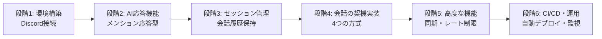

# 実装ロードマップ

段階的な実装計画と各段階での実装順序を定義します。

## 1. 実装方針

### 1.1 段階的実装のメリット

- **早期の動作確認**: 各段階で動作する最小限の機能を実装し、早期に動作確認できる
- **リスクの低減**: 小さな単位で実装・テストすることで、問題を早期に発見できる
- **学習効果**: 各段階で学んだことを次の段階に活かせる
- **柔軟な変更**: 要件変更に柔軟に対応できる
- **進捗管理**: 明確なマイルストーンで進捗を管理しやすい

### 1.2 実装原則

1. **動作する最小限の機能を優先**: 各段階で必ず動作する状態を作る
2. **テスト可能な状態を維持**: 各段階でテスト可能な状態を保つ
3. **リファクタリングを適宜実施**: コードの品質を維持しながら進める
4. **ドキュメントを更新**: 実装と同時にドキュメントも更新

---

## 2. 実装段階の全体像

---

## 3. 段階 1: 環境構築と Discord 接続

**目標**: Discord に接続し、メッセージを受信できるようにする

**期間**: 約 3-5 日

### 3.1 実装内容

- [ ] プロジェクト構造の作成
- [ ] `pyproject.toml` の設定（uv を使用）
- [ ] 基本的なディレクトリ構造の作成
- [ ] `.env.example` の作成
- [ ] `.gitignore` の設定
- [ ] discord.py のインストール
- [ ] `bot.py` の基本実装
- [ ] `on_ready` イベントの実装
- [ ] `on_message` イベントの実装（ログ出力のみ）
- [ ] 環境変数からトークンを読み込む
- [ ] メンション検知ロジック（固定メッセージで応答）

### 3.2 成果物

- Bot が Discord に接続できる
- メッセージを受信してログに出力できる
- メンションされた時に固定メッセージで応答できる

### 3.3 完了基準

- [x] Bot が Discord に接続できる
- [x] メッセージを受信できる
- [x] メンション時に固定メッセージで応答できる

---

## 4. 段階 2: AI 応答機能（メンション応答型）

**目標**: LiteLLM 経由で LLM API を呼び出し、メンション応答型を完全実装する

**期間**: 約 5-7 日

### 4.1 実装内容

- [ ] `ai/base.py`: AI プロバイダー抽象化インターフェース
- [ ] `ai/litellm_provider.py`: LiteLLM 統合実装
  - [ ] LiteLLM のセットアップ
  - [ ] 開発用モデル（Gemini 1.5 Flash）の設定
  - [ ] 本番用モデル（Claude Opus 4.5）の設定
  - [ ] フォールバック機能の実装
  - [ ] 基本的なリクエスト/レスポンス処理
- [ ] プロンプト生成機能
  - [ ] システムプロンプトの実装
  - [ ] 動的プロンプト生成
- [ ] メンション応答型の完全実装
  - [ ] メンション検知時の AI 応答生成
  - [ ] 応答の送信
  - [ ] 基本的なエラーハンドリング
- [ ] メッセージ長制限対応（2000 文字超の場合は分割）

### 4.2 成果物

- LiteLLM 経由で LLM API を呼び出せる
- メンション時に AI で応答を生成して送信できる
- 基本的なエラーハンドリングが実装されている

### 4.3 完了基準

- [x] LiteLLM 経由で LLM API を呼び出せる
- [x] メンション時に適切な応答が返る
- [x] API エラー時に適切に処理できる
- [x] フォールバック機能が動作する

---

## 5. 段階 3: セッション管理と会話履歴保持

**目標**: セッション管理と会話履歴の保持を実装する

**期間**: 約 6-8 日

### 5.1 実装内容

- [ ] SQLite データベースのセットアップ
  - [ ] `database/sqlite.py` の基本実装
  - [ ] データベースファイルの作成
  - [ ] スキーマの作成（sessions, messages テーブル）
  - [ ] インデックスの作成
  - [ ] 基本的な CRUD 操作
- [ ] ChatSession クラスの実装
  - [ ] `session/chat_session.py`: ChatSession クラス
  - [ ] メッセージの追加・取得
  - [ ] セッションの状態管理
- [ ] セッション管理モジュール
  - [ ] `session/manager.py`: セッション管理の基本機能
  - [ ] セッションの作成・取得・更新
  - [ ] メモリ内セッション管理
- [ ] 会話履歴の保持
  - [ ] 会話履歴をセッションに保存
  - [ ] プロンプトに会話履歴を含める
  - [ ] 会話の継続（文脈を考慮した応答）

### 5.2 成果物

- セッションをメモリ内で管理できる
- 会話履歴を保持して、文脈を考慮した応答ができる
- データベースに接続して基本的な操作ができる

### 5.3 完了基準

- [x] セッションの作成・取得ができる
- [x] 会話履歴が保持される
- [x] 文脈を考慮した応答ができる
- [x] データベースに接続できる

---

## 6. 段階 4: 会話の契機実装（4 つの方式）

**目標**: 4 つの会話の契機（メンション/スレッド/DM/聞き耳型）を実装する

**期間**: 約 10-14 日

### 6.1 実装内容

- [ ] メッセージルーターの実装
  - [ ] `router/message_router.py`: メッセージルーティング
  - [ ] 会話の契機判定ロジック
- [ ] スレッド型の実装
  - [ ] メンション検知時の自動スレッド作成
  - [ ] スレッド名の生成
  - [ ] スレッド内での会話継続（メンション不要）
  - [ ] スレッドアーカイブ検知
  - [ ] アーカイブ時のセッション保存
- [ ] DM 型の実装
  - [ ] DM チャンネル判定
  - [ ] DM 専用セッション管理
  - [ ] DM での会話継続
- [ ] 聞き耳型の実装
  - [ ] `eavesdrop/llm_judge.py`: LLM 判断機能（アプローチ 1）
    - [ ] 会話ログの一時保存
    - [ ] 判定フェーズ（裁判官）の実装
    - [ ] 発言生成フェーズ（演者）の実装
    - [ ] 判定用プロンプトの最適化
  - [ ] `eavesdrop/rule_judge.py`: ルールベース判断機能（アプローチ 2）
    - [ ] キーワード検知
    - [ ] 盛り上がり検知
    - [ ] ランダム判定
  - [ ] チャンネルごとの有効/無効設定
  - [ ] メインチャンネルへの直接投稿機能
- [ ] 統一インターフェースの実装
  - [ ] 4 つの方式を統一的に扱うインターフェース

### 6.2 成果物

- 4 つの会話の契機が全て実装されている
- 各方式で会話ができる
- 聞き耳型で適切なタイミングで会話に参加できる

### 6.3 完了基準

- [x] メンション応答型が動作する
- [x] スレッド型が動作する（自動スレッド作成）
- [x] DM 型が動作する
- [x] 聞き耳型が動作する（アプローチ 1）
- [x] 各方式で会話履歴が正しく管理される

---

## 7. 段階 5: 高度な機能（同期・レート制限・コマンド）

**目標**: セッション同期、レート制限対応、コマンド機能を実装する

**期間**: 約 8-10 日

### 7.1 実装内容

- [ ] セッション同期機能
  - [ ] メモリと SQLite のリアルタイム同期
  - [ ] バッチ同期（5 分ごと）
  - [ ] セッション終了時の保存
  - [ ] セッション復元機能（ボット再起動時）
  - [ ] セッションライフサイクル管理（タイムアウト、自動削除）
- [ ] レート制限対応
  - [ ] レート制限モニタリング
  - [ ] トークンバケットアルゴリズムの実装
  - [ ] リクエストキューイング
  - [ ] 優先度管理
- [ ] コマンド機能
  - [ ] `commands/chat.py`: スラッシュコマンド
  - [ ] `/chat start` コマンド（スレッド型開始）
  - [ ] `/chat reset` コマンド（会話履歴リセット）
  - [ ] `/chat status` コマンド（セッション状態表示）
- [ ] エラーハンドリングの強化
  - [ ] 詳細なエラー分類
  - [ ] リトライロジック（指数バックオフ）
  - [ ] フォールバック機能
  - [ ] 場面緘黙支援を考慮したエラーメッセージ

### 7.2 成果物

- セッションがメモリと SQLite で同期される
- レート制限に適切に対応できる
- スラッシュコマンドが使える
- エラーハンドリングが強化されている

### 7.3 完了基準

- [x] セッションが SQLite に保存される
- [x] ボット再起動時にセッションが復元される
- [x] レート制限に適切に対応できる
- [x] スラッシュコマンドが動作する
- [x] エラーが適切に処理される

---

## 8. 段階 6: CI/CD と運用機能

**目標**: CI/CD パイプラインを構築し、運用に必要な機能を実装する

**期間**: 約 8-10 日

### 8.1 実装内容

- [ ] CI/CD パイプライン構築
  - [ ] GitHub Actions ワークフローの作成
  - [ ] Docker イメージのビルド
  - [ ] GHCR へのプッシュ
  - [ ] Watchtower の設定（Synology NAS）
- [ ] Dockerfile の作成
  - [ ] Python 3.14 slim ベースイメージ
  - [ ] uv による依存関係インストール
  - [ ] 非 root ユーザーでの実行
  - [ ] ヘルスチェック設定
- [ ] ログ機能
  - [ ] ログシステムの実装
  - [ ] ログレベルの設定
  - [ ] ログファイルのローテーション
- [ ] モニタリング機能
  - [ ] メトリクス収集
  - [ ] アラート設定
  - [ ] ヘルスチェックエンドポイント
- [ ] バックアップ機能
  - [ ] バックアップスクリプト
  - [ ] バックアップスケジュール（1 日 1 回）
  - [ ] 古いバックアップの削除（7 日分保持）

### 8.2 成果物

- CI/CD パイプラインが動作する
- Docker コンテナとして動作する
- ログが適切に出力される
- モニタリングができる
- バックアップが自動で実行される

### 8.3 完了基準

- [x] コードをプッシュすると自動でデプロイされる
- [x] Docker コンテナとして動作する
- [x] ログが適切に出力される
- [x] ヘルスチェックが動作する
- [x] バックアップが自動で実行される

---

## 9. 実装の進め方

### 9.1 各段階の進め方

1. **実装**: 段階の内容を実装
2. **テスト**: 動作確認とテスト
3. **コミット**: 動作する状態でコミット
4. **ドキュメント更新**: 必要に応じてドキュメントを更新
5. **次の段階へ**: 次の段階に進む

### 9.2 コミット方針

- **段階ごとのコミット**: 各段階が完了したらコミット
- **明確なコミットメッセージ**: 何を実装したか明確に
- **動作確認**: コミット前に必ず動作確認

### 9.3 テスト方針

- **各段階でテスト**: 各段階で動作確認
- **手動テスト**: まずは手動で動作確認
- **自動テスト**: 可能な範囲で自動テストを追加

---

## 10. 実装チェックリスト

### 段階 1: 環境構築と Discord 接続

- [ ] プロジェクト構造の作成
- [ ] discord.py のインストールと設定
- [ ] Bot が Discord に接続できる
- [ ] メンション時に固定メッセージで応答できる

### 段階 2: AI 応答機能

- [ ] LiteLLM 統合の実装
- [ ] プロンプト生成機能
- [ ] メンション時に AI で応答できる
- [ ] 基本的なエラーハンドリング
- [ ] フォールバック機能

### 段階 3: セッション管理と会話履歴保持

- [ ] SQLite データベースのセットアップ
- [ ] ChatSession クラスの実装
- [ ] セッション管理モジュール
- [ ] 会話履歴の保持

### 段階 4: 会話の契機実装

- [ ] メッセージルーターの実装
- [ ] スレッド型の実装
- [ ] DM 型の実装
- [ ] 聞き耳型の実装（アプローチ 1）
- [ ] 統一インターフェース

### 段階 5: 高度な機能

- [ ] セッション同期機能
- [ ] レート制限対応
- [ ] コマンド機能
- [ ] エラーハンドリングの強化

### 段階 6: CI/CD と運用機能

- [ ] CI/CD パイプライン構築
- [ ] Dockerfile の作成
- [ ] ログ機能
- [ ] モニタリング機能
- [ ] バックアップ機能

---

## 11. 見積もり

| 段階       | 期間         | 主要機能                      |
| ---------- | ------------ | ----------------------------- |
| **段階 1** | 3-5 日       | 環境構築、Discord 接続        |
| **段階 2** | 5-7 日       | AI 応答機能、メンション応答型 |
| **段階 3** | 6-8 日       | セッション管理、会話履歴保持  |
| **段階 4** | 10-14 日     | 4 つの会話の契機              |
| **段階 5** | 8-10 日      | 同期、レート制限、コマンド    |
| **段階 6** | 8-10 日      | CI/CD、運用機能               |
| **合計**   | **40-54 日** | **約 8-11 週間**              |

---

## 12. リスク管理

### 12.1 各段階でのリスク

**段階 1**:

- Discord Bot トークンの取得に時間がかかる
- 環境構築で問題が発生する可能性

**段階 2**:

- Gemini API キーの取得に時間がかかる
- API の動作確認に時間がかかる

**段階 3**:

- データベース設計の見直しが必要になる可能性
- セッション管理の複雑さ

**段階 4**:

- スレッド作成の権限問題
- 聞き耳型の判定精度の問題

**段階 5**:

- レート制限の実装が複雑
- セッション同期のタイミング問題

**段階 6**:

- CI/CD の設定が複雑
- Synology NAS での動作確認

### 12.2 対策

- **早期の動作確認**: 各段階で動作確認
- **ドキュメント参照**: 実装前にドキュメントを確認
- **段階的な実装**: 小さな単位で実装
- **テストの実施**: 各段階でテストを実施

---

## 13. 次のステップ

実装を開始する場合は、**段階 1**から順番に進めてください。

各段階の詳細な実装手順については、[実装検討事項詳細](./implementation-considerations.md)を参照してください。

---

**作成日**: 2026年1月14日
**バージョン**: 2.0
**作成者**: kotonoha-bot 開発チーム
