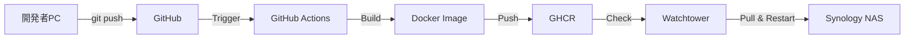

# デプロイメント・運用フロー

## 1. デプロイメントフロー

### 1.1 CI/CD パイプライン



### 1.2 デプロイメント手順

#### 1.2.1 初回デプロイ

1. **環境準備**

   ```bash
   # Synology NAS でディレクトリ作成
   mkdir -p /volume1/docker/kotonoha/{data,logs,backups}
   chmod 755 /volume1/docker/kotonoha/{data,logs,backups}
   ```

2. **環境変数設定**

   - Container Manager で環境変数を設定
   - `DISCORD_TOKEN` と `GEMINI_API_KEY` を設定

3. **Docker Compose 設定**

   ```yaml
   # docker-compose.yml を作成
   ```

4. **コンテナ起動**

   ```bash
   docker-compose up -d
   ```

5. **動作確認**
   - ログの確認
   - ヘルスチェックの確認
   - Discord での動作確認

#### 1.2.2 通常のデプロイ（自動）

1. **コード変更**

   - 開発者がコードを変更
   - GitHub にプッシュ

2. **自動ビルド**

   - GitHub Actions が自動的にトリガー
   - Docker イメージをビルド
   - GHCR にプッシュ

3. **自動更新**

   - Watchtower が新しいイメージを検出
   - コンテナを自動再起動

4. **動作確認**
   - ログの確認
   - エラーの有無を確認

---

## 2. 運用フロー

### 2.1 日常運用

#### 2.1.1 ログ確認

```bash
# リアルタイムログ確認
docker logs -f kotonoha-bot

# 最新100行のログ確認
docker logs --tail 100 kotonoha-bot

# エラーログのみ確認
docker logs kotonoha-bot 2>&1 | grep ERROR
```

#### 2.1.2 ヘルスチェック

```bash
# ヘルスチェックエンドポイントにアクセス
curl http://localhost:8080/health

# 期待される応答
{"status": "healthy", "database": "connected", "discord": "connected"}
```

#### 2.1.3 リソース監視

```bash
# コンテナのリソース使用状況
docker stats kotonoha-bot
```

### 2.2 バックアップ運用

#### 2.2.1 手動バックアップ

```bash
# データベースのバックアップ
docker exec kotonoha-bot python -m kotonoha_bot.scripts.backup

# または直接コピー
cp /volume1/docker/kotonoha/data/kotonoha.db \
   /volume1/docker/kotonoha/backups/kotonoha_$(date +%Y%m%d_%H%M%S).db
```

#### 2.2.2 自動バックアップ

- 1 日 1 回（深夜 0 時）に自動実行
- 7 日分のバックアップを保持
- 7 日以上古いバックアップは自動削除

#### 2.2.3 リストア

```bash
# バックアップからリストア
cp /volume1/docker/kotonoha/backups/kotonoha_YYYYMMDD_HHMMSS.db \
   /volume1/docker/kotonoha/data/kotonoha.db

# コンテナ再起動
docker-compose restart kotonoha
```

### 2.3 トラブルシューティング

#### 2.3.1 Bot が応答しない

1. **ログ確認**

   ```bash
   docker logs kotonoha-bot --tail 50
   ```

2. **接続状態確認**

   - Discord API への接続状態を確認
   - トークンの有効性を確認

3. **コンテナ再起動**

   ```bash
   docker-compose restart kotonoha
   ```

#### 2.3.2 API エラー

1. **エラーログ確認**

   ```bash
   docker logs kotonoha-bot | grep ERROR
   ```

2. **API キーの確認**

   - Anthropic API キーの有効性
   - レート制限の状態

3. **リトライ**
   - 自動リトライを待つ
   - 手動でコンテナ再起動

#### 2.3.3 データベースエラー

1. **データベースファイルの確認**

   ```bash
   ls -lh /volume1/docker/kotonoha/data/kotonoha.db
   ```

2. **データベースの整合性チェック**

   ```bash
   docker exec kotonoha-bot sqlite3 /app/data/kotonoha.db "PRAGMA integrity_check;"
   ```

3. **バックアップからリストア**
   - 最新のバックアップからリストア

---

## 3. モニタリング

### 3.1 監視項目

| 項目                     | 閾値    | アクション               |
| ------------------------ | ------- | ------------------------ |
| **メモリ使用量**         | > 500MB | 警告ログ出力             |
| **CPU 使用率**           | > 80%   | 警告ログ出力             |
| **API レート制限使用率** | > 80%   | 警告ログ出力             |
| **エラー率**             | > 5%    | 警告ログ出力、管理者通知 |
| **応答時間**             | > 10 秒 | 警告ログ出力             |

### 3.2 ログ監視

```bash
# エラーログの監視
tail -f /volume1/docker/kotonoha/logs/kotonoha.log | grep ERROR

# レート制限の監視
tail -f /volume1/docker/kotonoha/logs/kotonoha.log | grep "rate limit"
```

### 3.3 アラート設定

- **Discord チャンネル**: 管理者用チャンネルに通知
- **ログファイル**: エラーログに記録
- **メール通知**: 将来の拡張（オプション）

---

## 4. メンテナンス

### 4.1 定期メンテナンス

| 作業                   | 頻度       | 内容                     |
| ---------------------- | ---------- | ------------------------ |
| **ログローテーション** | 1 週間ごと | 古いログファイルの削除   |
| **データベース最適化** | 1 ヶ月ごと | `VACUUM` の実行          |
| **バックアップ確認**   | 1 週間ごと | バックアップの整合性確認 |
| **依存関係の更新**     | 3 ヶ月ごと | ライブラリの更新         |

### 4.2 データベース最適化

```bash
# SQLite の最適化
docker exec kotonoha-bot sqlite3 /app/data/kotonoha.db "VACUUM;"

# インデックスの再構築
docker exec kotonoha-bot sqlite3 /app/data/kotonoha.db "REINDEX;"
```

### 4.3 ログローテーション

```bash
# ログファイルのローテーション
logrotate -f /etc/logrotate.d/kotonoha
```

---

## 5. アップグレード手順

### 5.1 マイナーアップグレード

1. **コード更新**

   - GitHub にプッシュ
   - 自動デプロイを待つ

2. **動作確認**
   - ログの確認
   - 機能の動作確認

### 5.2 メジャーアップグレード

1. **バックアップ**

   ```bash
   docker exec kotonoha-bot python -m kotonoha_bot.scripts.backup
   ```

2. **データベースマイグレーション**

   ```bash
   docker exec kotonoha-bot python -m kotonoha_bot.scripts.migrate
   ```

3. **コード更新**

   - GitHub にプッシュ
   - 自動デプロイを待つ

4. **動作確認**
   - ログの確認
   - 機能の動作確認
   - データの整合性確認

---

## 6. ロールバック手順

### 6.1 緊急ロールバック

1. **現在のイメージタグを確認**

   ```bash
   docker inspect kotonoha-bot | grep Image
   ```

2. **前のバージョンに戻す**

   ```bash
   docker-compose pull kotonoha:previous-version
   docker-compose up -d kotonoha
   ```

3. **動作確認**
   - ログの確認
   - 機能の動作確認

### 6.2 データロールバック

1. **バックアップからリストア**

   ```bash
   cp /volume1/docker/kotonoha/backups/kotonoha_YYYYMMDD_HHMMSS.db \
      /volume1/docker/kotonoha/data/kotonoha.db
   ```

2. **コンテナ再起動**

   ```bash
   docker-compose restart kotonoha
   ```

---

**作成日**: 2026 年 1 月 14 日
**バージョン**: 1.0
**作成者**: kotonoha-bot 開発チーム
