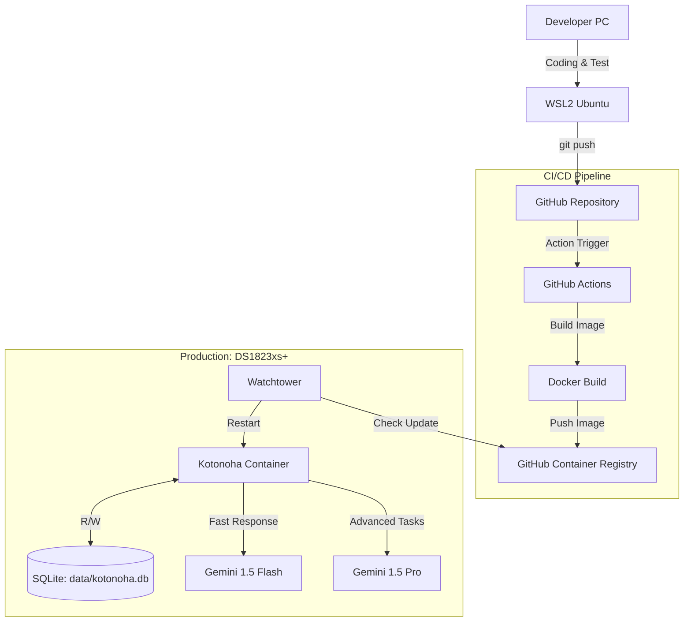

# Kotonoha（コトノハ）Discord ボット 要件定義書

場面緘黙自助グループ運営支援 Discord ボット

## 1. プロジェクト概要

### 1.1 プロジェクト名

**Kotonoha（コトノハ）** - 場面緘黙自助グループ運営支援 Discord ボット

### 1.2 目的

場面緘黙自助グループの Discord サーバー運営を支援するため、無料で利用可能なチャット AI 機能を統合した Discord ボット「Kotonoha（コトノハ）」を開発する。ユーザーが安心して対話できる環境を提供し、コミュニティの活性化と相互支援を促進する。

### 1.3 背景

場面緘黙（Selective Mutism）は、特定の場面や状況で話すことができない状態で、当事者や家族が孤立しがちです。自助グループでは、Discord などのオンラインツールを活用してコミュニティを形成していますが、以下の課題があります：

- **コミュニケーションのハードル**: 直接的な対話が難しい場合がある
- **24 時間サポートの必要性**: いつでも相談や交流の機会を提供したい
- **安心できる環境**: プレッシャーを感じずにコミュニケーションできる場が必要
- **情報提供**: 場面緘黙に関する情報やリソースへのアクセス

Kotonoha は、AI チャット機能を通じて、ユーザーが安心して対話できる環境を提供し、自助グループの運営を支援します。

### 1.3 スコープ

- 無料で利用可能なチャット AI API の選定
- Discord ボットへのチャット AI 機能の統合
- 基本的な会話機能の実装
- エラーハンドリングとレート制限の対応
- CI/CD パイプラインの構築（GitHub Actions → GHCR → Synology NAS）
- Docker コンテナ化と自動デプロイメント

### 1.4 システム構成概要

#### 1.4.1 アーキテクチャ

開発 PC から GitHub へプッシュすることで、自動的に Docker イメージがビルドされ、Synology NAS 上で稼働する Bot が更新される CI/CD 構成を採用しています。



#### 1.4.2 デプロイメント環境

- **開発環境**: WSL2 Ubuntu on Windows
- **本番環境**: Synology DS1823xs+ (Container Manager)
- **CI/CD**: GitHub Actions + GitHub Container Registry (GHCR)
- **自動更新**: Watchtower によるコンテナ自動更新
- **データ永続化**: SQLite データベース (`data/kotonoha.db`)

## 2. 機能要件

### 2.1 基本機能

- **チャット応答機能**: ユーザーのメッセージに対して AI が自然で安心感のある応答を生成
- **会話履歴の保持**: SQL と ChatSession のハイブリッド管理により、高速アクセスと永続化を両立
  - **ChatSession（メモリ）**: アクティブなセッションを高速に管理
  - **SQLite（永続化）**: 長期的な会話履歴をデータベースに保存
  - **自動同期**: セッション終了時や定期的に SQLite に同期
- **コマンド対応**: Discord のスラッシュコマンドまたはメンション形式での起動
- **マルチユーザー対応**: 複数のユーザーが同時に利用可能
- **プライバシー保護**: ユーザーごとの会話履歴を分離し、他ユーザーから見えないようにする

### 2.2 場面緘黙支援に特化した機能

- **安心できる応答**: プレッシャーを感じさせない、優しく受け止める応答スタイル
- **段階的コミュニケーション支援**: 短い応答から長い対話まで、ユーザーのペースに合わせた対応
- **情報提供**: 場面緘黙に関する基本的な情報やリソースへの案内（オプション）
- **非言語コミュニケーション支援**: 絵文字やリアクションを活用した表現の補助（オプション）

### 2.3 会話の契機（4 つの方式をサポート）

Kotonoha は、ユーザーの使い方に応じて 4 つの会話方式をサポートします。

#### 2.3.1 メンション応答型（基本）

**挙動:**

- ユーザーが Bot にメンション（@BotName）を送った時だけ反応
- 例: ユーザー「@Kotonoha こんにちは」→ Bot「こんにちは！」

**メリット:**

- 必要な時だけ呼び出せるので、他の会話の邪魔にならない
- 実装がシンプル（`on_message` イベントでメンション判定するだけ）

**デメリット:**

- 毎回 @ を打つのが面倒
- 会話が長引くとタイムラインが Bot の返信で埋め尽くされる

**履歴管理:**

- `message.reference` を辿るか、チャンネル ID で管理
- セッションキー: `channel_id` または `channel_id:user_id`

---

#### 2.3.2 スレッド型（AI チャットに最適）⭐ **推奨**

**挙動:**

- **ユーザーはメンションするだけ**: メインチャンネルで「@Kotonoha 今日は何月？」とメンション
- **Bot が自動でスレッドを作成**: Bot がその発言を起点として、自動的にスレッドを作成
- **Bot がスレッド内で応答**: 「現在は 1 月です（ここからはスレッドで話しましょう）」と返事
- **継続**: ユーザーはスレッド内で会話を続ける（もうメンションは不要）
- **ユーザー体験**: 「メンションしたら勝手に個室（スレッド）が用意された」という感覚

**技術的な理由（なぜスレッドが必須か）:**

- **会話履歴の取得が簡単**: スレッド内のメッセージを取得するだけで、その話題に関係する発言だけが純粋に取れる
- **コンテキストの分離**: 他の人の雑談が混ざらないため、Bot が混乱しない
- **スレッドがない場合の問題**: メインチャンネルで混ざって会話すると、Bot は「どれが自分宛てで、どれが関係ない雑談か」を判断できず、トンチンカンな発言をするリスクがある

**メリット:**

- メインのチャンネルを汚さない
- 「会話の区切り」が明確（スレッド ID = 1 つの会話セッションとして履歴管理しやすい）
- スレッドをアーカイブ（閉じる）すれば、会話終了も明確
- 場面緘黙支援に最適（プライベートな会話空間を提供）
- **ユーザーは手動でスレッドを作る必要がない**（Bot が自動化）

**デメリット:**

- Bot 側のスレッド作成処理が必要（ただし、ユーザーには見えない）

**履歴管理:**

- スレッド ID をセッションキーとして使用
- セッションキー: `thread_id`
- スレッドアーカイブ時にセッションを SQLite に保存

---

#### 2.3.3 DM（ダイレクトメッセージ）型

**挙動:**

- Bot と 1 対 1 で DM するタイプ
- 普通の DM と同じ

**メリット:**

- 他人に見られないプライベートな相談ができる
- 履歴管理は `user_id` だけで済むので超簡単
- 場面緘黙支援に最適（完全にプライベートな環境）

**デメリット:**

- サーバーのメンバーと共有したい話題には使えない

**履歴管理:**

- ユーザー ID をセッションキーとして使用
- セッションキー: `dm:user_id`
- 最もシンプルな管理方式

---

#### 2.3.4 聞き耳型（自然な会話参加）⭐ **場面緘黙支援に最適**

**挙動:**

- **「聞き耳を立てていて、話に入りたくなったら入ってくる」**という、人間と同じような挙動
- 技術的には**「常駐型（全てのメッセージを読み取る）」**だが、全てのメッセージに返信するのではなく、**「今、自分が発言すべきか？」という判断ロジック**を挟む
- 会話の流れを理解し、適切なタイミングで自然に会話に参加

**メリット:**

- 人間らしい自然な会話参加が可能
- 場面緘黙支援に最適（プレッシャーを感じさせず、自然な会話の流れを作る）
- ユーザーが積極的に話しかけなくても、会話に参加できる
- コミュニティの雰囲気を和らげる効果

**デメリット:**

- 全ての発言に対して判断処理が必要（API リクエストが増える）
- 実装がやや複雑
- 空気を読めないタイミングで発言するリスク

**実装アプローチ:**

Kotonoha は 2 つのアプローチをサポートします。

##### アプローチ 1: LLM に「空気」を読ませる（推奨・高精度）⭐

**重要な前提:**

- **スレッドを作らない**: メインチャンネルに直接書き込む
- **目的**: 「みんなの雑談に混ざること」が目的のため、スレッドを作ると会話の流れを切ってしまう
- **イメージ**: 「クラスの賑やかし役」として自然に会話に参加

**2 段階処理フロー:**

ユーザーが発言するたびに、Bot は以下のフローを実行します。

1. **受信**: ユーザーのメッセージを受け取る
2. **バッファ**: 直近の会話ログ（10〜20 件程度）に追加する
3. **判定フェーズ（裁判官）**:
   - 軽量な AI（Gemini 1.5 Flash）にログを渡す
   - **「今、君が割り込むべき？ YES か NO で答えて」**と聞く
   - AI が「NO」と言った ➡ 何もしない（無視）
   - AI が「YES」と言った ➡ 発言生成フェーズへ
4. **発言生成フェーズ（演者）**:
   - 再度 AI にログを渡し、「返信文を作って」と依頼する
   - Discord のメインチャンネルに直接書き込む

**判定用プロンプトの重要性:**

判定用 AI への指示（プロンプト）が最も重要です。以下のような指示を毎回送ります。

```txt
あなたはDiscordのチャットボットです。
キャラクター設定: [場面緘黙支援に優しい、安心感のある応答]

以下の会話履歴を見て、あなたが「今すぐに発言して会話に割って入るべき状況」かどうかを判定してください。

判断基準:
- ユーザーが困っていて助けが必要そうな時: YES
- 誰かがあなたの名前を呼んだ時: YES
- 場を和らげる発言が適切な時: YES
- シリアスな話、プライベートな話、関係ない話題: NO

回答は "YES" または "NO" の単語のみで答えてください。余計な説明は不要です。
```

**メリット:**

- かなり人間らしく、文脈に沿った「良いタイミング」で入ってこれる
- 場面緘黙支援に最適（自然な会話の流れを提供）
- **誤爆が少ない**: 単純なキーワード反応だと誤反応するが、LLM なら文脈で判断できる
- **圧倒的に「賢く」見える**: 文脈を理解して入ってくるので、ユーザーは「Bot に見守られている」感覚になる

**デメリット:**

- **レスポンスが少し遅れる**: 「判定」→「生成」と 2 回 AI を叩くため、返答までに 2〜4 秒程度かかる
- **API リクエスト数が増える**: 全てのメッセージに対して「判定」のリクエストを送るため、活発なサーバーだと無料枠の上限（Gemini Flash なら 1 分間 15 回）に引っかかりやすい
- **記憶の混濁（コンテキストのノイズ）**: メインチャンネルで複数の話題が混ざると、Bot が混乱しやすく、トンチンカンな発言をするリスクが少し高まる（スレッド型なら話題ごとに部屋が分かれるのでこの問題は起きない）

**技術仕様:**

- 判断用 AI: Gemini 1.5 Flash（高速・低コスト）
- 会話ログ保持: 直近 10〜20 件のメッセージ
- 判断プロンプト: Yes/No のみの簡潔な応答を要求（判定用プロンプトの最適化が重要）
- 応答生成: 判断が「YES」の場合のみ、通常の AI 応答を生成
- **発言場所**: メインチャンネルに直接書き込む（スレッドは作成しない）

##### アプローチ 2: ルールベースと確率（省エネ・高速）

**重要な前提:**

- **スレッドを作らない**: アプローチ 1 と同様に、メインチャンネルに直接書き込む
- **目的**: 省エネ・高速な判断が必要な場合に使用

**仕組み:**

- **キーワード検知**: 「Bot」「誰か」「教えて」「助けて」などの単語が含まれていたら 50%の確率で反応する
- **盛り上がり検知**: 「1 分間に 5 件以上の投稿があったら（盛り上がっていると判断して）、挨拶する」
- **ランダム**: 全てのメッセージに対して、3%～ 5%の確率で勝手にリプライする

**メリット:**

- API を無駄遣いしない（判定用の API リクエストが不要）
- 実装が簡単
- 高速な判断が可能（プログラム側で即座に判定）

**デメリット:**

- 文脈を無視して入ってくるので、シリアスな話をしている時に「ウケるｗ」とか言ってしまい、空気が読めない（KY な）Bot になるリスクがある
- 場面緘黙支援には不向き（不適切なタイミングで発言する可能性）
- **記憶の混濁**: アプローチ 1 と同様に、メインチャンネルで複数の話題が混ざると混乱しやすい

**技術仕様:**

- キーワードリスト: 設定ファイルで管理
- 確率設定: 設定可能（デフォルト: キーワード検知 50%、ランダム 3%）
- 盛り上がり検知: 時間窓とメッセージ数の閾値を設定可能

**履歴管理:**

- チャンネルごとの会話ログを一時保存（直近 10〜20 件）
- セッションキー: `eavesdrop:channel_id`
- 判断ログは保存しない（判断のみで、会話履歴には含めない）
- **発言場所**: メインチャンネルに直接書き込む（スレッドは作成しない）

**設定:**

- チャンネルごとに有効/無効を設定可能
- アプローチ 1 と 2 の選択が可能
- 判断の感度調整（より積極的/控えめ）が可能

---

#### 2.3.5 スレッド型と聞き耳型の比較

| 特徴                   | スレッド型（AI チャット）                        | 聞き耳型（空気を読む）                               |
| ---------------------- | ------------------------------------------------ | ---------------------------------------------------- |
| **イメージ**           | 「相談窓口 / カウンター」                        | 「クラスの賑やかし役」                               |
| **Bot の発言場所**     | 作成されたスレッドの中だけ                       | メインのタイムラインに直接                           |
| **スレッド作成**       | Bot が自動で作成（ユーザーはメンションするだけ） | スレッドを作らない                                   |
| **会話の続き方**       | スレッド内の発言なら、Bot は無条件で返信する     | Bot は毎回「また自分が答えるべきか？」を再度判定する |
| **記憶(コンテキスト)** | そのスレッド内の会話ログだけを読み込む           | チャンネルの「直近 ○ 件」を常に読み込む              |
| **主な用途**           | Q&A、相談、ロールプレイ、作業支援                | 雑談、ツッコミ、盛り上げ役                           |
| **場面緘黙支援**       | プライベートな会話空間を提供                     | 自然な会話の流れを作る                               |
| **コンテキストの分離** | 話題ごとに部屋が分かれるので混濁しない           | 複数の話題が混ざると混乱しやすい                     |

---

### 2.4 詳細機能

- **会話リセット**: 会話履歴をリセットするコマンド（各方式で対応）
- **設定機能**: 応答の長さ、温度などのパラメータ調整（オプション）
- **エラーメッセージ**: API エラー時の適切で安心感のあるエラーメッセージ表示
- **スレッド管理**: スレッドの作成、アーカイブ検知、自動セッション保存

## 3. 非機能要件

### 3.1 パフォーマンス

- 応答時間: 通常 3 秒以内（API 依存）
- 同時接続: 複数ユーザーからの同時リクエストに対応
- レート制限: API のレート制限を遵守
- **会話履歴アクセス**: ChatSession（メモリ）による高速アクセス（O(1)）
- **データ永続化**: SQLite への非同期同期により、応答速度への影響を最小化

### 3.2 セキュリティ・プライバシー

- API キーの安全な管理（環境変数または設定ファイル）
- ユーザー入力のサニタイゼーション
- 不適切なコンテンツのフィルタリング（オプション）
- **プライバシー保護**: 会話履歴の完全な分離と保護
- **データの最小化**: 必要最小限のデータのみを保存
- **匿名性の尊重**: ユーザーの匿名性を保護する設計

### 3.3 可用性

- API 障害時の適切なエラーハンドリング
- タイムアウト処理
- フォールバック機能（オプション）

### 3.4 コスト

- **必須**: 無料で利用可能な API のみを使用
- 無料枠の範囲内での運用

## 4. 無料チャット AI API 選択肢

### 4.1 OpenAI API

**特徴:**

- GPT-3.5-turbo モデルが利用可能
- 無料枠: 新規アカウントで$5 のクレジット（期限あり）
- 高品質な応答
- レート制限あり

**メリット:**

- 高い応答品質
- 安定した API
- 豊富なドキュメント

**デメリット:**

- 無料枠は期間限定
- レート制限が厳しい場合がある

**選定理由候補:**

- 最も高品質な応答が期待できる
- 開発が容易

---

### 4.2 Groq API

**特徴:**

- 高速な推論（GPU 加速）
- 無料枠: 1 日あたり 14,400 リクエスト（Mixtral-8x7B）
- オープンソースモデル（Llama、Mixtral など）を利用
- 低レイテンシ

**メリット:**

- 非常に高速
- 無料枠が比較的広い
- オープンソースモデルを使用

**デメリット:**

- 応答品質はモデル依存
- 比較的新しいサービス

**選定理由候補:**

- 高速な応答が可能
- 無料枠が実用的

---

### 4.3 Hugging Face Inference API

**特徴:**

- オープンソースモデルを利用
- 無料枠: 月 30,000 リクエスト
- 多様なモデルから選択可能
- コミュニティモデルも利用可能

**メリット:**

- 完全無料（制限内）
- 多様なモデル選択
- オープンソース

**デメリット:**

- モデルによって品質にばらつき
- レート制限あり

**選定理由候補:**

- 完全無料で利用可能
- モデルの選択肢が豊富

---

### 4.4 Ollama（ローカル実行）

**特徴:**

- 完全無料
- ローカルでモデルを実行
- インターネット接続不要
- プライバシー保護

**メリット:**

- 完全無料（コストゼロ）
- プライバシー保護
- レート制限なし
- オフライン動作可能

**デメリット:**

- サーバーリソースが必要
- セットアップがやや複雑
- 応答速度はハードウェア依存

**選定理由候補:**

- 完全無料で運用可能
- プライバシー重視の場合に最適

---

### 4.5 Google Dialogflow

**特徴:**

- 無料トライアルあり
- インテントベースの会話設計
- 多言語対応

**メリット:**

- Google のインフラ
- インテント管理が容易

**デメリット:**

- 無料枠は期間限定
- 設定が複雑
- 自然な会話には不向きな場合がある

---

### 4.6 Google Gemini API ⭐ **採用予定**

**特徴:**

- Gemini 1.5 Flash: 高速応答用モデル
- Gemini 1.5 Pro: 高度なタスク用モデル
- 無料枠: 1 分あたり 15 リクエスト、1 日あたり 1,500 リクエスト（Flash）
- 多言語対応（日本語含む）
- 長いコンテキストウィンドウ（最大 1M トークン）

**メリット:**

- Google の最新 AI 技術
- Flash モデルは高速で低コスト
- Pro モデルは高品質な応答
- 無料枠が実用的
- 使い分けによる最適化が可能

**デメリット:**

- 無料枠の制限あり
- API キーの管理が必要

**使い分け戦略:**

- **Gemini 1.5 Flash**: 通常の会話、高速応答が必要な場合
- **Gemini 1.5 Pro**: 複雑な質問、高度な推論が必要な場合

**選定理由:**

- システム構成で既に採用が決定
- Flash と Pro の使い分けにより、コストと品質のバランスが取れる
- Google の安定したインフラ

---

### 4.7 推奨 API 選定

#### **採用決定: Google Gemini API**

- **理由**: システム構成で既に採用が決定、Flash と Pro の使い分けが可能
- **モデル**:
  - `gemini-1.5-flash`: 通常の会話、高速応答
  - `gemini-1.5-pro`: 高度なタスク、複雑な推論

#### 代替候補（フォールバック用）

- **Groq API**: 高速で無料枠が実用的
- **Hugging Face Inference API**: 完全無料（制限内）
- **Ollama（ローカル）**: 完全無料、プライバシー保護

## 5. 技術仕様

### 5.1 技術スタック

| カテゴリ        | 技術                                                   |
| --------------- | ------------------------------------------------------ |
| Language        | Python 3.14                                            |
| Package Manager | uv                                                     |
| Container       | Docker (Synology Container Manager)                    |
| Hardware        | Synology DS1823xs+ (AMD Ryzen V1780B / AVX 対応)       |
| Database        | SQLite                                                 |
| Session 管理    | SQL + ChatSession ハイブリッド（メモリ + 永続化）      |
| AI APIs         | Gemini 1.5 Flash (高速推論)、Gemini 1.5 Pro (高度推論) |

### 5.2 開発環境

- **言語**: Python 3.14
- **フレームワーク**: discord.py
- **依存関係管理**: uv（pyproject.toml）
- **開発環境**: WSL2 Ubuntu on Windows

### 5.3 本番環境

- **ホスト**: Synology DS1823xs+ (Container Manager)
  - **CPU**: AMD Ryzen V1780B
  - **特徴**: AVX 対応（AI 推論の最適化に有利）
- **コンテナ化**: Docker
- **自動更新**: Watchtower
- **データベース**: SQLite (`data/kotonoha.db`)
- **データ永続化**: Docker ボリュームマウント

### 5.4 CI/CD パイプライン

- **バージョン管理**: GitHub
- **CI/CD**: GitHub Actions
- **コンテナレジストリ**: GitHub Container Registry (GHCR)
- **自動デプロイ**: Watchtower による自動更新
- **ワークフロー**:
  1. 開発 PC でコード変更
  2. GitHub へプッシュ
  3. GitHub Actions が Docker イメージをビルド
  4. GHCR へイメージをプッシュ
  5. Watchtower が新しいイメージを検出
  6. コンテナを自動再起動

### 5.5 アーキテクチャ

```console
Discord Message (4つの契機)
    ├─→ メンション応答型 (@BotName)
    ├─→ スレッド型 (thread内)
    ├─→ DM型 (ダイレクトメッセージ)
    └─→ 聞き耳型 (全てのメッセージを監視)
    ↓
Message Router (会話の契機判定)
    ├─→ メンション検知
    ├─→ スレッド判定
    ├─→ DM判定
    └─→ 聞き耳型判定（スレッドは作成しない）
        ├─→ アプローチ1: LLM判断 (Gemini Flash)
        │   ├─→ 判定フェーズ（裁判官）: 会話ログ(直近10件) → 判断プロンプト → YES/NO
        │   └─→ 発言生成フェーズ（演者）: YESの場合のみ返信文生成 → メインチャンネルに投稿
        └─→ アプローチ2: ルールベース
            ├─→ キーワード検知
            ├─→ 盛り上がり検知
            └─→ ランダム判定
            └─→ 判定結果 → メインチャンネルに投稿
    ↓
Discord Bot (discord.py)
    ↓
Chat AI Service (抽象化レイヤー)
    ↓
Session Manager (ハイブリッド管理)
    ├─→ ChatSession (メモリ: 高速アクセス)
    │   ├─→ セッションキー: channel_id / thread_id / dm:user_id / eavesdrop:channel_id
    │   └─→ 会話履歴の高速管理
    └─→ SQLite (永続化: 長期保存)
        └─→ セッション終了時に同期
    ↓
API Router (使い分けロジック)
    ├─→ Gemini 1.5 Flash (高速応答・判断用)
    └─→ Gemini 1.5 Pro (高度なタスク)
    ↓
AI Response
    ↓
Discord Message Response
    ↓
Session Manager (会話履歴更新)
    ├─→ ChatSession 更新
    └─→ SQLite 同期（必要に応じて）
```

### 5.6 実装方針

- **抽象化レイヤー**: 複数の API に対応できるよう抽象化インターフェースを実装
- **API 使い分け**: タスクの複雑さに応じて Flash/Pro を自動選択
- **設定管理**: 環境変数で API キーと設定を管理
- **会話管理（ハイブリッド方式）**:
  - **ChatSession（メモリ）**: アクティブなセッションをメモリ内で高速管理
    - ユーザーごとのセッションを辞書型で管理
    - 会話履歴の高速アクセスと更新
    - メモリ使用量を最適化（古いセッションは SQLite に移動）
  - **SQLite（永続化）**: 長期的な会話履歴をデータベースに保存
    - セッション終了時や定期的に SQLite に同期
    - ボット再起動時に SQLite からセッションを復元
    - データ損失の防止
  - **同期戦略**:
    - リアルタイム同期: 重要な会話は即座に SQLite に保存
    - バッチ同期: 定期的にメモリ内のセッションを SQLite に同期
    - セッション終了時: セッション終了時に必ず SQLite に保存
- **会話の契機管理**:
  - **メンション応答型**: `on_message` イベントでメンション判定、セッションキー: `channel_id` または `channel_id:user_id`
  - **スレッド型（推奨）**: スレッド作成・検知、セッションキー: `thread_id`、スレッドアーカイブ時にセッション保存
  - **DM 型**: DM チャンネル判定、セッションキー: `dm:user_id`、最もシンプルな管理
  - **聞き耳型（場面緘黙支援に最適）**:
    - **重要な前提**: スレッドを作らない（メインチャンネルに直接書き込む）
    - **アプローチ 1（推奨）**: LLM に「空気」を読ませる
      - 全てのメッセージを監視（常駐型）
      - 会話ログを一時保存（直近 10〜20 件）
      - **2 段階処理**:
        1. **判定フェーズ（裁判官）**: Gemini 1.5 Flash で判断プロンプト（Yes/No のみ）
        2. **発言生成フェーズ（演者）**: 「YES」の場合のみ応答生成
      - 判定用プロンプトの最適化が重要
      - セッションキー: `eavesdrop:channel_id`
      - 発言場所: メインチャンネルに直接（スレッドは作成しない）
    - **アプローチ 2**: ルールベースと確率
      - キーワード検知（50%確率で反応）
      - 盛り上がり検知（1 分間に 5 件以上で挨拶）
      - ランダム判定（3%〜5%確率）
      - 設定ファイルで調整可能
      - 発言場所: メインチャンネルに直接（スレッドは作成しない）
  - **統一インターフェース**: 4 つの方式を統一的なインターフェースで扱えるように実装
- **エラーハンドリング**: 各 API のエラーを適切に処理、フォールバック機能
- **Docker 化**: 本番環境での実行を考慮した Dockerfile 作成
- **データ永続化**: SQLite データベースをボリュームマウントで永続化
- **場面緘黙支援の考慮**:
  - **プロンプト設計**: 優しく受け止める、プレッシャーを感じさせない応答スタイル
  - **プライバシー重視**: ユーザーごとの会話履歴を完全に分離
  - **段階的対応**: 短い応答から長い対話まで、ユーザーのペースに合わせた対応
  - **安心感の提供**: エラーメッセージも含めて、常に安心感のある応答を心がける

## 6. 実装計画

### 6.1 Phase 1: 基盤実装

- [ ] Discord ボットの基本セットアップ（discord.py）
- [ ] チャット AI サービスの抽象化インターフェース作成
- [ ] Gemini API（Flash/Pro）の実装
- [ ] API 使い分けロジックの実装
- [ ] 会話の契機判定モジュールの実装（メンション/スレッド/DM/聞き耳型判定）
- [ ] 基本的な会話機能の実装（メンション応答型を優先）
- [ ] SQLite データベースのセットアップ
- [ ] ChatSession 管理モジュールの実装（メモリ内セッション管理）
- [ ] Dockerfile の作成
- [ ] 基本的なエラーハンドリング

### 6.2 Phase 2: 機能拡張

- [ ] 会話履歴管理の実装（SQL + ChatSession ハイブリッド）
  - [ ] ChatSession と SQLite の同期機能
  - [ ] セッション復元機能（ボット再起動時）
  - [ ] バッチ同期機能（定期的な SQLite への保存）
- [ ] 会話の契機の完全実装
  - [ ] スレッド型の実装（Bot が自動でスレッド作成、検知、アーカイブ処理）
    - [ ] メンション検知時の自動スレッド作成機能
    - [ ] スレッド内での会話継続機能（メンション不要）
    - [ ] スレッドアーカイブ検知とセッション保存
  - [ ] DM 型の実装（DM チャンネル判定、セッション管理）
  - [ ] 聞き耳型の実装（スレッドは作成しない）
    - [ ] アプローチ 1: LLM 判断機能（Gemini Flash による空気読み）
      - [ ] 判定フェーズ（裁判官）の実装
      - [ ] 発言生成フェーズ（演者）の実装
      - [ ] 判定用プロンプトの最適化
    - [ ] アプローチ 2: ルールベース判断機能（キーワード/盛り上がり/ランダム）
    - [ ] 会話ログの一時保存機能（直近 10〜20 件）
    - [ ] チャンネルごとの有効/無効設定
    - [ ] メインチャンネルへの直接投稿機能
  - [ ] 統一インターフェースの実装（4 つの方式を統一的に扱う）
- [ ] エラーハンドリングの強化
- [ ] レート制限対応
- [ ] コマンド機能の追加（会話リセット、設定など）
  - [ ] `/chat start` コマンド（スレッド型開始）
  - [ ] `/chat reset` コマンド（会話履歴リセット）
- [ ] GitHub Actions ワークフローの作成
- [ ] Docker イメージのビルドと GHCR へのプッシュ設定
- [ ] Watchtower の設定（Synology NAS）

### 6.3 Phase 3: 最適化・運用

- [ ] 複数 API 対応（フォールバック機能）
- [ ] パフォーマンス最適化
- [ ] ログ機能の追加
- [ ] 設定機能の追加
- [ ] モニタリング機能
- [ ] データベースバックアップ機能
- [ ] ヘルスチェック機能

## 7. 制約事項

### 7.1 技術的制約

- Gemini API のレート制限に準拠（1 分 15 リクエスト、1 日 1,500 リクエスト）
- Discord API のレート制限に準拠
- Synology NAS のリソース制約
- Docker コンテナのメモリ・CPU 制限
- SQLite データベースのファイルサイズ制限
- **メモリ使用量**: ChatSession のメモリ使用量を最適化（古いセッションは SQLite に移動）

### 7.2 運用制約

- 無料枠の範囲内での運用
- API キーの安全な管理（環境変数、GitHub Secrets）
- 定期的なメンテナンス
- データベースのバックアップ
- ネットワーク接続の安定性（NAS 環境）

### 7.3 デプロイメント制約

- GitHub Actions の実行時間制限
- GHCR のストレージ制限
- Watchtower の更新チェック間隔
- コンテナ再起動時のダウンタイム

## 8. リスクと対策

### 8.1 リスク

1. **API の無料枠終了**: 無料枠が終了する可能性

   - **対策**: 複数 API に対応し、フォールバック機能を実装

2. **レート制限**: リクエスト数が上限に達する

   - **対策**: レート制限の監視と適切なエラーメッセージ

3. **API 障害**: 外部 API の障害

   - **対策**: タイムアウト設定とエラーハンドリング

4. **コスト増加**: 無料枠を超える可能性

   - **対策**: 使用量の監視とアラート機能

5. **プライバシー漏洩**: 会話履歴が他ユーザーに漏洩する可能性

   - **対策**: ユーザーごとの会話履歴を完全に分離、データベース設計での分離、アクセス制御の実装

6. **不適切な応答**: AI が不適切な応答を生成する可能性

   - **対策**: プロンプト設計の最適化、コンテンツフィルタリング、定期的な監視と改善

7. **ユーザーの不安**: システム障害やエラーがユーザーに不安を与える可能性

   - **対策**: 優しく安心感のあるエラーメッセージ、システム状態の透明性、サポート体制の整備

8. **聞き耳型の不適切な発言**: 空気を読めずに不適切なタイミングで発言する可能性

   - **対策**: アプローチ 1（LLM 判断）を推奨、判断プロンプトの最適化、シリアスな会話の検知機能
   - **対策**: チャンネルごとの有効/無効設定、感度調整機能

9. **聞き耳型の API 消費増加**: 全てのメッセージに対して判断処理が必要
   - **対策**: Gemini 1.5 Flash を使用（高速・低コスト）、判断プロンプトを簡潔に（Yes/No のみ）
   - **対策**: アプローチ 2（ルールベース）を併用可能、チャンネルごとの設定で制御

## 9. 成功基準

### 9.1 機能面

- ユーザーが自然で安心感のある会話を AI と行える
- エラー発生時も適切に処理され、ユーザーに不安を与えない
- 複数ユーザーが同時に利用可能
- プライバシーが保護され、安心して利用できる
- **4 つの会話の契機が正常に動作**:
  - メンション応答型: メンション時に適切に反応
  - スレッド型: スレッド作成・検知・アーカイブ処理が正常に動作
  - DM 型: DM での会話が正常に動作
  - 聞き耳型: 適切なタイミングで自然に会話に参加（場面緘黙支援に最適）

### 9.2 パフォーマンス面

- 応答時間が 3 秒以内（API 依存）
- レート制限内で運用可能
- 24 時間安定稼働

### 9.3 運用面

- 無料枠の範囲内で運用可能
- メンテナンスが容易
- 自助グループの運営を効果的に支援できる

### 9.4 場面緘黙支援面

- ユーザーがプレッシャーを感じずにコミュニケーションできる
- 段階的なコミュニケーション支援が可能
- プライバシーが保護され、安心して利用できる環境

## 10. 今後の拡張案

### 10.1 機能拡張

- **場面緘黙支援機能の強化**
  - 段階的なコミュニケーション練習機能
  - 感情表現の支援機能
  - コミュニケーションログの可視化（ユーザー自身のみ閲覧可能）
- **聞き耳型の改善**
  - 判断精度の向上（プロンプト最適化、コンテキスト理解の強化）
  - シリアスな会話の検知機能（場面緘黙支援に重要）
  - チャンネルごとの詳細設定（感度調整、キーワードカスタマイズ）
  - 会話の雰囲気分析（盛り上がり度、真剣度など）
- **情報提供機能**
  - 場面緘黙に関する情報提供
  - リソース・支援機関への案内
  - FAQ 機能
- **コミュニティ支援機能**
  - イベント通知機能
  - グループ活動の記録・共有（オプション）
- **その他**
  - 画像生成機能の追加
  - 音声認識・音声合成機能（オプション）
  - 多言語対応の強化
  - カスタムプロンプト設定

### 10.2 技術的拡張

- データベースによる会話履歴の永続化（SQLite → PostgreSQL 移行）
- キャッシュ機能の実装
- モニタリング・分析機能
- 複数 NAS 環境への対応
- ロードバランシング
- メトリクス収集（Prometheus/Grafana）

## 11. 参考資料

### 11.1 API ドキュメント

- [Google Gemini API Documentation](https://ai.google.dev/docs)
- [Groq API Documentation](https://console.groq.com/docs)
- [Hugging Face Inference API](https://huggingface.co/docs/api-inference/index)
- [Ollama Documentation](https://ollama.ai/docs)
- [OpenAI API Documentation](https://platform.openai.com/docs)

### 11.2 Discord Bot 開発

- [discord.py Documentation](https://discordpy.readthedocs.io/)

### 11.3 CI/CD・インフラ

- [GitHub Actions Documentation](https://docs.github.com/ja/actions)
- [GitHub Container Registry](https://docs.github.com/ja/packages/working-with-a-github-packages-registry/working-with-the-container-registry)
- [Watchtower Documentation](https://containrrr.dev/watchtower/)
- [Synology Container Manager](https://www.synology.com/ja-jp/dsm/feature/docker)
- [Docker Documentation](https://docs.docker.com/)

### 11.4 場面緘黙関連リソース

- [場面緘黙について](https://www.mhlw.go.jp/stf/seisakunitsuite/bunya/hukushi_kaigo/shougaishahukushi/chiiki-houkatsu/chiikihoukatsu01.html) - 厚生労働省
- [場面緘黙症 Journal](https://selectivemutismjournal.org/) - 国際的な情報リソース
- 場面緘黙自助グループ関連のコミュニティリソース

---

**作成日**: 2024 年
**最終更新日**: 2024 年
**バージョン**: 1.9
**作成者**: kotonoha-bot 開発チーム
**プロジェクト**: 場面緘黙自助グループ運営支援 Discord ボット「Kotonoha（コトノハ）」

## 12. 関連ドキュメント

### 12.1 実装検討事項

実装前に検討すべき技術的な詳細事項については、別ドキュメント「[実装検討事項詳細](./implementation-considerations.md)」を参照してください。

### 12.2 WBS（作業分解構造）

プロジェクトの作業分解構造については、別ドキュメント「[WBS（作業分解構造）](./wbs.md)」を参照してください。

### 12.3 機能要件・非機能要件一覧

機能要件と非機能要件の詳細一覧については、別ドキュメント「[機能要件一覧・非機能要件一覧](./functional-requirements.md)」を参照してください。

### 12.4 その他のドキュメント

その他のドキュメントについては、[ドキュメント README](./README.md) を参照してください。

主な検討事項:

- **Discord API の制限事項**: レート制限、メッセージ長制限、スレッド作成の制限など
- **セッション管理の詳細設計**: セッションキー、ライフサイクル、タイムアウト設定
- **エラーハンドリングの詳細**: API エラーの分類、エラーメッセージの設計、ログ設計
- **データベーススキーマ設計**: SQLite スキーマ、クエリ最適化
- **プロンプト設計の詳細**: システムプロンプト、判定用プロンプト、動的生成
- **レート制限対策**: Gemini API のレート制限、実装方法
- **メモリ管理とパフォーマンス**: メモリ使用量の最適化、非同期処理
- **セキュリティ対策**: API キーの管理、入力のサニタイゼーション、プライバシー保護
- **テスト戦略**: 単体テスト、統合テスト、エンドツーエンドテスト
- **モニタリングとアラート**: 監視項目、アラート設定
- **デプロイメントと運用**: Docker 設定、ヘルスチェック、バックアップ戦略

## 13. 付録: システム構成詳細

### 12.1 ディレクトリ構造（予定）

```console
kotonoha-bot/
├── .github/
│   └── workflows/
│       └── docker-build.yml      # GitHub Actionsワークフロー
├── docs/
│   ├── requirements.md           # 本要件定義書
│   ├── implementation-considerations.md  # 実装検討事項詳細
│   └── wbs.md                   # WBS（作業分解構造）
├── src/
│   └── kotonoha_bot/
│       ├── __init__.py
│       ├── bot.py                # Discordボットメイン
│       ├── ai/
│       │   ├── __init__.py
│       │   ├── base.py           # 抽象化インターフェース
│       │   └── gemini.py          # Gemini API実装
│       ├── database/
│       │   ├── __init__.py
│       │   └── sqlite.py          # SQLite管理
│       ├── session/
│       │   ├── __init__.py
│       │   ├── manager.py         # セッション管理（ハイブリッド）
│       │   └── chat_session.py    # ChatSessionクラス
│       ├── router/
│       │   ├── __init__.py
│       │   └── message_router.py   # 会話の契機判定（メンション/スレッド/DM/聞き耳型）
│       ├── eavesdrop/
│       │   ├── __init__.py
│       │   ├── llm_judge.py        # アプローチ1: LLM判断（Gemini Flash）
│       │   └── rule_judge.py       # アプローチ2: ルールベース判断
│       └── commands/
│           └── chat.py            # チャットコマンド（/chat start, /chat reset）
├── data/
│   └── kotonoha.db               # SQLiteデータベース（.gitignore）
├── Dockerfile
├── docker-compose.yml            # 開発用（オプション）
├── .env.example                  # 環境変数テンプレート
├── pyproject.toml
└── README.md
```

### 12.2 環境変数（予定）

```bash
# Discord
DISCORD_TOKEN=your_discord_bot_token

# Gemini API
GEMINI_API_KEY=your_gemini_api_key
GEMINI_FLASH_MODEL=gemini-1.5-flash
GEMINI_PRO_MODEL=gemini-1.5-pro

# Database
DATABASE_PATH=/app/data/kotonoha.db

# Eavesdrop (聞き耳型)
EAVESDROP_ENABLED=true
EAVESDROP_APPROACH=llm  # llm or rule
EAVESDROP_LOG_SIZE=10   # 会話ログ保持数（直近N件）
EAVESDROP_KEYWORD_PROBABILITY=0.5  # キーワード検知時の反応確率（アプローチ2）
EAVESDROP_RANDOM_PROBABILITY=0.03  # ランダム反応確率（アプローチ2）

# Logging
LOG_LEVEL=INFO
```

### 12.3 Dockerfile（予定の構成）

- Python 3.14 slim ベースイメージ
- uv による依存関係インストール
- 非 root ユーザーでの実行
- ヘルスチェック設定
- データボリュームマウントポイント: `/app/data`
