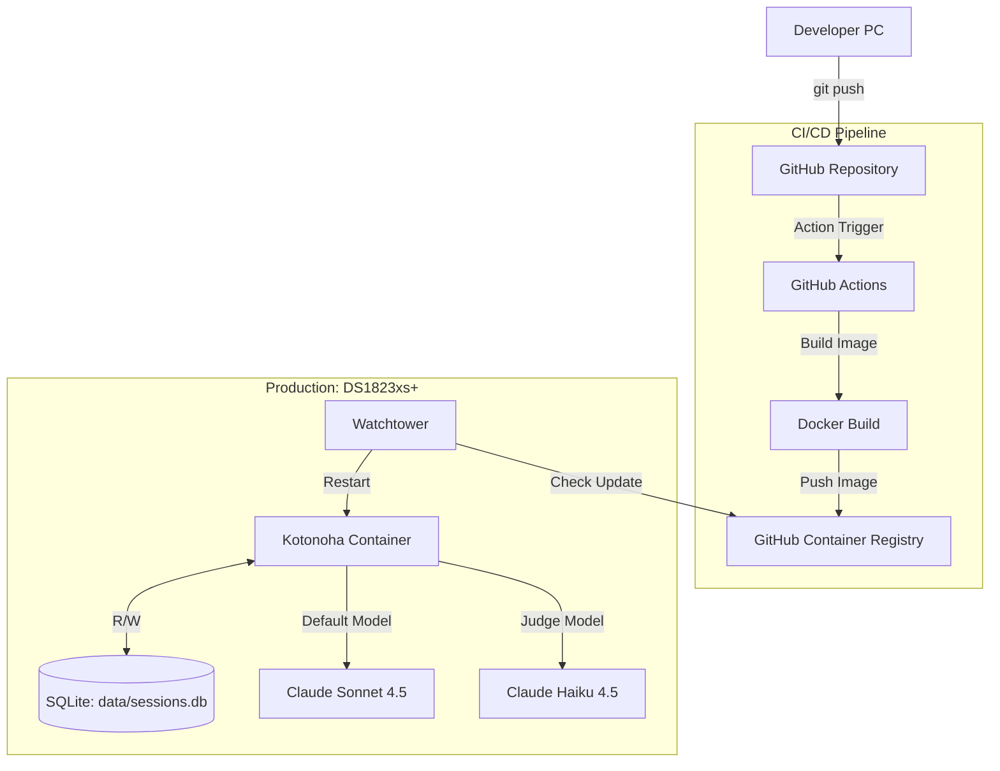

# Requirements Overview - Kotonoha Discord Bot

場面緘黙自助グループ運営支援 Discord ボット「Kotonoha（コトノハ）」の要件定義書（概要版）

## 1. プロジェクト概要

### 1.1 プロジェクト名

**Kotonoha（コトノハ）** - 場面緘黙自助グループ運営支援 Discord ボット

### 1.2 目的

場面緘黙自助グループの Discord サーバー運営を支援するため、無料で利用可能なチャット AI 機能を統合した Discord ボット「Kotonoha（コトノハ）」を開発する。ユーザーが安心して対話できる環境を提供し、コミュニティの活性化と相互支援を促進する。

### 1.3 背景

場面緘黙（Selective Mutism）は、特定の場面や状況で話すことができない状態で、当事者や家族が孤立しがちです。自助グループでは、Discord などのオンラインツールを活用してコミュニティを形成していますが、以下の課題があります：

- **コミュニケーションのハードル**: 直接的な対話が難しい場合がある
- **24 時間サポートの必要性**: いつでも相談や交流の機会を提供したい
- **安心できる環境**: プレッシャーを感じずにコミュニケーションできる場が必要
- **情報提供**: 場面緘黙に関する情報やリソースへのアクセス

Kotonoha は、AI チャット機能を通じて、ユーザーが安心して対話できる環境を提供し、自助グループの運営を支援します。

### 1.4 スコープ

**含まれるもの**:

- Claude API（LiteLLM 経由）の統合
- Discord ボットへのチャット AI 機能の統合
- 3 つの会話の契機（メンション/スレッド/聞き耳型）
- 会話履歴の管理（メモリ + SQLite ハイブリッド）
- エラーハンドリングとレート制限の対応
- CI/CD パイプラインの構築（GitHub Actions → GHCR → Synology NAS）
- Docker コンテナ化と自動デプロイメント
- スラッシュコマンド（`/chat reset`, `/chat status`）
- ヘルスチェック機能（HTTP エンドポイント）

**含まれないもの**:

- 医療的な診断やアドバイス
- 有料 API の使用（必須ではない）
- マルチサーバー対応（初期バージョン）
- 音声認識・音声合成機能
- ルールベースの聞き耳型判定（LLM 判定のみ実装）

## 2. システム構成概要

### 2.1 アーキテクチャ

### 2.2 技術スタック

| カテゴリ           | 技術                      | 用途                 | 実装状況    |
| ------------------ | ------------------------- | -------------------- | ----------- |
| **言語**           | Python 3.14               | アプリケーション開発 | ✅ 実装済み |
| **パッケージ管理** | uv                        | 依存関係管理         | ✅ 実装済み |
| **フレームワーク** | discord.py                | Discord Bot 開発     | ✅ 実装済み |
| **AI API**         | Claude API (LiteLLM 経由) | AI 応答生成          | ✅ 実装済み |
| **データベース**   | SQLite                    | 会話履歴の永続化     | ✅ 実装済み |
| **コンテナ**       | Docker                    | コンテナ化           | ✅ 実装済み |
| **CI/CD**          | GitHub Actions            | 自動ビルド・デプロイ | ✅ 実装済み |
| **レジストリ**     | GitHub Container Registry | イメージ保存         | ✅ 実装済み |
| **自動更新**       | Watchtower                | コンテナ自動更新     | ✅ 実装済み |
| **本番環境**       | Synology DS1823xs+        | 本番環境ホスト       | ✅ 実装済み |

**AI モデル**:

- **デフォルトモデル**: Claude Sonnet 4.5（`anthropic/claude-sonnet-4-5`）
- **判定用モデル**: Claude Haiku 4.5（`anthropic/claude-haiku-4-5`、聞き耳型の判定に使用）
- **フォールバックモデル**: 環境変数で設定可能（`LLM_FALLBACK_MODEL`）

詳細は [system-architecture.md](../architecture/system-architecture.md) を参照してください。

## 3. 機能要件（概要）

### 3.1 コア機能

1. **チャット応答機能**

   - ユーザーのメッセージに対して AI が自然で安心感のある応答を生成
   - 場面緘黙支援に特化したプロンプト設計
   - メッセージ長制限対応（2000 文字超の応答を自動分割）

2. **会話の契機（3 つの方式）**

   - **メンション応答型**: Bot にメンションされた時だけ反応
   - **スレッド型**: メンション時に自動でスレッドを作成し会話継続 ⭐ 推奨
   - **聞き耳型**: LLM で適切なタイミングを判断して自然に会話に参加 ⭐ 場面緘黙支援に最適

   詳細な説明については、[会話の契機の詳細](./conversation-triggers.md)を参照してください。

3. **会話履歴管理**

   - SQLite と ChatSession のハイブリッド管理
   - メモリ内で高速アクセス、SQLite で永続化
   - ボット再起動時の自動復元
   - バッチ同期（5 分ごと）とセッションクリーンアップ（1 時間ごと）

4. **セッション管理**
   - ユーザーごとの会話履歴を分離
   - プライバシー保護の徹底
   - 自動タイムアウトとクリーンアップ

詳細は [functional-requirements.md](./functional-requirements.md) を参照してください。

### 3.2 実装済み機能

**Phase 1-6 で実装済み**:

- ✅ メンション応答型
- ✅ スレッド型（自動スレッド作成）
- ✅ 聞き耳型（LLM 判定）
- ✅ セッション管理（ハイブリッド）
- ✅ レート制限対応（トークンバケット、リクエストキュー）
- ✅ スラッシュコマンド（`/chat reset`, `/chat status`）
- ✅ エラーハンドリング強化
- ✅ メッセージ長制限対応
- ✅ ヘルスチェック機能
- ✅ バックアップ機能

**実装状況**: Phase 1-6 完了（89.7% の要件を実装済み）

詳細は [実装ロードマップ](../implementation/roadmap.md) を参照してください。

## 4. 非機能要件（概要）

### 4.1 パフォーマンス

- **応答時間**: 通常 3 秒以内（API 依存）
- **同時接続**: 100 セッションまで対応
- **メモリ効率**: ハイブリッド管理による最適化
- **レート制限**: トークンバケットアルゴリズムとリクエストキューで管理

### 4.2 セキュリティ・プライバシー

- **API キー管理**: 環境変数による安全な管理
- **プライバシー保護**: ユーザーごとの会話履歴の完全な分離
- **データ最小化**: 必要最小限のデータのみ保存
- **匿名性の尊重**: ユーザーの匿名性を保護

### 4.3 可用性

- **24 時間稼働**: Docker による安定稼働
- **自動復旧**: Watchtower による自動更新とヘルスチェック
- **エラー処理**: 適切なエラーハンドリングとリトライロジック
- **フォールバック**: API エラー時の代替モデルへの自動切り替え

### 4.4 コスト

- **低コスト**: Claude Haiku 4.5 を判定用に使用
- **最適化**: 開発・本番で適切なモデルを選択し、コストを最適化
- **レート制限管理**: トークンバケットとリクエストキューで API 呼び出しを最適化

詳細は [functional-requirements.md](./functional-requirements.md) の非機能要件セクションを参照してください。

## 5. 制約事項

### 5.1 技術的制約

- Claude API のレート制限（有料プランによる制限、フォールバック機能で対応）
- Discord API のレート制限
- SQLite の単一ファイルデータベース（`sessions.db`）
- Synology NAS のリソース制約

### 5.2 運用制約

- 無料枠の範囲内での運用（推奨）
- 定期的なメンテナンスが必要
- データベースのバックアップ管理（自動バックアップスクリプト実装済み）

## 6. 成功基準

### 6.1 機能面

- ✅ ユーザーが自然で安心感のある会話を AI と行える
- ✅ 3 つの会話の契機が正常に動作する
- ✅ エラー発生時も適切に処理され、ユーザーに不安を与えない
- ✅ プライバシーが保護され、安心して利用できる

### 6.2 パフォーマンス面

- ✅ 応答時間が 3 秒以内（API 依存）
- ✅ 24 時間安定稼働
- ✅ レート制限内で運用可能

### 6.3 場面緘黙支援面

- ✅ ユーザーがプレッシャーを感じずにコミュニケーションできる
- ✅ 段階的なコミュニケーション支援が可能
- ✅ 安心できる環境が提供されている

## 7. リスクと対策

| リスク           | 影響度 | 発生確率 | 対策                            | 実装状況    |
| ---------------- | ------ | -------- | ------------------------------- | ----------- |
| API の無料枠終了 | 高     | 中       | 複数 API に対応、フォールバック | ✅ 実装済み |
| レート制限超過   | 中     | 高       | レート制限監視、優先度管理      | ✅ 実装済み |
| プライバシー漏洩 | 高     | 低       | セッション分離、アクセス制御    | ✅ 実装済み |
| 不適切な AI 応答 | 中     | 中       | プロンプト最適化、監視と改善    | ✅ 実装済み |
| システム障害     | 中     | 低       | 自動復旧、バックアップ、監視    | ✅ 実装済み |

## 8. 今後の拡張案

### 8.1 機能拡張

- **場面緘黙支援機能の強化**
  - 段階的なコミュニケーション練習機能
  - 感情表現の支援機能
  - コミュニケーションログの可視化（ユーザー自身のみ閲覧可能）
- **聞き耳型の改善**
  - ルールベース判定の実装（オプション）
  - チャンネルごとの詳細設定（感度調整、キーワードカスタマイズ）
  - 会話の雰囲気分析（盛り上がり度、真剣度など）
- **情報提供機能**
  - 場面緘黙に関する情報提供
  - リソース・支援機関への案内
  - FAQ 機能
- **コミュニティ支援機能**
  - イベント通知機能
  - グループ活動の記録・共有（オプション）
- **その他**
  - 画像生成機能の追加
  - 音声認識・音声合成機能（オプション）
  - 多言語対応の強化
  - カスタムプロンプト設定（`/settings` コマンド）

### 8.2 技術的拡張

- データベースによる会話履歴の永続化（SQLite → PostgreSQL 移行、オプション）
- キャッシュ機能の実装（Phase 7 で検討）
- モニタリング・分析機能（Phase 8 で実装予定）
- 複数 NAS 環境への対応
- ロードバランシング
- メトリクス収集（Prometheus/Grafana、Phase 8 で実装予定）

### 8.3 実装予定 Phase

- **Phase 7**: 完全リファクタリング（コード品質向上、テストカバレッジ向上）
- **Phase 8**: 高度な運用機能（モニタリング・設定管理・コスト管理）
- **Phase 9**: 自動化・最適化機能
- **Phase 10**: 監査機能

詳細は [実装ロードマップ](../implementation/roadmap.md) を参照してください。

## 9. 参考資料

### 9.1 API ドキュメント

- [Claude API Documentation](https://platform.claude.com/docs)
- [LiteLLM Documentation](https://docs.litellm.ai/)
- [Groq API Documentation](https://console.groq.com/docs)
- [Hugging Face Inference API](https://huggingface.co/docs/api-inference/index)
- [Ollama Documentation](https://ollama.ai/docs)
- [OpenAI API Documentation](https://platform.openai.com/docs)

### 9.2 Discord Bot 開発

- [discord.py Documentation](https://discordpy.readthedocs.io/)

### 9.3 CI/CD・インフラ

- [GitHub Actions Documentation](https://docs.github.com/ja/actions)
- [GitHub Container Registry](https://docs.github.com/ja/packages/working-with-a-github-packages-registry/working-with-the-container-registry)
- [Watchtower Documentation](https://containrrr.dev/watchtower/)
- [Synology Container Manager](https://www.synology.com/ja-jp/dsm/feature/docker)
- [Docker Documentation](https://docs.docker.com/)

### 9.4 場面緘黙関連リソース

- [場面緘黙について](https://www.mhlw.go.jp/stf/seisakunitsuite/bunya/hukushi_kaigo/shougaishahukushi/chiiki-houkatsu/chiikihoukatsu01.html)
  - 厚生労働省
- [場面緘黙症 Journal](https://selectivemutismjournal.org/) - 国際的な情報リソース
- 場面緘黙自助グループ関連のコミュニティリソース

## 10. 関連ドキュメント

### 10.1 要件定義

- **[機能要件一覧](./functional-requirements.md)**: 詳細な機能要件と非機能要件
- **[会話の契機の詳細](./conversation-triggers.md)**: 3 つの会話方式の詳細説明
- **[ユーザーストーリー](./user-stories.md)**: ユーザー視点の機能記述
- **[ユースケース](./use-cases.md)**: 詳細なユースケース記述

### 10.2 設計

- **[システムアーキテクチャ](../architecture/system-architecture.md)**: システム構成と技術スタック
- **[基本設計](../architecture/basic-design.md)**: システムの基本設計
- **[詳細設計](../architecture/detailed-design.md)**: モジュール・関数の詳細設計
- **[データベース設計](../architecture/database-design.md)**: ER 図とテーブル定義

### 10.3 実装

- **[実装ロードマップ](../implementation/roadmap.md)**: 段階的な実装計画 ⭐ 実装開始前に必読
- **[実装検討事項](../implementation/considerations.md)**: 実装前の技術的検討事項
- **[ミドルウェア選定](../implementation/middleware-selection.md)**: 技術選定の理由

### 10.4 仕様

- **[API 仕様](../specifications/api-specification.md)**: 外部/内部 API 仕様
- **[イベント仕様](../specifications/event-specification.md)**: Discord イベント処理
- **[コマンド仕様](../specifications/command-specification.md)**: スラッシュコマンド

### 10.5 テスト・運用

- **[テスト計画](../testing/test-plan.md)**: テスト計画と戦略
- **[テスト仕様](../testing/test-specification.md)**: テストケース
- **[デプロイメント](../operations/deployment-operations.md)**: デプロイ手順
- **[トラブルシューティング](../operations/troubleshooting.md)**: 問題解決ガイド
- **[ヘルスチェック](../operations/health-check.md)**: ヘルスチェック機能の詳細

---

**作成日**: 2026 年 1 月 14 日  
**最終更新日**: 2026 年 1 月（現在の実装に基づいて改訂）  
**バージョン**: 3.0  
**作成者**: kotonoha-bot 開発チーム

### 更新履歴

- **v3.0** (2026-01): 現在の実装に基づいて改訂
  - Mermaid 図を実装に合わせて更新（Gemini → Claude API）
  - データベースファイル名を `sessions.db` に修正
  - 技術スタックに実装状況カラムを追加
  - AI モデルの詳細を追加（Claude Sonnet 4.5、Claude Haiku 4.5）
  - 実装済み機能セクションを追加
  - 実装状況を反映（Phase 1-6 完了、89.7% の要件を実装済み）
  - リスクと対策に実装状況を追加
  - 今後の拡張案に実装予定 Phase を追加
  - スコープに実装済み機能を追加
  - コスト要件の説明を更新
- **v2.0** (2026-01-14): 初版リリース後の更新
- **v2.0** (2026-01-14): 初版リリース後の更新
- **v1.0** (2026-01-14): 初版リリース
