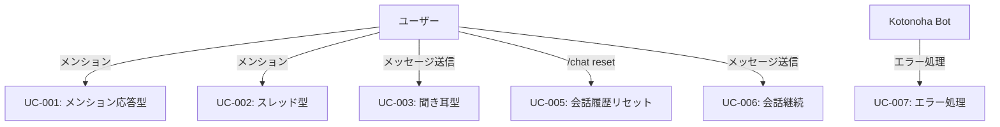

# ユースケース記述

## 1. ユースケース一覧

| ID     | ユースケース名                   | 優先度 | 実装フェーズ |
| ------ | -------------------------------- | ------ | ------------ |
| UC-001 | メンション応答型で会話を開始する | 高     | Phase 1      |
| UC-002 | スレッド型で会話を開始する       | 高     | Phase 5      |
| UC-003 | 聞き耳型で自然に会話に参加する   | 高     | Phase 5      |
| UC-005 | 会話履歴をリセットする           | 中     | Phase 5      |
| UC-006 | 会話を継続する                   | 高     | Phase 1      |
| UC-007 | エラーが発生した時の処理         | 高     | Phase 1      |

---

## 2. 詳細ユースケース記述

### UC-001: メンション応答型で会話を開始する

**概要**: ユーザーが Bot にメンションして会話を開始します。

**アクター**: ユーザー、Kotonoha Bot

**前提条件**:

- Bot が Discord サーバーに参加している
- ユーザーが Bot をメンションできる権限を持っている

**基本フロー**:

1. ユーザーがチャンネルで「@Kotonoha こんにちは」とメッセージを送信
2. Bot がメンションを検知
3. Bot がセッションを作成（セッションキー: `channel_id` または `channel_id:user_id`）
4. Bot が AI で応答を生成
5. Bot が応答メッセージを送信
6. 会話履歴をセッションに保存

**代替フロー**:

- 3a. 既存のセッションがある場合、そのセッションを使用
- 4a. API エラーが発生した場合、エラーメッセージを送信

**事後条件**:

- セッションが作成され、会話履歴が保存されている
- ユーザーが Bot の応答を受信している

**例外**:

- Bot がオフラインの場合: メッセージは送信されない
- API エラーの場合: エラーメッセージを送信

---

### UC-002: スレッド型で会話を開始する

**概要**: ユーザーがメンションすると、Bot が自動でスレッドを作成し、その中で会話を継続します。

**アクター**: ユーザー、Kotonoha Bot

**前提条件**:

- Bot が Discord サーバーに参加している
- Bot がスレッドを作成する権限を持っている

**基本フロー**:

1. ユーザーがメインチャンネルで「@Kotonoha 今日は何月？」とメンション
2. Bot がメンションを検知
3. Bot がそのメッセージを起点としてスレッドを作成
4. Bot がスレッド内で応答（「現在は 1 月です（ここからはスレッドで話しましょう）」）
5. セッションを作成（セッションキー: `thread_id`）
6. ユーザーがスレッド内で会話を継続（メンション不要）

**代替フロー**:

- 3a. スレッド作成に失敗した場合、メインチャンネルで応答（メンション応答型にフォールバック）
- 5a. 既存のスレッドセッションがある場合、そのセッションを使用

**事後条件**:

- スレッドが作成され、セッションが保存されている
- ユーザーがスレッド内で Bot の応答を受信している

**例外**:

- スレッド作成権限がない場合: エラーメッセージを送信
- スレッド作成に失敗した場合: メインチャンネルで応答

---

### UC-003: 聞き耳型で自然に会話に参加する

**概要**: Bot が会話を監視し、適切なタイミングで自然に会話に参加します。

**アクター**: ユーザー、Kotonoha Bot

**前提条件**:

- 聞き耳型が有効になっている
- チャンネルで聞き耳型が有効になっている

**基本フロー（アプローチ 1: LLM 判断）**:

1. ユーザー A がチャンネルでメッセージを送信（「Python で配列の最後を取得する方法は？」）
2. Bot がメッセージを受信
3. Bot が会話ログ（直近 10 件）を取得
4. Bot が Claude 3 Haiku で判定（「今、発言すべきか？」→ YES/NO）
5. 判定が「YES」の場合:
   a. Bot が Claude API で応答を生成
   b. Bot がメインチャンネルに応答を送信
6. 判定が「NO」の場合: 何もしない

**基本フロー（アプローチ 2: ルールベース）**:

1. ユーザー A がチャンネルでメッセージを送信
2. Bot がメッセージを受信
3. Bot がルールベースで判定:
   - キーワード検知: 「Bot」「教えて」などの単語が含まれているか
   - 盛り上がり検知: 1 分間に 5 件以上の投稿があるか
   - ランダム判定: 3%〜5%の確率
4. 判定が「反応すべき」の場合:
   a. Bot が応答を生成
   b. Bot がメインチャンネルに応答を送信
5. 判定が「反応しない」の場合: 何もしない

**代替フロー**:

- 4a. API エラーが発生した場合、エラーログを出力（ユーザーには通知しない）
- 5a. レート制限に達した場合、判定をスキップ

**事後条件**:

- 適切なタイミングで Bot が会話に参加している
- 会話ログが一時保存されている

**例外**:

- シリアスな話題の場合: 判定が「NO」となり、Bot は発言しない
- レート制限に達した場合: 判定処理をスキップ

---

### UC-005: 会話履歴をリセットする

**概要**: ユーザーが現在の会話履歴をリセットして、新しい会話として開始します。

**アクター**: ユーザー、Kotonoha Bot

**前提条件**:

- アクティブなセッションが存在する

**基本フロー**:

1. ユーザーが `/chat reset` コマンドを実行
2. Bot がコマンドを検知
3. Bot が現在のセッションを取得
4. Bot がセッションの会話履歴をクリア
5. Bot がメモリ内のセッションをリセット
6. Bot が「会話履歴をリセットしました」と応答

**代替フロー**:

- 3a. セッションが見つからない場合、「会話履歴が見つかりませんでした」と応答

**事後条件**:

- メモリ内の会話履歴がクリアされている
- SQLite の履歴は保持されている（アーカイブとして）

**例外**:

- セッションが見つからない場合: エラーメッセージを送信

---

### UC-006: 会話を継続する

**概要**: ユーザーが既存のセッションで会話を継続します。

**アクター**: ユーザー、Kotonoha Bot

**前提条件**:

- アクティブなセッションが存在する

**基本フロー**:

1. ユーザーがメッセージを送信
2. Bot がメッセージを受信
3. Bot がセッションを取得（メモリまたは SQLite から）
4. Bot が会話履歴を取得
5. Bot がプロンプトを生成（システムプロンプト + 会話履歴 + ユーザーメッセージ）
6. Bot が AI で応答を生成
7. Bot が応答を送信
8. Bot が会話履歴を更新

**代替フロー**:

- 3a. メモリにセッションがない場合、SQLite から復元
- 6a. API エラーが発生した場合、エラーメッセージを送信

**事後条件**:

- 会話履歴が更新されている
- ユーザーが Bot の応答を受信している

**例外**:

- セッションが見つからない場合: 新しいセッションを作成

---

### UC-007: エラーが発生した時の処理

**概要**: API エラーやシステムエラーが発生した時に、適切に処理します。

**アクター**: ユーザー、Kotonoha Bot、システム

**前提条件**:

- Bot が動作中

**基本フロー**:

1. エラーが発生（API エラー、データベースエラーなど）
2. Bot がエラータイプを判定
3. Bot がエラーログを出力
4. Bot がエラータイプに応じて処理:
   - **429 Rate Limit**: 待機してリトライ（最大 3 回）
   - **400 Bad Request**: エラーメッセージを送信
   - **500 Server Error**: リトライ（最大 3 回）、失敗時はエラーメッセージ
   - **503 Service Unavailable**: フォールバック API に切り替え
5. ユーザーに適切なメッセージを送信（場面緘黙支援を考慮）

**代替フロー**:

- 4a. リトライが全て失敗した場合、エラーメッセージを送信
- 4b. CRITICAL エラーの場合、管理者に通知

**事後条件**:

- エラーがログに記録されている
- ユーザーに適切なメッセージが送信されている
- 可能な場合は処理が継続されている

**例外**:

- 致命的なエラーの場合: Bot が停止する可能性がある

---

## 3. ユースケース図

---

**作成日**: 2026 年 1 月 14 日
**バージョン**: 1.0
**作成者**: kotonoha-bot 開発チーム
