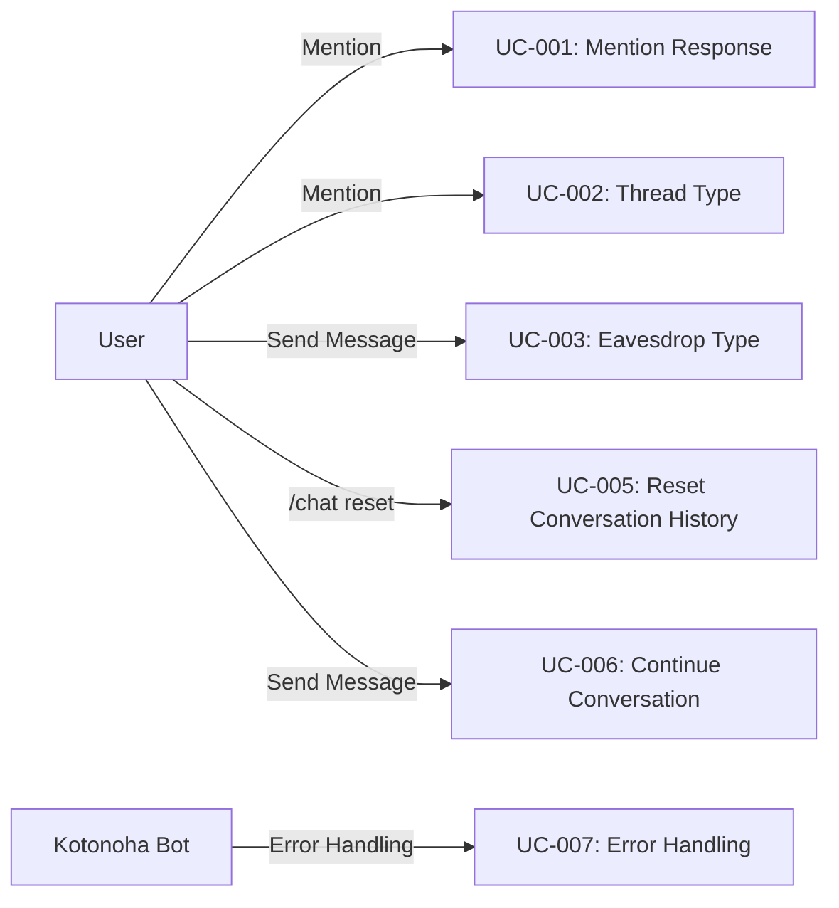

# ユースケース記述

## 1. ユースケース一覧

| ID     | ユースケース名                   | 優先度 | 実装フェーズ | 実装状況 |
| ------ | -------------------------------- | ------ | ------------ | -------- |
| UC-001 | メンション応答型で会話を開始する | 高     | Phase 1      | ✅ 完了  |
| UC-002 | スレッド型で会話を開始する       | 高     | Phase 5      | ✅ 完了  |
| UC-003 | 聞き耳型で自然に会話に参加する   | 高     | Phase 5      | ✅ 完了  |
| UC-005 | 会話履歴をリセットする           | 中     | Phase 6      | ✅ 完了  |
| UC-006 | 会話を継続する                   | 高     | Phase 1      | ✅ 完了  |
| UC-007 | エラーが発生した時の処理         | 高     | Phase 1      | ✅ 完了  |

---

## 2. 詳細ユースケース記述

### UC-001: メンション応答型で会話を開始する

**概要**: ユーザーが Bot にメンションして会話を開始します。

**アクター**: ユーザー、Kotonoha Bot

**前提条件**:

- Bot が Discord サーバーに参加している
- ユーザーが Bot をメンションできる権限を持っている

**基本フロー**:

1. ユーザーがチャンネルで「@Kotonoha こんにちは」とメッセージを送信
2. Bot がメンションを検知（`MessageRouter` で判定）
3. Bot がセッションキーを生成（`mention:{user_id}`）
4. Bot がセッションを取得または作成
5. Bot が AI で応答を生成（Claude Sonnet 4.5、システムプロンプト + 日付情報 + 会話履歴）
6. Bot が応答メッセージを送信（2000 文字超の場合は自動分割）
7. Bot が会話履歴をセッションに保存
8. Bot がセッションを SQLite に保存（バッチ同期または即座に保存）

**代替フロー**:

- 4a. 既存のセッションがある場合、そのセッションを使用
- 5a. API エラーが発生した場合、エラーメッセージを送信（リトライロジックあり）
- 5b. レート制限に達した場合、リクエストキューに追加して待機

**事後条件**:

- セッションが作成され、会話履歴が保存されている
- ユーザーが Bot の応答を受信している

**例外**:

- Bot がオフラインの場合: メッセージは送信されない
- API エラーの場合: エラーメッセージを送信（場面緘黙支援を考慮した表現）

**実装ファイル**: `src/kotonoha_bot/bot/handlers.py`

---

### UC-002: スレッド型で会話を開始する

**概要**: ユーザーがメンションすると、Bot が自動でスレッドを作成し、その中で会話を継続します。

**アクター**: ユーザー、Kotonoha Bot

**前提条件**:

- Bot が Discord サーバーに参加している
- Bot がスレッドを作成する権限を持っている

**基本フロー**:

1. ユーザーがメインチャンネルで「@Kotonoha 今日は何月？」とメンション
2. Bot がメンションを検知（`MessageRouter` で判定）
3. Bot がスレッド名を生成（LLM で生成、またはメッセージ内容から生成）
4. Bot がそのメッセージを起点としてスレッドを作成
   - `auto_archive_duration` は環境変数 `THREAD_AUTO_ARCHIVE_DURATION` で設定可能
   - 未設定の場合はサーバーのデフォルト値を使用
5. Bot がスレッド内で応答（「現在は 1 月です（ここからはスレッドで話しましょう）」）
6. Bot がセッションキーを生成（`thread:{thread_id}`）
7. Bot がセッションを作成
8. ユーザーがスレッド内で会話を継続（メンション不要）

**代替フロー**:

- 4a. スレッド作成に失敗した場合、メインチャンネルで応答（メンション応答型にフォールバック）
- 7a. 既存のスレッドセッションがある場合、そのセッションを使用

**事後条件**:

- スレッドが作成され、セッションが保存されている
- ユーザーがスレッド内で Bot の応答を受信している

**例外**:

- スレッド作成権限がない場合: エラーメッセージを送信
- スレッド作成に失敗した場合: メインチャンネルで応答

**実装ファイル**: `src/kotonoha_bot/bot/handlers.py`

---

### UC-003: 聞き耳型で自然に会話に参加する

**概要**: Bot が会話を監視し、適切なタイミングで自然に会話に参加します。

**アクター**: ユーザー、Kotonoha Bot

**前提条件**:

- 聞き耳型が有効になっている（環境変数 `EAVESDROP_ENABLED_CHANNELS` で指定）
- チャンネルで聞き耳型が有効になっている

**基本フロー（アプローチ 1: LLM 判断）✅ 実装済み**:

1. ユーザー A がチャンネルでメッセージを送信（「Python で配列の最後を取得する方法は？」）
2. Bot がメッセージを受信（Bot 自身のメッセージは除外）
3. Bot が会話ログバッファにメッセージを追加（`ConversationBuffer`）
4. Bot が直近のメッセージを取得（最大 20 件、`EAVESDROP_BUFFER_SIZE`）
5. Bot が最低メッセージ数をチェック（3 件以上必要、`EAVESDROP_MIN_MESSAGES`）
6. Bot が最小介入間隔をチェック（10 分、`EAVESDROP_MIN_INTERVENTION_INTERVAL_MINUTES`）
7. Bot が会話状態を分析（ENDING/MISUNDERSTANDING/CONFLICT/ACTIVE）
8. Bot が Claude Haiku 4.5 で判定（「今、発言すべきか？」→ YES/NO）
9. Bot が同じ会話判定（前回の介入から会話が変わったか）
10. Bot が会話状況変化判定（前回の介入から状況が変わったか）
11. 判定が「YES」の場合:
    a. Bot が Claude Sonnet 4.5 で応答を生成
    b. Bot がメインチャンネルに応答を送信
    c. Bot が介入履歴を記録
12. 判定が「NO」の場合: 何もしない

**基本フロー（アプローチ 2: ルールベース）⏳ 未実装**:

1. ユーザー A がチャンネルでメッセージを送信
2. Bot がメッセージを受信
3. Bot がルールベースで判定:
   - キーワード検知: 「Bot」「教えて」などの単語が含まれているか
   - 盛り上がり検知: 1 分間に 5 件以上の投稿があるか
   - ランダム判定: 3%〜5%の確率
4. 判定が「反応すべき」の場合:
   a. Bot が応答を生成
   b. Bot がメインチャンネルに応答を送信
5. 判定が「反応しない」の場合: 何もしない

**代替フロー**:

- 5a. メッセージ数が不足している場合、判定をスキップ
- 6a. 最小介入間隔が経過していない場合、判定をスキップ
- 7a. 会話が終了している場合、判定をスキップ
- 8a. API エラーが発生した場合、エラーログを出力（ユーザーには通知しない）
- 11a. レート制限に達した場合、リクエストキューに追加して待機

**事後条件**:

- 適切なタイミングで Bot が会話に参加している
- 会話ログが一時保存されている（`ConversationBuffer`）
- 介入履歴が記録されている

**例外**:

- シリアスな話題の場合: 判定が「NO」となり、Bot は発言しない
- レート制限に達した場合: リクエストキューに追加して待機
- 会話が終了している場合: 判定をスキップ

**実装ファイル**: `src/kotonoha_bot/eavesdrop/llm_judge.py`, `src/kotonoha_bot/bot/handlers.py`

**設定値**:

- バッファサイズ: 20（`EAVESDROP_BUFFER_SIZE`）
- 最低メッセージ数: 3（`EAVESDROP_MIN_MESSAGES`）
- 最小介入間隔: 10 分（`EAVESDROP_MIN_INTERVENTION_INTERVAL_MINUTES`）
- 判定用モデル: Claude Haiku 4.5（`EAVESDROP_JUDGE_MODEL`）

---

### UC-005: 会話履歴をリセットする

**概要**: ユーザーが現在の会話履歴をリセットして、新しい会話として開始します。

**アクター**: ユーザー、Kotonoha Bot

**前提条件**:

- アクティブなセッションが存在する

**基本フロー**:

1. ユーザーが `/chat reset` コマンドを実行
2. Bot がコマンドを検知
3. Bot がセッションキーを決定:
   - スレッド内: `thread:{thread_id}`
   - DM: `dm:{channel_id}`
   - その他: `mention:{user_id}`
4. Bot が現在のセッションを取得
5. Bot がセッションの会話履歴をクリア（`session.messages.clear()`）
6. Bot が `last_active_at` を更新
7. Bot がセッションを SQLite に保存
8. Bot が「会話履歴をリセットしました。新しい会話として始めましょう。」と応答（ephemeral）

**代替フロー**:

- 4a. セッションが見つからない場合、「会話履歴が見つかりませんでした。」と応答

**事後条件**:

- メモリ内の会話履歴がクリアされている
- SQLite の履歴は保持されている（アーカイブとして）

**例外**:

- セッションが見つからない場合: エラーメッセージを送信

**実装ファイル**: `src/kotonoha_bot/commands/chat.py`

**実装状況**: ✅ Phase 6 で実装済み

---

### UC-006: 会話を継続する

**概要**: ユーザーが既存のセッションで会話を継続します。

**アクター**: ユーザー、Kotonoha Bot

**前提条件**:

- アクティブなセッションが存在する（または SQLite から復元可能）

**基本フロー**:

1. ユーザーがメッセージを送信
2. Bot がメッセージを受信
3. Bot がセッションキーを決定（会話の契機に応じて）
4. Bot がセッションを取得（メモリまたは SQLite から）
5. Bot が会話履歴を取得（`session.get_conversation_history()`）
6. Bot がプロンプトを生成（システムプロンプト + 日付情報 + 会話履歴 + ユーザーメッセージ）
7. Bot が AI で応答を生成（Claude Sonnet 4.5）
8. Bot が応答を送信（2000 文字超の場合は自動分割）
9. Bot が会話履歴を更新（`session.add_message()`）
10. Bot がセッションを SQLite に保存（バッチ同期または即座に保存）

**代替フロー**:

- 4a. メモリにセッションがない場合、SQLite から復元
- 4b. SQLite にもセッションがない場合、新しいセッションを作成
- 7a. API エラーが発生した場合、エラーメッセージを送信（リトライロジックあり）
- 7b. レート制限に達した場合、リクエストキューに追加して待機

**事後条件**:

- 会話履歴が更新されている
- ユーザーが Bot の応答を受信している

**例外**:

- セッションが見つからない場合: 新しいセッションを作成

**実装ファイル**: `src/kotonoha_bot/bot/handlers.py`

---

### UC-007: エラーが発生した時の処理

**概要**: API エラーやシステムエラーが発生した時に、適切に処理します。

**アクター**: ユーザー、Kotonoha Bot、システム

**前提条件**:

- Bot が動作中

**基本フロー**:

1. エラーが発生（API エラー、データベースエラーなど）
2. Bot がエラータイプを判定（`classify_discord_error`, `classify_database_error`）
3. Bot がエラーログを出力
4. Bot がエラータイプに応じて処理:
   - **429 Rate Limit**: リクエストキューに追加して待機、リトライ（最大 3 回）
   - **400 Bad Request**: エラーメッセージを送信（ユーザーフレンドリーな表現）
   - **500 Server Error**: リトライ（最大 3 回、指数バックオフ）、失敗時はエラーメッセージ
   - **503 Service Unavailable**: フォールバック API に切り替え（`LLM_FALLBACK_MODEL`）
   - **データベースエラー**: エラーメッセージを送信（場面緘黙支援を考慮）
5. ユーザーに適切なメッセージを送信（場面緘黙支援を考慮した表現）

**代替フロー**:

- 4a. リトライが全て失敗した場合、エラーメッセージを送信
- 4b. CRITICAL エラーの場合、ログに記録（管理者に通知は未実装）

**事後条件**:

- エラーがログに記録されている
- ユーザーに適切なメッセージが送信されている
- 可能な場合は処理が継続されている

**例外**:

- 致命的なエラーの場合: Bot が停止する可能性がある

**実装ファイル**: `src/kotonoha_bot/errors/`, `src/kotonoha_bot/ai/litellm_provider.py`

**実装状況**: ✅ Phase 1, Phase 6 で実装済み

---

## 3. ユースケース図

---

**作成日**: 2026 年 1 月 14 日  
**最終更新日**: 2026 年 1 月（現在の実装に基づいて改訂）  
**バージョン**: 2.0  
**作成者**: kotonoha-bot 開発チーム

### 更新履歴

- **v2.0** (2026-01): 現在の実装に基づいて改訂
  - セッションキーの形式を実装に合わせて更新（`mention:{user_id}`, `thread:{thread_id}`, `eavesdrop:{channel_id}`）
  - 聞き耳型の実装詳細を追加（LLM 判断のみ実装済み、ルールベースは未実装）
  - 聞き耳型の設定値を追加（バッファサイズ、最低メッセージ数、最小介入間隔）
  - コマンドの実装状況を更新（`/chat reset`, `/chat status` は Phase 6 で実装済み）
  - エラーハンドリングの実装詳細を追加（リトライロジック、フォールバック機能）
  - 実装ファイルのパスを追加
  - 実装状況カラムを追加
  - メッセージ分割機能の説明を追加
  - バッチ同期機能の説明を追加
  - レート制限対応の説明を追加
- **v1.0** (2026-01-14): 初版リリース
