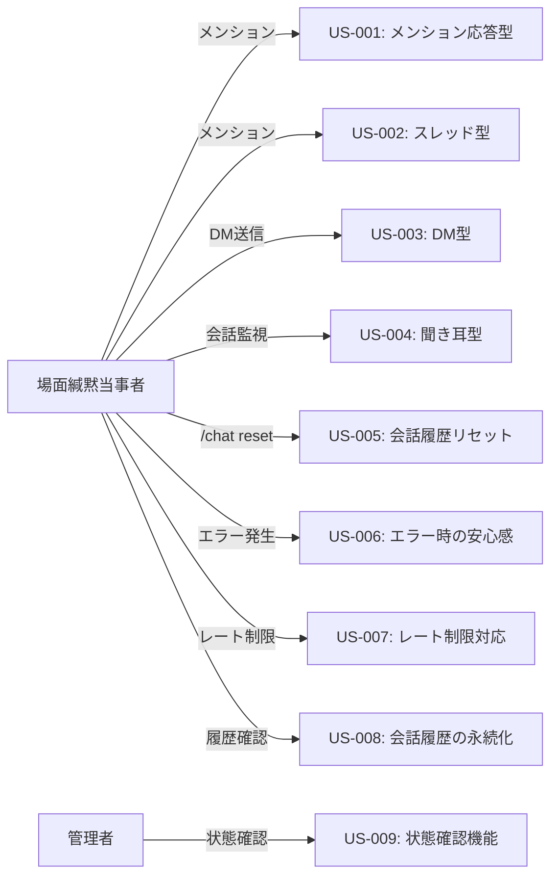

# ユーザーストーリー

## 1. ユーザーストーリー一覧

### Phase 1: 基盤実装

#### US-001: メンション応答型で会話を開始したい

**ストーリー**:

```txt
場面緘黙当事者として、Bot にメンションして会話を開始したい。
なぜなら、必要な時だけ呼び出せるので、他の会話の邪魔にならないから。
```

**受け入れ基準**:

- Bot にメンション（@Kotonoha）すると応答する
- 会話履歴が保持される
- 会話を継続できる

**優先度**: 高

**見積もり**: 5 ポイント

---

#### US-002: スレッド型で会話を開始したい

**ストーリー**:

```txt
場面緘黙当事者として、メンションすると自動でスレッドが作成され、その中で会話したい。
なぜなら、メインチャンネルを汚さず、プライベートな会話空間を提供できるから。
```

**受け入れ基準**:

- メンションすると自動でスレッドが作成される
- スレッド内でメンションなしで会話を継続できる
- スレッドアーカイブ時に会話履歴が保存される

**優先度**: 高

**見積もり**: 10 ポイント

---

#### US-003: DM 型で会話を開始したい

**ストーリー**:

```txt
場面緘黙当事者として、Bot と1対1で DM で会話したい。
なぜなら、他人に見られない完全にプライベートな相談ができるから。
```

**受け入れ基準**:

- Bot に DM を送信すると応答する
- DM で会話を継続できる
- 会話履歴が保存される

**優先度**: 中

**見積もり**: 5 ポイント

---

#### US-004: 聞き耳型で自然に会話に参加してほしい

**ストーリー**:

```txt
場面緘黙当事者として、Bot が自然に会話に参加してほしい。
なぜなら、積極的に話しかけなくても、会話に参加できるから。
```

**受け入れ基準**:

- Bot が会話を監視している
- 適切なタイミングで自然に会話に参加する
- シリアスな話題には参加しない

**優先度**: 高

**見積もり**: 13 ポイント

---

### Phase 2: 機能拡張

#### US-005: 会話履歴をリセットしたい

**ストーリー**:

```txt
場面緘黙当事者として、会話履歴をリセットして新しい会話として始めたい。
なぜなら、話題を変えたい時や、新しい気持ちで始めたい時があるから。
```

**受け入れ基準**:

- `/chat reset` コマンドで会話履歴をリセットできる
- リセット後、新しい会話として開始できる

**優先度**: 中

**見積もり**: 3 ポイント

---

#### US-006: エラーが発生しても安心したい

**ストーリー**:

```txt
場面緘黙当事者として、エラーが発生しても不安にならないようにしたい。
なぜなら、エラーメッセージが不安を煽る表現だと、コミュニケーションを避けたくなるから。
```

**受け入れ基準**:

- エラーメッセージが優しい表現である
- エラーが発生してもシステムが停止しない
- 適切な代替案が提示される

**優先度**: 高

**見積もり**: 5 ポイント

---

#### US-007: レート制限に達しても動作を継続したい

**ストーリー**:

```txt
場面緘黙当事者として、レート制限に達しても Bot が動作を継続してほしい。
なぜなら、突然応答が止まると不安になるから。
```

**受け入れ基準**:

- レート制限に達した場合、待機してリトライする
- ユーザーに適切なメッセージを送信する
- システムが停止しない

**優先度**: 高

**見積もり**: 8 ポイント

---

### Phase 3: 最適化・運用

#### US-008: 会話履歴が失われないようにしたい

**ストーリー**:

```txt
場面緘黙当事者として、会話履歴が失われないようにしたい。
なぜなら、過去の会話を振り返りたい時があるから。
```

**受け入れ基準**:

- 会話履歴が SQLite に保存される
- ボット再起動時に会話履歴が復元される
- バックアップが定期的に作成される

**優先度**: 中

**見積もり**: 8 ポイント

---

#### US-009: Bot の状態を確認したい

**ストーリー**:

```txt
管理者として、Bot の状態を確認したい。
なぜなら、問題が発生した時に迅速に対応したいから。
```

**受け入れ基準**:

- ヘルスチェックエンドポイントで状態を確認できる
- ログで動作状況を確認できる
- モニタリング機能でパフォーマンスを確認できる

**優先度**: 中

**見積もり**: 8 ポイント

---

## 2. エピック

### エピック 1: 基本会話機能

**説明**: 4 つの会話の契機を実装し、基本的な会話機能を提供する。

**ユーザーストーリー**:

- US-001: メンション応答型
- US-002: スレッド型
- US-003: DM 型
- US-004: 聞き耳型

**優先度**: 高

---

### エピック 2: セッション管理

**説明**: 会話履歴の管理と永続化機能を実装する。

**ユーザーストーリー**:

- US-005: 会話履歴リセット
- US-008: 会話履歴の永続化

**優先度**: 中

---

### エピック 3: エラーハンドリング

**説明**: エラーが発生しても安心して使えるようにする。

**ユーザーストーリー**:

- US-006: エラー時の安心感
- US-007: レート制限対応

**優先度**: 高

---

### エピック 4: 運用機能

**説明**: Bot の運用を支援する機能を実装する。

**ユーザーストーリー**:

- US-009: 状態確認機能

**優先度**: 中

---

## 3. ユーザーストーリーマップ



---

## 4. 受け入れテストシナリオ

### US-001 の受け入れテスト

#### シナリオ 1: メンションで会話を開始

```txt
Given: Bot が Discord に接続されている
When: ユーザーが「@Kotonoha こんにちは」とメンション
Then: Bot が「こんにちは！」と応答する
And: セッションが作成される
```

#### シナリオ 2: 会話を継続

```txt
Given: セッションが存在する
When: ユーザーが「今日は何月？」とメンション
Then: Bot が会話履歴を考慮して応答する
```

---

### US-002 の受け入れテスト

#### シナリオ 1: スレッドの自動作成

```txt
Given: Bot が Discord に接続されている
When: ユーザーが「@Kotonoha 相談があります」とメンション
Then: Bot がスレッドを作成する
And: スレッド内で Bot が応答する
```

#### シナリオ 2: スレッド内での会話継続

```txt
Given: スレッドが作成されている
When: ユーザーがスレッド内でメッセージを送信（メンションなし）
Then: Bot が応答する
```

---

### US-004 の受け入れテスト

#### シナリオ 1: 適切なタイミングで参加

```txt
Given: 聞き耳型が有効になっている
When: ユーザーが「Python で配列の最後を取得する方法は？」と送信
Then: Bot が判定して「YES」と判断する
And: Bot が応答を生成して送信する
```

#### シナリオ 2: 不適切なタイミングでは参加しない

```txt
Given: 聞き耳型が有効になっている
When: ユーザーが「今日のお昼ラーメン食べた」と送信
Then: Bot が判定して「NO」と判断する
And: Bot は応答しない
```

---

**作成日**: 2026年1月14日
**バージョン**: 1.0
**作成者**: kotonoha-bot 開発チーム
