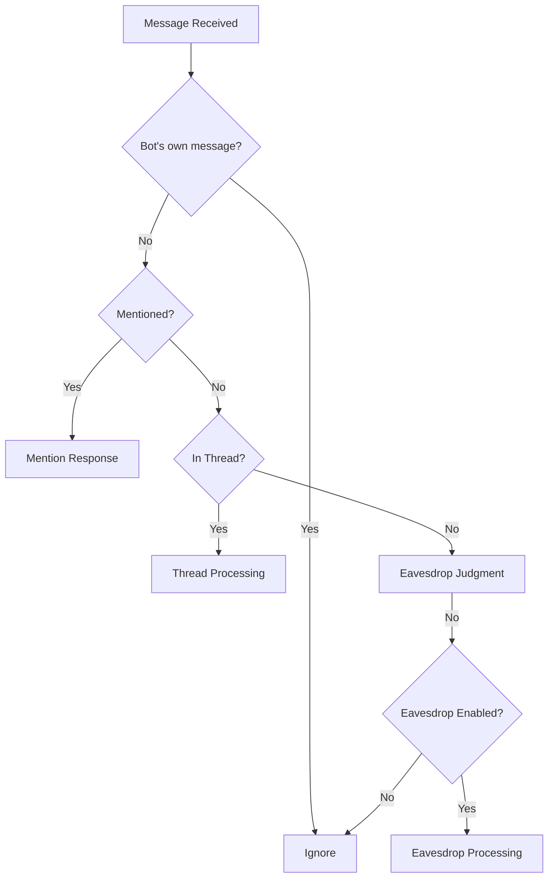
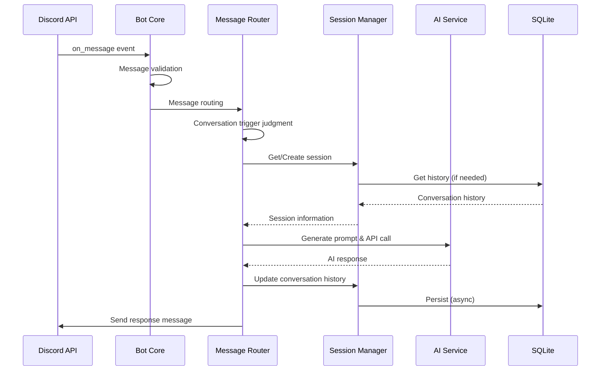
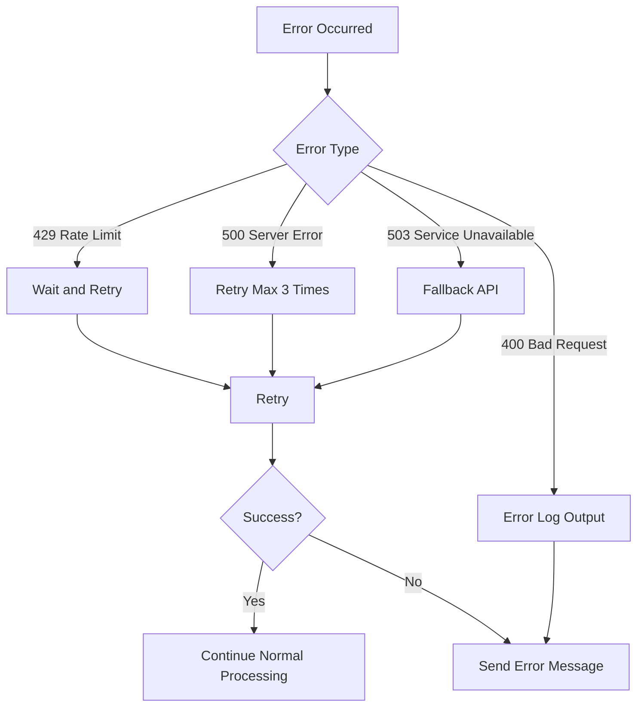

# イベント処理仕様書

## 1. Discord イベント一覧

### 1.1 `on_ready`

**説明**: Bot が Discord に接続し、準備が完了した時に発火します。

**処理内容**:

1. 接続状態の確認
2. ログ出力（起動完了メッセージ）
3. バックグラウンドタスクの開始
   - セッションクリーンアップタスク（1 時間ごと）
   - SQLite バッチ同期タスク（5 分ごと）
   - リクエストキューの開始

**ログ出力**:

```txt
INFO: Bot is ready! Logged in as {bot.user}
INFO: Cleanup task started
INFO: Batch sync task started
INFO: Request queue started
```

**実装場所**: `src/kotonoha_bot/bot/handlers.py` の `setup_handlers()` 関数内

---

### 1.2 `on_message`

**説明**: メッセージが送信された時に発火します。

**処理フロー**:



**処理内容**:

1. **メッセージ検証**

   - Bot 自身のメッセージは無視（`message.author.bot` をチェック）
   - Bot 自身のメッセージの場合はコマンド処理のみ実行

2. **ルーティング**

   - Message Router にメッセージを渡す
   - 会話の契機を判定（mention, thread, eavesdrop）

3. **ハンドラー呼び出し**

   - 判定結果に応じて適切なハンドラーを呼び出し
     - `mention`: `handle_mention()` を呼び出し
     - `thread`: `handle_thread()` を呼び出し
     - `eavesdrop`: `handle_eavesdrop()` を呼び出し

4. **コマンド処理**

   - メンションまたはスレッド型でない場合のみ、スラッシュコマンドを処理

**実装場所**: `src/kotonoha_bot/bot/handlers.py` の `setup_handlers()` 関数内

**エラーハンドリング**:

- API エラー: エラーメッセージを送信
- レート制限: 待機してリトライ
- タイムアウト: タイムアウトメッセージを送信

---

### 1.3 `on_thread_update`

**説明**: スレッドが更新された時に発火します。

**処理内容**:

1. スレッドのアーカイブ状態を確認（`after.archived` と `before.archived` を比較）
2. アーカイブされた場合:
   - セッションキーを生成（`thread:{thread_id}`）
   - セッションを SQLite に保存
   - ログ出力

**実装場所**: `src/kotonoha_bot/bot/handlers.py` の `setup_handlers()` 関数内

**注意**: 現在の実装では、スレッドがアーカイブされた時のみ処理を行います。
スレッド名の変更など、その他の更新は処理しません。

---

### 1.4 `on_error`

**説明**: イベント処理中にエラーが発生した時に発火します。

**処理内容**:

1. エラーログの出力（`logger.exception()` を使用）
2. スタックトレースの記録

**実装場所**: `src/kotonoha_bot/bot/client.py` の `KotonohaBot` クラス

**注意**: 現在の実装では、すべてのエラーをログに記録します。管理者への通知機能は未実装です。

---

## 2. リクエストキュー

### 2.1 リクエストキューの概要

**説明**: メッセージ処理を優先度順にキューイングし、レート制限を管理します。

**処理内容**:

1. リクエストのキューイング
   - 優先度管理（メンション > スレッド > 聞き耳型）
   - 非同期処理
2. ワーカーループによる順次処理
3. エラーハンドリング

**実装場所**: `src/kotonoha_bot/rate_limit/request_queue.py`

**開始タイミング**: `on_ready` イベントで開始

---

## 3. バックグラウンドタスク

### 3.1 セッションクリーンアップタスク

**説明**: 定期的に非アクティブセッションをクリーンアップします。

**実行頻度**: 1 時間ごと

**処理内容**:

1. 非アクティブセッションの検索
2. 24 時間以上経過したセッションを削除
3. メモリ使用量の最適化

---

### 3.2 SQLite バッチ同期タスク

**説明**: 定期的にメモリ内のセッションを SQLite に同期します。

**実行頻度**: 5 分ごと

**処理内容**:

1. アイドル状態のセッションを検索
2. SQLite に保存
3. 同期エラーのログ出力

---

### 3.3 レート制限監視（将来の拡張）

**説明**: API のレート制限使用率を監視する機能（将来の拡張として設計）。

**実装状況**: ⏳ 未実装

**注意**: `RateLimitMonitor` クラスは実装されていますが
（`src/kotonoha_bot/rate_limit/monitor.py`）、定期タスクとして実行されていません。
現在は `LiteLLMProvider` 内でリクエストを記録するのみです。

---

### 3.4 データベースバックアップ（外部スクリプト）

**説明**: データベースをバックアップする機能。

**実装状況**: ✅ 実装済み（外部スクリプト）

**実装場所**: `scripts/backup.sh`

**実行方法**:

- 手動実行: `docker exec kotonoha-bot /app/scripts/backup.sh`
- cron による定期実行（NAS 上で設定）

**処理内容**:

1. SQLite のオンラインバックアップ（`.backup` コマンド）
2. バックアップファイルの圧縮（gzip）
3. 7 日以上古いバックアップの自動削除

**注意**: 現在の実装では、Bot 内の定期タスクとして実行されていません。外部スクリプト（cron など）で実行する必要があります。

---

## 4. イベント処理フロー図

### 4.1 メッセージ処理フロー



### 4.2 エラー処理フロー



---

**作成日**: 2026 年 1 月 14 日  
**最終更新日**: 2026 年 1 月 15 日  
**バージョン**: 2.0  
**作成者**: kotonoha-bot 開発チーム

## 更新履歴

- **v2.0** (2026-01-15): 実際の実装に基づいて改訂
  - `on_ready` の処理内容を実装に合わせて更新
  - `on_message` の処理フローを実装に合わせて更新
  - `on_thread_update` の処理内容を実装に合わせて更新
  - `on_thread_create`, `on_thread_delete` を削除（未実装）
  - `on_rate_limit` を削除（未実装）
  - カスタムイベントセクションを削除（未実装）
  - リクエストキューセクションを追加
  - レート制限監視タスクを「将来の拡張」に変更
  - データベースバックアップタスクを外部スクリプトとして記載
- **v1.0** (2026-01-14): 初版リリース
