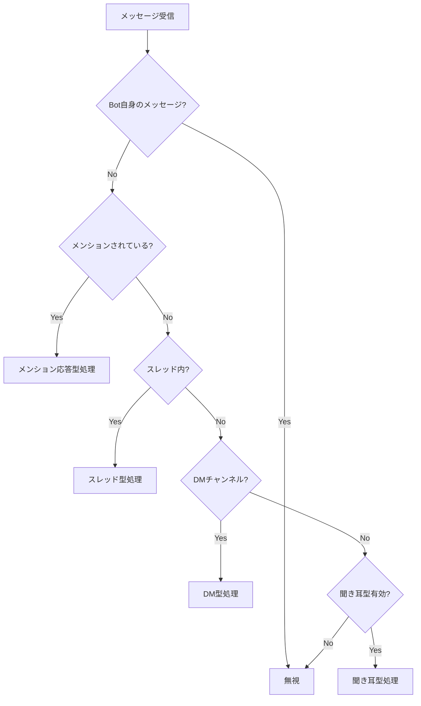
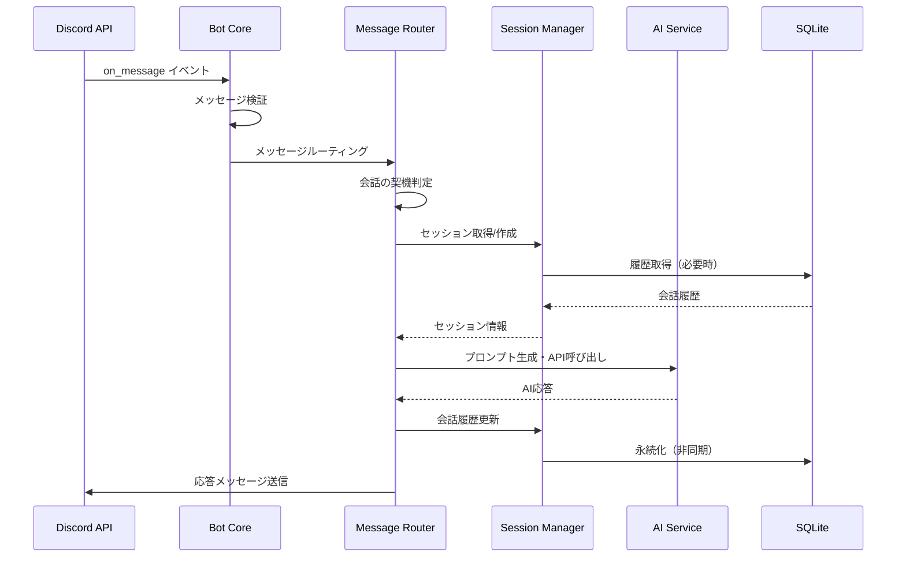
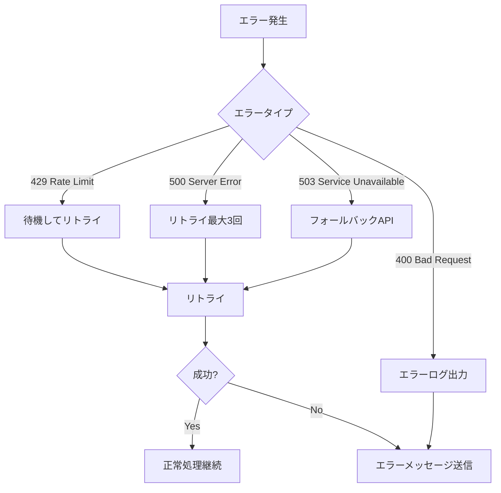

# イベント処理仕様書

## 1. Discord イベント一覧

### 1.1 `on_ready`

**説明**: Bot が Discord に接続し、準備が完了した時に発火します。

**処理内容**:

1. 接続状態の確認
2. データベース接続の確認
3. SQLite からのセッション復元（必要時）
4. ログ出力（起動完了メッセージ）
5. バックグラウンドタスクの開始
   - セッションクリーンアップ（1 時間ごと）
   - SQLite バッチ同期（5 分ごと）
   - レート制限監視（1 分ごと）

**ログ出力**:

```txt
INFO: Bot is ready. Logged in as {bot.user.name} (ID: {bot.user.id})
INFO: Connected to {len(bot.guilds)} guild(s)
INFO: Database connection established
```

**エラーハンドリング**:

- データベース接続エラー: エラーログを出力し、起動を継続（データベースなしでも動作可能）

---

### 1.2 `on_message`

**説明**: メッセージが送信された時に発火します。

**処理フロー**:



**処理内容**:

1. **メッセージ検証**

   - Bot 自身のメッセージは無視
   - 空のメッセージは無視

2. **ルーティング**

   - Message Router にメッセージを渡す
   - 会話の契機を判定

3. **セッション管理**

   - セッションキーの生成
   - セッションの取得または作成

4. **AI 応答生成**

   - プロンプト生成
   - API 呼び出し
   - 応答送信

5. **履歴更新**
   - 会話履歴に追加
   - セッション更新

**エラーハンドリング**:

- API エラー: エラーメッセージを送信
- レート制限: 待機してリトライ
- タイムアウト: タイムアウトメッセージを送信

---

### 1.3 `on_thread_create`

**説明**: スレッドが作成された時に発火します。

**処理内容**:

1. スレッド情報の取得
2. セッションキーの生成（`thread_id`）
3. セッションの作成
4. ログ出力

**使用ケース**:

- Bot が自動でスレッドを作成した場合
- ユーザーが手動でスレッドを作成した場合（Bot が参加している場合）

---

### 1.4 `on_thread_update`

**説明**: スレッドが更新された時に発火します。

**処理内容**:

1. スレッドのアーカイブ状態を確認
2. アーカイブされた場合:
   - セッションを SQLite に保存
   - メモリからセッションを削除
   - ログ出力

**使用ケース**:

- スレッドがアーカイブされた時
- スレッド名が変更された時

---

### 1.5 `on_thread_delete`

**説明**: スレッドが削除された時に発火します。

**処理内容**:

1. セッションを SQLite に保存
2. メモリからセッションを削除
3. ログ出力

---

### 1.6 `on_error`

**説明**: イベント処理中にエラーが発生した時に発火します。

**処理内容**:

1. エラーログの出力
2. スタックトレースの記録
3. 管理者への通知（CRITICAL エラーの場合）

**エラーレベル**:

- **ERROR**: 通常のエラー（API エラーなど）
- **CRITICAL**: 致命的なエラー（Bot の停止が必要な場合）

---

### 1.7 `on_rate_limit`

**説明**: Discord API のレート制限に達した時に発火します。

**処理内容**:

1. レート制限情報のログ出力
2. 警告メッセージの出力（使用率が高い場合）
3. リトライ待機

---

## 2. カスタムイベント

### 2.1 `on_session_timeout`

**説明**: セッションがタイムアウトした時に発火します（内部イベント）。

**処理内容**:

1. セッション状態の更新（アクティブ → アイドル → 非アクティブ）
2. SQLite への保存（アイドル状態になった時）
3. メモリからの削除（24 時間経過時）

**発火タイミング**:

- 5 分経過: アクティブ → アイドル
- 30 分経過: アイドル → 非アクティブ
- 24 時間経過: 削除

---

### 2.2 `on_api_error`

**説明**: AI API でエラーが発生した時に発火します（内部イベント）。

**処理内容**:

1. エラータイプの判定
2. リトライロジックの実行
3. フォールバック処理（必要時）
4. エラーログの出力

**エラータイプ**:

- **429 Too Many Requests**: レート制限超過
- **400 Bad Request**: 無効なリクエスト
- **500 Internal Server Error**: サーバーエラー
- **503 Service Unavailable**: サービス利用不可

---

## 3. バックグラウンドタスク

### 3.1 セッションクリーンアップタスク

**説明**: 定期的に非アクティブセッションをクリーンアップします。

**実行頻度**: 1 時間ごと

**処理内容**:

1. 非アクティブセッションの検索
2. 24 時間以上経過したセッションを削除
3. メモリ使用量の最適化

---

### 3.2 SQLite バッチ同期タスク

**説明**: 定期的にメモリ内のセッションを SQLite に同期します。

**実行頻度**: 5 分ごと

**処理内容**:

1. アイドル状態のセッションを検索
2. SQLite に保存
3. 同期エラーのログ出力

---

### 3.3 レート制限監視タスク

**説明**: API のレート制限使用率を監視します。

**実行頻度**: 1 分ごと

**処理内容**:

1. 各 API の使用率を計算
2. 警告閾値（80%）を超えた場合に警告ログを出力
3. 使用率の記録

---

### 3.4 データベースバックアップタスク

**説明**: 定期的にデータベースをバックアップします。

**実行頻度**: 1 日 1 回（深夜 0 時）

**処理内容**:

1. データベースファイルのコピー
2. バックアップファイル名にタイムスタンプを付与
3. 7 日以上古いバックアップを削除

---

## 4. イベント処理フロー図

### 4.1 メッセージ処理フロー



### 4.2 エラー処理フロー



---

**作成日**: 2026年1月14日
**バージョン**: 1.0
**作成者**: kotonoha-bot 開発チーム
