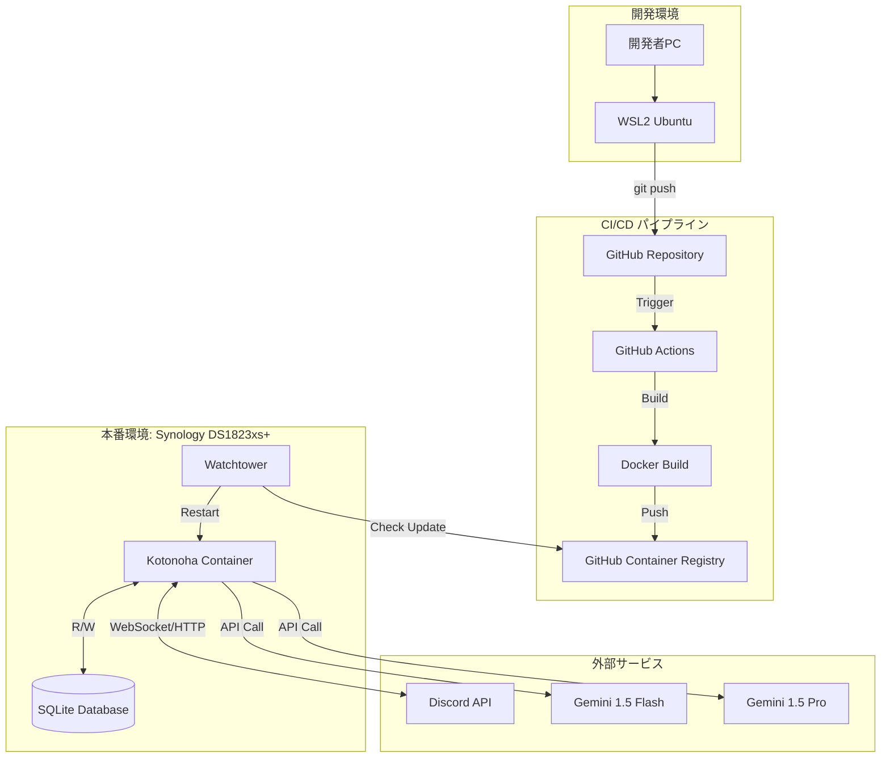
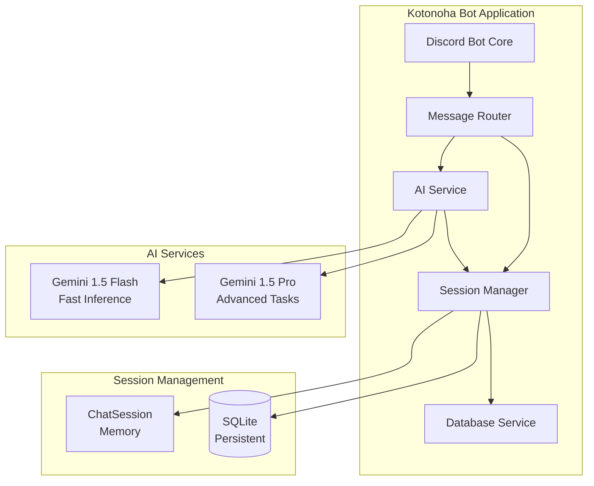
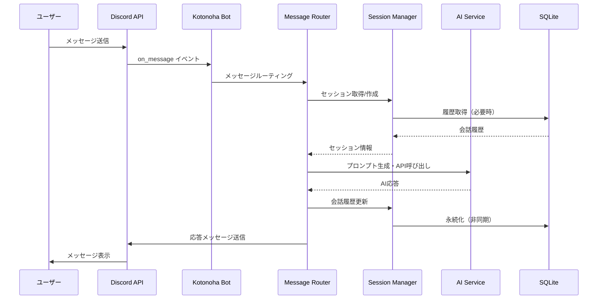

# システム構成図・技術スタック定義

## 1. システム構成図

### 1.1 全体システム構成



### 1.2 アプリケーション構成



### 1.3 データフロー図



## 2. 技術スタック定義

### 2.1 技術スタック一覧

| カテゴリ               | 技術                      | バージョン | 用途                    |
| ---------------------- | ------------------------- | ---------- | ----------------------- |
| **言語**               | Python                    | 3.14       | アプリケーション開発    |
| **パッケージ管理**     | uv                        | latest     | 依存関係管理            |
| **フレームワーク**     | discord.py                | latest     | Discord Bot 開発        |
| **AI SDK**             | google-generativeai       | latest     | Gemini API クライアント |
| **データベース**       | SQLite                    | 3.x        | 会話履歴の永続化        |
| **コンテナ**           | Docker                    | latest     | コンテナ化              |
| **CI/CD**              | GitHub Actions            | -          | 自動ビルド・デプロイ    |
| **コンテナレジストリ** | GitHub Container Registry | -          | イメージ保存            |
| **自動更新**           | Watchtower                | latest     | コンテナ自動更新        |
| **OS**                 | Ubuntu (WSL2)             | 22.04+     | 開発環境                |
| **本番 OS**            | DSM (Synology)            | latest     | 本番環境                |

### 2.2 主要ライブラリ

| ライブラリ          | バージョン | 用途                     |
| ------------------- | ---------- | ------------------------ |
| discord.py          | latest     | Discord API クライアント |
| google-generativeai | latest     | Gemini API クライアント  |
| aiosqlite           | latest     | 非同期 SQLite 操作       |
| python-dotenv       | latest     | 環境変数管理             |
| pytest              | latest     | テストフレームワーク     |
| pytest-asyncio      | latest     | 非同期テスト             |

### 2.3 ハードウェア要件

| 項目             | 仕様                        |
| ---------------- | --------------------------- |
| **CPU**          | AMD Ryzen V1780B (AVX 対応) |
| **メモリ**       | 最小 512MB、推奨 1GB        |
| **ストレージ**   | 最小 1GB（データベース用）  |
| **ネットワーク** | インターネット接続必須      |

## 3. 環境変数一覧

### 3.1 必須環境変数

| 変数名           | 説明                   | 例                                         | 必須 |
| ---------------- | ---------------------- | ------------------------------------------ | ---- |
| `DISCORD_TOKEN`  | Discord Bot トークン   | `MTIzNDU2Nzg5MDEyMzQ1Njc4OQ.XXXXXX.XXXXXX` | ✅   |
| `GEMINI_API_KEY` | Google Gemini API キー | `AIzaSyXXXXXXXXXXXXXXXXXXXXXXXXXXXXX`      | ✅   |

### 3.2 オプション環境変数

#### 3.2.1 Gemini API 設定

| 変数名               | 説明           | デフォルト値       | 必須 |
| -------------------- | -------------- | ------------------ | ---- |
| `GEMINI_FLASH_MODEL` | Flash モデル名 | `gemini-1.5-flash` | ❌   |
| `GEMINI_PRO_MODEL`   | Pro モデル名   | `gemini-1.5-pro`   | ❌   |
| `GEMINI_TEMPERATURE` | 温度パラメータ | `0.7`              | ❌   |
| `GEMINI_MAX_TOKENS`  | 最大トークン数 | `2048`             | ❌   |

#### 3.2.2 データベース設定

| 変数名                | 説明                     | デフォルト値            | 必須 |
| --------------------- | ------------------------ | ----------------------- | ---- |
| `DATABASE_PATH`       | データベースファイルパス | `/app/data/kotonoha.db` | ❌   |
| `DATABASE_BACKUP_DIR` | バックアップディレクトリ | `/app/backups`          | ❌   |

#### 3.2.3 セッション設定

| 変数名                   | 説明                         | デフォルト値   | 必須 |
| ------------------------ | ---------------------------- | -------------- | ---- |
| `SESSION_TIMEOUT_ACTIVE` | アクティブタイムアウト（秒） | `300` (5 分)   | ❌   |
| `SESSION_TIMEOUT_IDLE`   | アイドルタイムアウト（秒）   | `1800` (30 分) | ❌   |
| `SESSION_MAX_MEMORY`     | メモリ内最大セッション数     | `100`          | ❌   |
| `SESSION_HISTORY_LIMIT`  | メモリ内履歴保持数           | `50`           | ❌   |

#### 3.2.4 聞き耳型設定

| 変数名                          | 説明                             | デフォルト値 | 必須 |
| ------------------------------- | -------------------------------- | ------------ | ---- |
| `EAVESDROP_ENABLED`             | 聞き耳型の有効/無効              | `true`       | ❌   |
| `EAVESDROP_APPROACH`            | アプローチ選択 (`llm` or `rule`) | `llm`        | ❌   |
| `EAVESDROP_LOG_SIZE`            | 会話ログ保持数                   | `10`         | ❌   |
| `EAVESDROP_KEYWORD_PROBABILITY` | キーワード検知時の反応確率       | `0.5`        | ❌   |
| `EAVESDROP_RANDOM_PROBABILITY`  | ランダム反応確率                 | `0.03`       | ❌   |

#### 3.2.5 ログ設定

| 変数名             | 説明                                                         | デフォルト値             | 必須 |
| ------------------ | ------------------------------------------------------------ | ------------------------ | ---- |
| `LOG_LEVEL`        | ログレベル (`DEBUG`, `INFO`, `WARNING`, `ERROR`, `CRITICAL`) | `INFO`                   | ❌   |
| `LOG_FILE`         | ログファイルパス                                             | `/app/logs/kotonoha.log` | ❌   |
| `LOG_MAX_SIZE`     | ログファイル最大サイズ（MB）                                 | `10`                     | ❌   |
| `LOG_BACKUP_COUNT` | ログバックアップ数                                           | `5`                      | ❌   |

#### 3.2.6 レート制限設定

| 変数名                         | 説明                          | デフォルト値 | 必須 |
| ------------------------------ | ----------------------------- | ------------ | ---- |
| `RATE_LIMIT_FLASH_MAX`         | Flash API 最大リクエスト数/分 | `15`         | ❌   |
| `RATE_LIMIT_PRO_MAX`           | Pro API 最大リクエスト数/分   | `2`          | ❌   |
| `RATE_LIMIT_WARNING_THRESHOLD` | 警告閾値（使用率）            | `0.8`        | ❌   |

#### 3.2.7 その他設定

| 変数名               | 説明                   | デフォルト値 | 必須 |
| -------------------- | ---------------------- | ------------ | ---- |
| `BOT_PREFIX`         | コマンドプレフィックス | `/`          | ❌   |
| `MESSAGE_MAX_LENGTH` | メッセージ最大長       | `2000`       | ❌   |
| `HEALTH_CHECK_PORT`  | ヘルスチェックポート   | `8080`       | ❌   |

### 3.3 環境変数設定例

```bash
# .env ファイル例

# Discord
DISCORD_TOKEN=your_discord_bot_token_here

# Gemini API
GEMINI_API_KEY=your_gemini_api_key_here
GEMINI_FLASH_MODEL=gemini-1.5-flash
GEMINI_PRO_MODEL=gemini-1.5-pro
GEMINI_TEMPERATURE=0.7
GEMINI_MAX_TOKENS=2048

# Database
DATABASE_PATH=/app/data/kotonoha.db
DATABASE_BACKUP_DIR=/app/backups

# Session
SESSION_TIMEOUT_ACTIVE=300
SESSION_TIMEOUT_IDLE=1800
SESSION_MAX_MEMORY=100
SESSION_HISTORY_LIMIT=50

# Eavesdrop
EAVESDROP_ENABLED=true
EAVESDROP_APPROACH=llm
EAVESDROP_LOG_SIZE=10
EAVESDROP_KEYWORD_PROBABILITY=0.5
EAVESDROP_RANDOM_PROBABILITY=0.03

# Logging
LOG_LEVEL=INFO
LOG_FILE=/app/logs/kotonoha.log
LOG_MAX_SIZE=10
LOG_BACKUP_COUNT=5

# Rate Limiting
RATE_LIMIT_FLASH_MAX=15
RATE_LIMIT_PRO_MAX=2
RATE_LIMIT_WARNING_THRESHOLD=0.8

# Other
BOT_PREFIX=/
MESSAGE_MAX_LENGTH=2000
HEALTH_CHECK_PORT=8080
```

## 4. ボリューム設計（Docker）

### 4.1 ボリューム構成

```yaml
volumes:
  kotonoha_data:
    driver: local
    driver_opts:
      type: none
      o: bind
      device: /volume1/docker/kotonoha/data
  kotonoha_logs:
    driver: local
    driver_opts:
      type: none
      o: bind
      device: /volume1/docker/kotonoha/logs
  kotonoha_backups:
    driver: local
    driver_opts:
      type: none
      o: bind
      device: /volume1/docker/kotonoha/backups
```

### 4.2 マウントポイント

| ホストパス                         | コンテナパス   | 用途                 | 永続化 |
| ---------------------------------- | -------------- | -------------------- | ------ |
| `/volume1/docker/kotonoha/data`    | `/app/data`    | SQLite データベース  | ✅     |
| `/volume1/docker/kotonoha/logs`    | `/app/logs`    | ログファイル         | ❌     |
| `/volume1/docker/kotonoha/backups` | `/app/backups` | バックアップファイル | ✅     |

### 4.3 Docker Compose 設定例

```yaml
version: "3.8"

services:
  kotonoha:
    image: ghcr.io/your-org/kotonoha-bot:latest
    container_name: kotonoha-bot
    restart: unless-stopped
    environment:
      - DISCORD_TOKEN=${DISCORD_TOKEN}
      - GEMINI_API_KEY=${GEMINI_API_KEY}
      - DATABASE_PATH=/app/data/kotonoha.db
      - LOG_FILE=/app/logs/kotonoha.log
    volumes:
      - kotonoha_data:/app/data
      - kotonoha_logs:/app/logs
      - kotonoha_backups:/app/backups
    resources:
      limits:
        memory: 1G
        cpus: "1.0"
      reservations:
        memory: 512M
        cpus: "0.5"
    healthcheck:
      test:
        [
          "CMD",
          "python",
          "-c",
          "import requests; requests.get('http://localhost:8080/health')",
        ]
      interval: 30s
      timeout: 10s
      retries: 3
      start_period: 40s

volumes:
  kotonoha_data:
    driver: local
  kotonoha_logs:
    driver: local
  kotonoha_backups:
    driver: local
```

### 4.4 ボリュームの権限設定

```bash
# データディレクトリの権限設定
chmod 755 /volume1/docker/kotonoha/data
chmod 755 /volume1/docker/kotonoha/logs
chmod 755 /volume1/docker/kotonoha/backups

# 所有者設定（コンテナ内のユーザーIDに合わせる）
chown -R 1000:1000 /volume1/docker/kotonoha/data
chown -R 1000:1000 /volume1/docker/kotonoha/logs
chown -R 1000:1000 /volume1/docker/kotonoha/backups
```

### 4.5 バックアップ戦略

| 項目                 | 設定                           |
| -------------------- | ------------------------------ |
| **バックアップ頻度** | 1 日 1 回（深夜 0 時）         |
| **保存期間**         | 7 日分                         |
| **保存場所**         | `/app/backups`                 |
| **ファイル名形式**   | `kotonoha_YYYYMMDD_HHMMSS.db`  |
| **自動削除**         | 7 日以上古いファイルを自動削除 |

---

**作成日**: 2024 年
**バージョン**: 1.0
**作成者**: kotonoha-bot 開発チーム
